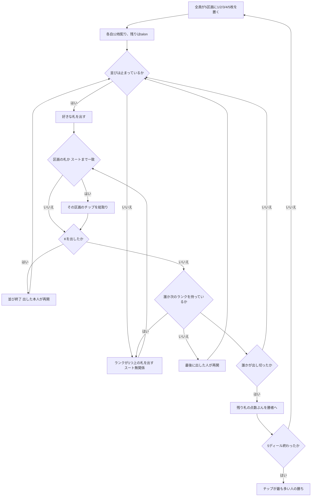

# ル・ナン・ジョーヌ (Le Nain Jaune) — CUI マニュアル

## ゲーム概要

フランスのストップス系ゲーム。52 枚と、**5 区画の専用盤**を使います。中央の ♦7 が「黄色い小人 (le nain jaune)」で、最も多くチップが積まれます。

出典: [Wikipedia: Nain Jaune](https://en.wikipedia.org/wiki/Nain_Jaune)

## 起動方法

```sh
go run ./cmd/trumpcards nainjaune
go run ./cmd/trumpcards --lang en nainjaune   # 英語表示
```

## ルール

### 盤の 5 区画とアンティ

**取る札はスートまで決まっています。**ランクが合っていても別スートでは取れません。

| 区画 | 取る札 | 各プレイヤーが置く枚数 |
|---|---|---|
| ♦10 | **♦10** | 1 |
| ♣J | **♣J** | 2 |
| ♠Q | **♠Q** | 3 |
| ♥K | **♥K** | 4 |
| **♦7（黄色い小人）** | **♦7** | **5** |

1 人あたり合計 **15 枚**を毎ディール置きます。**取られなかった区画は次のディールへ持ち越されます。**♦7 は 5 枚ずつ積み上がるので、放置されると一気に大きくなります。

### 配り方

各自 **12 枚**。残り 4 枚は **talon** として脇に置かれ、誰も使いません。

### 手番

- **並びが止まっているとき**: **好きな札**を出して始めます
- **並びの途中**: **ランクが 1 つ上の札**を出します。**スートは一切関係ありません**
- **K を出すと並びは終わり**、出した本人が好きな札で次を始めます
- 誰も次のランクを持っていなければ、最後に出した人が好きな札から始め直します

### 精算

先に手札を出し切った人が、他家から**残り札の点数ぶん**を受け取ります。**枚数ではありません。**

| 札 | 点 |
|---|---|
| A | 1 |
| 2〜10 | 額面 |
| J / Q / K | **各 10** |

5 ディール戦い、チップが最も多い人の勝ちです。

## Pope Joan との違い

同じストップス系で盤も似ていますが、**並びの作り方が正反対**です。

| | Pope Joan | ル・ナン・ジョーヌ |
|---|---|---|
| 並び | **同じスート**の次に高い札 | **スート無関係**にランクが 1 つ上 |
| 止まる場所 | ♦7（♦8 が抜いてある）と K | **K のみ** |
| 精算 | 残り札の**枚数** | 残り札の**点数** |

## ゲームの流れ



## コマンド一覧

| コマンド | 説明 |
|---------|------|
| `p <i>` | 手札 `i` を出す |
| `n` | 次のディールへ進む |
| `h` | ヒントを表示する |
| `l` / `log` | 棋譜を表示する |
| `r` | ゲームごとリセットする |
| `q` | 終了する |

## 画面の見方

```
ディール1/5 · talon4枚
並びは【スート無関係】にランクが1つずつ上がります／Kで止まります／精算は枚数ではなく【点数】（A=1、絵札=各10）
盤: ♦10:4 ♣J:8 ♠Q:12 ♥K:16 ♦7（黄色い小人）:20
あなた: チップ-15 手札12枚（63点）
  [0]SPADE 1 [1]HEART 11 [2]CLOVER 5 ...
CPU 1: チップ-15 手札12枚（58点）
```

- **盤の 5 区画は毎回すべて出ます。**膨らんでいる区画がそのディールの狙いどころです
- **各プレイヤーの「点」が出ます。**支払いは枚数ではなく点数なので、枚数だけでは相手がいくら抱えているか判りません
- CPU の**手札の中身**は伏せられます

## 遊び方のコツ

- **♦7 は毎ディール 5 枚ずつ積まれます。**出せる巡が来たら最優先で取りに行く価値があります
- **絵札は 1 枚 10 点の負債です。**出し切れないと分かった時点で、絵札から処理したいところですが、並びは K で止まるので出す機会自体が限られます
- **K は主導権を取る札です。**出せば並びが終わり、自分が好きな札で始め直せます
- **スートは無関係です。**Pope Joan の感覚で「同じスートの次」を探すと出せる札を見落とします
