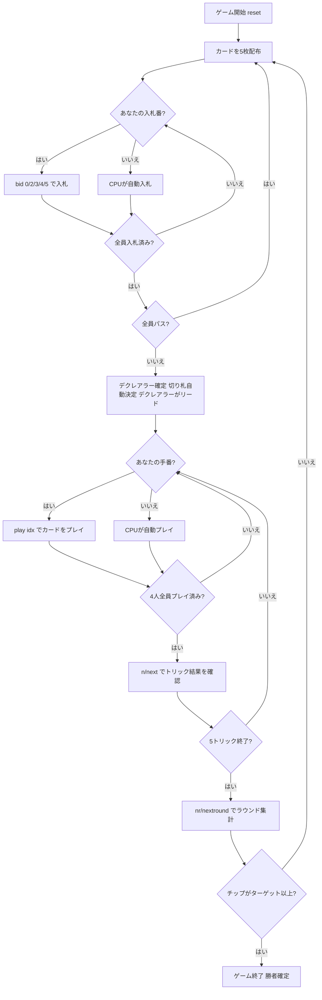

# ナップ (Napoleon)（CUI版）遊び方

## ゲーム概要

Nap（ナップ、Napoleon）はイギリスで古くから親しまれているトリックテイキングゲームです。52枚の標準デッキを4人でプレイし、各プレイヤーに5枚ずつ配って5トリックを争います。各ラウンドの最初に**入札フェーズ**があり、最高入札者が**デクレアラー**となって1対3で戦います。デクレアラーが宣言したトリック数以上を取ればチップを獲得し、失敗すれば相手3人がチップを獲得します。先にターゲット（デフォルト20チップ）に達したプレイヤーがマッチ勝利です。

## 起動方法

```sh
go run ./cmd/trumpcards nap
go run ./cmd/trumpcards --lang en nap  # 英語モード
```

## ルール

### デッキと配布

- **デッキ**: 52枚（A,2-10,J,Q,K × 4スート）
- **プレイヤー**: 4人（プレイヤー0 = あなた、プレイヤー1〜3 = CPU）
- **配布**: 各プレイヤー5枚、計5トリック
- **カードの強さ（高い順）**: A > K > Q > J > 10 > 9 > 8 > 7 > 6 > 5 > 4 > 3 > 2

### 入札フェーズ

ディーラーの左隣から時計回りに、各プレイヤーが1回だけ入札します。入札できるコントラクトは以下のとおりです（弱い順）。

| コントラクト | コマンド値 | 取るべきトリック数 |
|--------------|------------|-------------------|
| **Pass（パス）** | `0` | — |
| **Two（ツー）** | `2` | 2トリック以上 |
| **Three（スリー）** | `3` | 3トリック以上 |
| **Four（フォー）** | `4` | 4トリック以上 |
| **Nap（ナップ）** | `5` | 全5トリック |

- 先の入札より高いコントラクトのみ上書きできます（Pass < Two < Three < Four < Nap）。
- 全員がパスした場合はそのラウンドは無効となり、再配布されます。
- 最高入札者が**デクレアラー**（宣言者）となり、他の3人が**ディフェンダー**として対戦します。

### 切り札

デクレアラーの手札で最も枚数の多いスートが自動的に切り札スートになります（簡易実装）。デクレアラーが最初のトリックをリードします。

### トリック・テイキング

- **スートフォロー義務**: リードされたスートのカードを持っている場合は必ず出さなければなりません。
- 持っていない場合は任意のカードを出せます（切り札でも他スートでも可）。
- **トリックの勝者**:
  - 切り札スートのカードが場にあれば、最も強い切り札カードが勝ちます。
  - 切り札がなければ、リードスートの最も強いカードが勝ちます。
- トリックの勝者が次のトリックをリードします。

### チップ得点と勝利条件

| 結果 | チップ得点 |
|------|------------|
| デクレアラーが宣言トリック数以上を達成（Two/Three/Four） | デクレアラーがコントラクト値（2/3/4）チップを獲得 |
| デクレアラーがNapを達成（全5トリック） | デクレアラーが**10チップ**を獲得 |
| デクレアラーがTwo/Three/Fourで失敗 | 各ディフェンダーがコントラクト値チップを獲得 |
| デクレアラーがNapで失敗 | 各ディフェンダーが**5チップ**を獲得 |

**マッチ勝利**: 先にターゲット（デフォルト **20** チップ）に達したプレイヤーが勝利。

## ゲームの流れ



## コマンド一覧

| コマンド | 短縮形 | 説明 |
|----------|--------|------|
| `bid <0/2/3/4/5>` | — | 入札する（0=Pass, 2=Two, 3=Three, 4=Four, 5=Nap） |
| `pass` | — | パスする（bid 0 と同じ） |
| `play <idx>` | — | 手札のidx番目のカードを出す（トリックフェーズ） |
| `next` | `n` | 次のトリックへ進む（トリック終了後） |
| `nextround` | `nr` | 次のラウンドへ進む（5トリック終了後） |
| `setdifficulty <0-2>` | `sd <0-2>` | CPU難易度設定（0=Easy, 1=Normal, 2=Hard） |
| `log` | `l` | アクションログを表示 |
| `reset` | `r` | 新しいゲームを開始（設定保持） |
| `quit` | `q` | ゲーム終了 |
| `help` | `?` | コマンド一覧を表示 |

## 画面の見方

```
==========
Nap (ナップ)
==========
ラウンド: 1  トリック: 0
チップ: あなた=0  CPU1=0  CPU2=0  CPU3=0
----------
フェーズ: BID
入札状況: あなた=?  CPU1=?  CPU2=?  CPU3=?
あなたの手番です。入札してください。
bid <0/2/3/4/5>  (0=Pass, 2=Two, 3=Three, 4=Four, 5=Nap)

==========
ラウンド: 1  トリック: 1
チップ: あなた=0  CPU1=0  CPU2=0  CPU3=0
切り札: ♠  デクレアラー: CPU1 [Nap]
You: 5枚 [ディフェンダー]
[0]A♥ [1]K♥ [2]Q♠ [3]J♦ [4]10♣
CPU1: 5枚 [デクレアラー]  CPU2: 5枚 [ディフェンダー]  CPU3: 5枚 [ディフェンダー]
----------
フェーズ: PLAY
あなたの手番です。カードを出してください。
play <idx>
```

- **フェーズ: BID**: 入札フェーズ。各プレイヤーが1回入札します。
- **フェーズ: PLAY**: トリックフェーズ。スートフォロー義務に従いカードを出します。
- **切り札行**: 現在の切り札スートとデクレアラー・コントラクト表示。
- **チップ行**: 各プレイヤーの累積チップ数。
- **`[n]`付き行**: あなたの手札（インデックス付き）。

## 遊び方のコツ

- **入札の目安**: Two（2トリック）はA・Kが2枚以上あれば安定します。Three（3トリック）は強いカードが3枚以上必要です。Four（4トリック）はA・K・Qが揃い切り札スートが3枚以上ある場合に検討しましょう。
- **Napの高リスク・高リターン**: Nap（全5トリック）は成功で10チップ、失敗でも各相手に5チップしか払わないため、手札が非常に強い場合は積極的に狙う価値があります。A・Kを揃えた強い5枚手なら宣言を検討してください。
- **切り札スートを活かせ**: デクレアラーの切り札は手札の最長スートから自動選択されます。宣言前に自分の最長スートを確認し、そのスートでトリックを稼げるか計算しておきましょう。
- **デクレアラーは序盤に切り札を引き出せ**: 切り札リードで相手の切り札を消費させると、後半の強いカードで安全にトリックを取りやすくなります。
- **ディフェンダーは連携して阻止**: 3人で力を合わせてデクレアラーを阻みましょう。デクレアラーが弱そうなスートをリードして切り札を節約させると有効です。
- **得点管理**: Napの失敗は1回で最大5チップ×3人＝15チップを相手に渡すことになります。ターゲット残チップ差を常に意識し、安全なコントラクトに留めるか強気に行くかを判断しましょう。
- **スートフォロー義務を利用**: ディフェンダーはデクレアラーが切り札以外の弱いスートしか持っていない状況を作ることが理想です。デクレアラーが手放したくないスートをリードして手札を絞りましょう。
