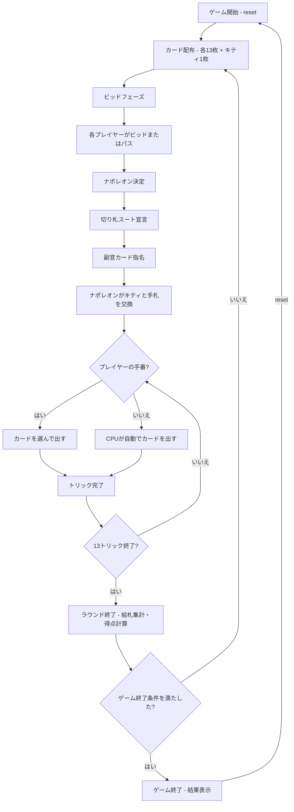

# ナポレオン（CUI版）遊び方

## ゲーム概要

4人（プレイヤー1人 + CPU 3人）で遊ぶトリックテイキング型カードゲームです。52枚+ジョーカー1枚の計53枚を使用し、絵札（J/Q/K/A + ジョーカー = 最大17枚）の獲得数をビッドして競います。最高ビッドのプレイヤーがナポレオンとなり、切り札スートと副官カードを宣言します。ナポレオン軍（ナポレオン＋副官）と連合軍の隠しチーム戦です。

## 起動方法

```sh
go run ./cmd/trumpcards napoleon
go run ./cmd/trumpcards --lang en napoleon  # 英語モード
```

## ルール

### 基本ルール

- 53枚のカード（52枚+ジョーカー1枚）を4人に配布（1人13枚、余り1枚はキティ）
- 各ラウンド開始時に絵札の獲得予想数をビッド（最低入札数〜17）
- 最高ビッドのプレイヤーが **ナポレオン** になる
- ナポレオンは **切り札スート** を宣言し、 **副官カード** を指名する
- 副官カードを持つプレイヤーはナポレオンの味方（他のプレイヤーには非公開）
- ナポレオンはキティのカードと手札を交換できる
- リードスートに従う（フォロースート）
- トリックの勝者: 切り札が出ていれば最高の切り札、なければリードスートの最高値

### 特殊カード

- **ジョーカー（マイティ）**: 最も強いカード。どのトリックでも勝つ
- **スペードの3（ジョーカーキラー）**: ジョーカーに対してのみ勝てる特殊カード

### 絵札（ピクチャーカード）

以下のカードが絵札としてカウントされます（最大17枚）：
- ジャック (J) × 4枚
- クイーン (Q) × 4枚
- キング (K) × 4枚
- エース (A) × 4枚
- ジョーカー × 1枚

### 得点

- **ナポレオン軍の勝利**: ナポレオン軍が獲得した絵札数 >= ビッド数
- **連合軍の勝利**: ナポレオン軍が獲得した絵札数 < ビッド数

### ゲーム終了

- ポイント上限に到達したプレイヤーが出た場合にゲーム終了

### CPU難易度

- **Easy** (0): ランダムにカードを出す
- **Normal** (1): 基本的なトリック戦略（デフォルト）
- **Hard** (2): 戦略的なプレイ（切り札管理等）

## ゲームの流れ



## コマンド一覧

| コマンド | 短縮形 | 説明 |
|----------|--------|------|
| `reset` | `r` | ゲームリセット（設定保持） |
| `bid <n>` | `b <n>` | ビッドを宣言（0=パス、最低入札数〜17） |
| `trump <suit>` | `t <suit>` | 切り札スートを宣言（1=スペード, 2=クローバー, 3=ハート, 4=ダイヤ） |
| `exchange <idx...>` | `e <idx...>` | キティとカードを交換（インデックス指定） |
| `play <idx>` | `p <idx>` | カードをプレイ（インデックス指定） |
| `next` | `n` | 次のトリックへ |
| `nextround` | `nr` | ラウンドをスコアリングして次のラウンドへ |
| `hint` | `h` | 推奨カードのヒントを表示 |
| `log` | `l` | 棋譜表示 |
| `setdifficulty <0-2>` | `sd <0-2>` | CPU難易度設定（0=Easy, 1=Normal, 2=Hard） |
| `setlimit <n>` | `sl <n>` | ポイント上限設定 |
| `setminbid <n>` | `sm <n>` | 最低入札数設定 |
| `quit` | `q` | ゲーム終了 |
| `help` | `?` | ヘルプ表示 |

### コマンド例

- `b 12` → 絵札12枚をビッド
- `b 0` → パス（ビッドしない）
- `t 1` → スペードを切り札に宣言
- `e 0 3` → インデックス0と3のカードをキティと交換
- `p 2` → インデックス2のカードを出す
- `sd 2` → CPU難易度をHardに設定
- `sl 300` → ポイント上限を300に設定
- `sm 10` → 最低入札数を10に設定

## 画面の見方

```
==========
Napoleon (ナポレオン)
==========
ラウンド 2 / トリック 5
切り札: スペード
ナポレオン: CPU 1 (ビッド: 12)
副官カード: HEART A
----------
[You]: 50点 (絵札: 3)
[0]SPADE 5  [1]CLOVER 8  [2]HEART K  [3]DIAMOND 3  ...
CPU 1: 80点 (ナポレオン, 絵札: 5)
CPU 2: 30点 (絵札: 2)
CPU 3: 40点 (絵札: 1)
----------
現在のトリック:
  CPU 1: CLOVER 10
  CPU 2: CLOVER K
手番: あなた
p <idx>・・・カードを出す
==========
```

- `ラウンド N / トリック M`: 現在のラウンドとトリック番号
- `切り札`: 宣言された切り札スート
- `ナポレオン`: ナポレオンのプレイヤーとビッド数
- `副官カード`: 指名された副官カード
- `[You]: N点 (絵札: X)`: プレイヤーの累計得点と獲得絵札数
- `[0]SPADE 5`...: インデックス付きの手札カード
- `現在のトリック`: 現在のトリックに出されたカード

## 遊び方のコツ

- ビッドは手札の強さに応じて慎重に行いましょう。絵札とトランプの枚数を確認してからビッドしましょう
- ナポレオンになった場合、切り札スートは自分が多く持つスートを選びましょう
- 副官カードは、自分が持っていない強いカード（例: エース）を指名すると効果的です
- ジョーカー（マイティ）は最強のカードですが、スペードの3（ジョーカーキラー）に注意しましょう
- 連合軍の場合、ナポレオンの切り札を早く消費させる戦略が有効です
- 迷った時は `h` コマンドでヒントを表示できます
