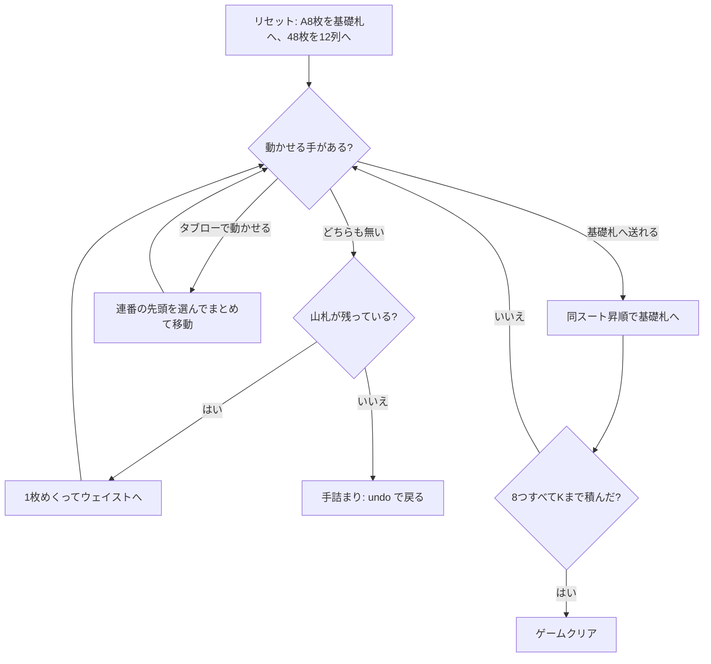

# ナポレオンズ・スクエア (Napoleon's Square) — CUI マニュアル

## ゲーム概要

2 デッキ 104 枚を使う大型ソリティア。中央に 8 つの基礎札（スートごとに 2 つ）、その周囲を 12 列×4 枚のタブローが正方形に囲む。残りは山札となり、1 枚ずつめくって使う。

最大の特徴は**連番のまとめ移動**で、同じスートで 1 つずつ下がって並んだカードは、その先頭を指定すれば塊ごと別の列へ動かせる。この点がフォーティシーブス（1 枚ずつしか動かせない）との決定的な違いで、長い連番をどう組んで運ぶかがそのまま勝率になる。

## 起動方法

```sh
go run ./cmd/trumpcards napoleonssquare
go run ./cmd/trumpcards --lang en napoleonssquare   # 英語
```

## ルール

- 52 枚 2 組（104 枚）。8 枚のエースを抜いて基礎札に置き、48 枚を 12 列×4 枚に配る。残り 48 枚が山札
- 基礎札は**同じスートで昇順** A→2→…→K。スートごとに 2 列あり、2 組目のエースは 2 列目を開く
- タブローは**同じスートで降順** K→…→A に重ねる
- 同スートで 1 つずつ下がる**連番はまとめて移動できる**。移動先はその連番の先頭が置ける列
- **空いた列には任意のカード・任意の連番を置ける**
- 山札は 1 枚ずつめくってウェイストへ送る。**めくり直しはできない（1 巡のみ）**
- 8 つの基礎札すべてを K まで積み切ればクリア

> 補足: issue #4391 の仕様案は「8 枚の A を置き、**残り 96 枚**を 12 列×4 枚のタブローに配る」としているが、12×4 は 48 であって 96 ではない。列構成の方が実際のルールと一致するため、48 枚をタブロー、残り 48 枚を山札としている。

## ゲームの流れ



## コマンド一覧

| コマンド | 説明 |
|---------|------|
| `d`, `draw` | 山札を 1 枚めくってウェイストへ送る |
| `m w f` | ウェイスト最上段を基礎札へ |
| `m w t <col>` | ウェイスト最上段をタブロー列 `<col>` へ |
| `m t <col> f` | タブロー列 `<col>` の最上段を基礎札へ |
| `m t <from> t <to>` | 列 `<from>` の最上段を列 `<to>` へ |
| `m t <from> t <to> <idx>` | 列 `<from>` の `<idx>` 番目から末尾までの連番をまとめて列 `<to>` へ |
| `h`, `hint` | ヒントを表示する |
| `ac`, `autocomplete` | 基礎札へ送れる札がなくなるまで自動で送る |
| `u`, `undo` | 1 手戻す |
| `g`, `giveup` | ギブアップ |
| `l` | 棋譜（アクションログ）を表示する |
| `r`, `reset` | 最初からやり直す |
| `q`, `quit` | 終了する |

## 画面の見方

```
基礎札: ♠A | ♣A | ♥3 | ♦A | ♠A | ♣A | ♥A | ♦A   ← スート固定、2列ずつ
山札: 41枚 ウェイスト: ♥7 (3枚)
----------
列0: [0]♠7 [1]♦2 [2]♣9 [3]♥4     ← [n] は列内インデックス
列1: [0]♦J [1]♠3 [2]♥8 [3]♠6
...
列11: [0]♣4 [1]♦9 [2]♠Q [3]♥2
----------
手数: 12
```

- 基礎札は 8 つ。スートは固定なので、配り直しても同じ位置を見ればよい
- 各列の `[n]` が `m t <from> t <to> <idx>` の `<idx>` に対応する。連番の先頭の番号を指定する
- 手詰まりになると、脱出に必要なアンドゥ回数が表示される

## 遊び方のコツ

- **連番を育ててから運ぶ。** 1 枚ずつ動かすと手数を無駄に消費する。同スートで繋げてから塊で移すのが基本
- 空き列は最強の資源。安易に埋めず、長い連番の一時置き場として温存する
- 山札は 1 巡しかない。めくる前に、盤面で動かせる手が本当に無いか確認する
- エースは 8 枚とも最初から場にあるので、序盤から 2 を探して基礎札を伸ばせる
- `hint` は基礎札 → タブロー → 山札の順に手を 1 つ返すだけで、最善手の保証はない。詰まったら `undo` で分岐をやり直す
