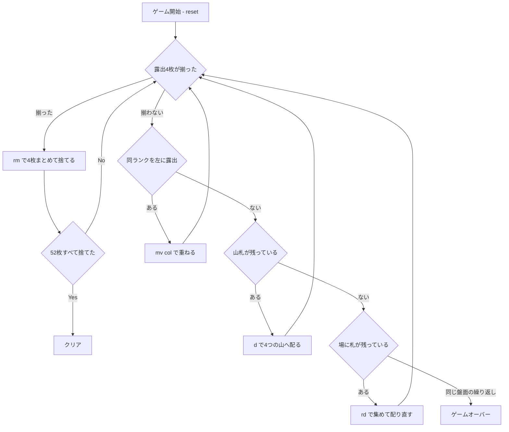

# ナルコティック（CUI版）遊び方

## ゲーム概要

1人用のペア除去ソリティアです（別名 **Perpetual Motion / 永久機関**）。52枚のうち4枚を **4つの山** へ1枚ずつ配り、各山の**一番手前の札だけ**を使います。**露出している4枚のランクが揃ったら、その4枚をまとめて捨てます。**52枚すべてを捨てられればクリアです。

**山札が尽きても終わりません。**場の札を集めて何度でも配り直せます（回数無制限）。ただし集め方は決まっていて**シャッフルしない**ので、同じ盤面が戻ってきて打つ手が無ければ、そこから先は永遠に同じ繰り返しになります。そこが敗北です。

「進行が読みにくく、いつまでも終わらない」ことからこの名がついたとされます。

## 起動方法

```sh
go run ./cmd/trumpcards narcotic
go run ./cmd/trumpcards --lang en narcotic  # 英語モード
```

## ルール

### 基本ルール

- 52枚のトランプ（ジョーカーなし）を使用
- 開始時、4つの山へ1枚ずつ配る（残り48枚は山札）
- **使えるのは各山の一番手前の札だけ**。その下の札は、手前が無くなって初めて使える
- **捨てられるのは「露出4枚のランクが全て揃ったとき」だけ**。そのときは4枚とも捨てる
  - スートは見ません。4枚が同じランクでありさえすればよい
  - 3枚だけ揃っても捨てられません
  - どれか1つの山が空だと、揃えようがないので捨てられません
- **重ねる**: 同じランクを露出している山があれば、**より左の山**へ重ねられます
  - 行き先は「同じランクを露出している**最も左**の山」で自動的に決まります
  - **左へしか動かせません。**右へも動けると同じ2枚を往復させられてしまいます
  - 重ねると露出が1枚減り、下の札が出てくるので、4枚が揃う目が生まれます
- **配る**: `d` で4つの山へ1枚ずつ配ります（空の山にも配ります）
- **配り直す**: 山札が尽きたら `rd` で、**一番右の山から順に左へ**重ねて集め、**シャッフルせずに**山札へ戻します。回数に上限はありません

### ゲーム終了

- **クリア**: 52枚すべてを捨てた状態
- **ゲームオーバー**: **同じ盤面（と山札）が再び現れ、かつ打つ手が1つも無い**とき。配り直しがシャッフルしないので、そこから先は必ず同じ繰り返しになります

## ゲームの流れ



## コマンド一覧

| コマンド | 短縮形 | 説明 |
|----------|--------|------|
| `draw` | `d` | 4つの山へ1枚ずつ配る |
| `remove` | `rm` | 露出4枚のランクが揃っているとき、その4枚を捨てる（列の指定は不要） |
| `move <col>` | `mv <col>` | その山の露出札を、同ランクを露出する最も左の山へ重ねる |
| `redeal` | `rd` | 山札が尽きたとき、右の山から集めてシャッフルせず配り直す（上限なし） |
| `undo` | `u` | 直前の操作を1手だけ取り消す |
| `hint` | `h` | 次の一手と、その理由を表示する |
| `giveup` | `g` | ゲームを放棄する |
| `log` | `l` | 棋譜を表示する |
| `reset` | `r` | 新しいデッキでゲームを最初からやり直す |
| `quit` | `q` | 終了する |
| `help` | `?` | コマンド一覧を表示 |

`rm` に列番号は要りません。捨てるのは常に4枚まとまりで、選ぶ余地がないためです。

## 画面の見方

```
==========
Narcotic (ナルコティック)
==========
列0: [SPADE 7]*
列1: HEART 2 [HEART 7]*>
列2: [CLOVER 7]*
列3: [DIAMOND 7]*
----------
Stock: 44枚 | Discard: 4枚 | 配り直し: 0回
マーカー: * = 4枚揃って捨てられる / > = 左の同ランクへ重ねられる
----------
手数: 8
==========
```

- **列0〜3**: 4つの山。`[ ]` で囲まれているのが**露出札＝いま使える札**です
- **`*`**: 露出4枚が揃っていて捨てられる合図。**盤面全体の性質なので、付くときは4列すべてに付きます**
- **`>`**: その山の札を、左の同ランクの山へ重ねられる合図
- **Stock / Discard / 配り直し**: 山札の残り、捨てた枚数、配り直した回数（上限なし）

## 遊び方のコツ

- **重ねる手は「捨てられる形」を作るための唯一の道具です。**露出が減るぶん下の札が出てくるので、揃う組み合わせが変わります。
- **配り直してもカードの順序は変わりません。**だから「集める前にどの山をどう並べておくか」がそのまま次の展開になります。闇雲に `rd` を押すより、重ねられる手を先に使い切るほうが盤面が動きます。
- 同じ盤面が戻ってきたと感じたら、それは本当にループしています。`u` で戻って別の重ね方を試すのが唯一の打開策です。
- `h` は「何をするか」と「なぜそれか」の両方を表示します。詰まったら理由のほうを読むと、次に何を崩すべきか見えてきます。
