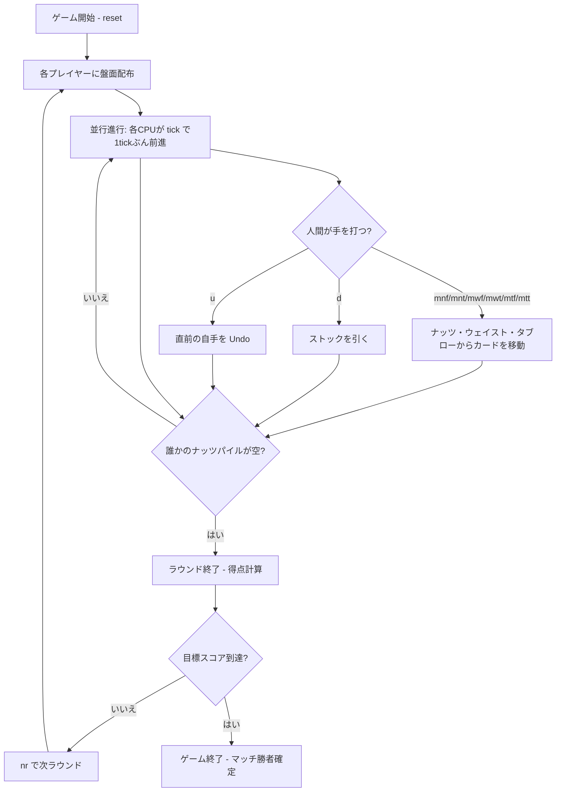

# ナーツ（CUI版）遊び方

## ゲーム概要

Nertz（別名: Pounce, Nerts, Racing Demon）は、複数プレイヤー（既定4人 / 1人間 + 3CPU、2〜6人で設定可能）が同時並行でクロンダイク風のソリティアを進める対戦型カードゲームです。各プレイヤーは自分専用の52枚デッキで盤面を構築しつつ、中央に置かれた共有ファウンデーションへ最も多くカードを送り込み、自分の「ナッツパイル（13枚）」をいち早く空にした人がそのラウンドを取ります。

## 起動方法

```sh
go run ./cmd/trumpcards nertz
go run ./cmd/trumpcards --lang en nertz  # 英語モード
```

## ルール

### 盤面構成（プレイヤーごと）

- **ナッツパイル（Nertz Pile）**: 13枚を伏せて積み、トップ（末尾）が表向きで使用可能。
- **タブロー（River）**: 4列に1枚ずつ表向きで配置。Klondike と同じく赤黒交互・降順で重ねる（空き列は任意のカードで埋め直せる）。
- **ストック / ウェイスト**: 残り35枚をストックとして所有し、`d` コマンドで1または3枚（設定で選択）ずつウェイストへめくる。空になったら自動でリサイクル。

### 共有ファウンデーション

- 中央に「プレイヤー数 × 4」枠（既定16枠）を用意。誰でもAから置き始め、置いた瞬間にスートが固定されます。
- 同スートで値+1の順に積み上げ、Kで完成。完成後はそのファウンデーションは閉鎖されます。
- 各カードを置いた人（DeckIdx）が記録され、ラウンド終了時の得点計算に使われます。

### CPUのリアルタイム駆動

- ドメインは純粋に状態のみを保持し、リアルタイムは usecase 層で `tick` を駆動して再現します。
- CPU難易度ごとに 1tick あたりの手数が変わります: Easy=1 / Normal=3 / Hard=5。
- 人間プレイヤーは `u` で直前の自分の操作のみ Undo 可能（CPU の手は Undo 対象外）。

### 得点とゲーム終了

- 誰かのナッツパイルが空になるとラウンド終了、その人が「Nertz」をコールします。
- 得点: ファウンデーションへの貢献 1枚 = +1 / 残ったナッツカード 1枚 = -2。
- 累積スコアが目標値（既定100、25〜500で設定可）を超えたプレイヤーが出るとマッチ終了。

## ゲームの流れ



## コマンド一覧

| コマンド | 短縮形 | 説明 |
|----------|--------|------|
| `reset` | `r` | 新しいマッチを開始 |
| `draw <p>` | `d <p>` | プレイヤー `<p>` がストックを引く |
| `mnf <p> <f>` | — | ナッツパイル → ファウンデーション `<f>` |
| `mnt <p> <c>` | — | ナッツパイル → タブロー列 `<c>` |
| `mwf <p> <f>` | — | ウェイスト → ファウンデーション `<f>` |
| `mwt <p> <c>` | — | ウェイスト → タブロー列 `<c>` |
| `mtf <p> <c> <f>` | — | タブロー列 `<c>` → ファウンデーション `<f>` |
| `mtt <p> <c> <i> <c2>` | — | タブロー列 `<c>` の `<i>` 番目以降を列 `<c2>` へ移動 |
| `tick` | — | CPU を 1tick ぶん進める（人間が手を打たない時間用） |
| `nr` | — | 次ラウンドを開始 |
| `undo` | `u` | 直前の自手を Undo |
| `hint` | `h` | 推奨手を表示 |
| `log` | `l` | 棋譜を表示 |
| `help` | `?` | コマンド一覧を表示 |
| `quit` | `q` | ゲーム終了 |

## 画面の見方

```
==========
Nertz / Pounce (ナーツ / パウンス)
==========
ラウンド 1 / 手数 12
[Foundations]
  F0 SPADE 5 (5/13)
  F1 (empty)
  ...
  F15 (empty)
----------
[P0 人間 You] スコア: 3
  ナッツ: HEART 7 (残 10)
  T0: SPADE 5 HEART 4
  T1: (empty)
  T2: CLOVER 12 DIAMOND 11 SPADE 10
  T3: HEART 9
  ウェイスト: DIAMOND 3 (3枚)  ストック: 32枚
[P1 CPU CPU1] スコア: -1
  ...
----------
プレイ中
```

- `ナッツ` の `(残 N)` は自分のナッツパイル残数。0 になるとラウンド終了をコールできます。
- `T0..T3` はタブロー列。末尾（右端）が最下段で、移動の起点になります。
- `[Foundations]` は全プレイヤーで共有。番号は固定（プレイヤー数×4）です。

## 遊び方のコツ

- ナッツパイルのトップを優先的に消化すること。タブローやウェイストは後でも処理できますが、ナッツが残ると -2/枚なので不利になります。
- 1ドロー設定だとウェイストの再利用が容易、3ドロー設定だと展開は速いがアクセス可能なカードが限られます。CPU難易度と合わせて好みで調整してください。
- リアルタイムなので `tick` を放置すると CPU に貢献を奪われます。ストックを引く前に置けるカードがないか必ず確認しましょう。
- Undo は人間プレイヤーの直前操作のみ。CPU の進行はそのままなので「考え直したい」場面で使うのがおすすめです。
