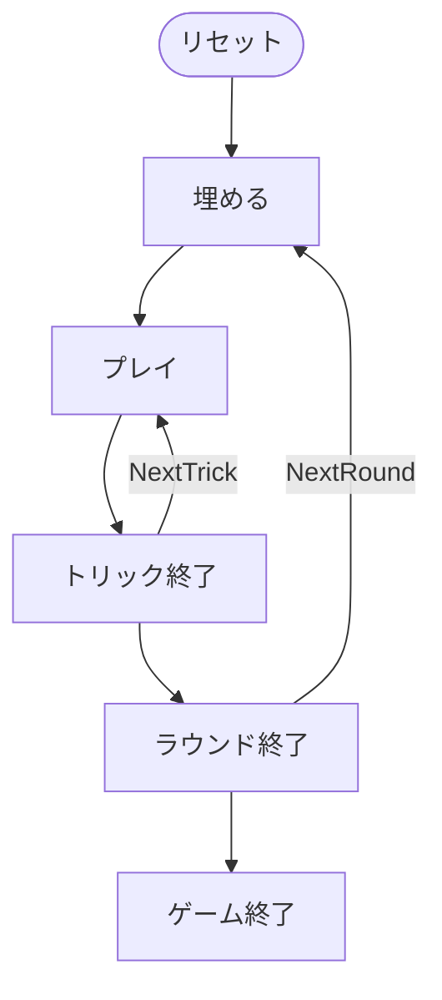

# ナインティナイン（CUI版）遊び方

## ゲーム概要

3人（プレイヤー1人 + CPU 2人）で遊ぶトリックテイキング型カードゲームです。36枚のデッキを使い、各ディール開始時に手札12枚から3枚を「埋める（ビッド）」ことで、埋めたカードのスート合計（♦=0 / ♠=1 / ♥=2 / ♣=3）が宣言ビッド（0〜9）になります。埋めた後は手札9枚で9トリックを戦い、宣言数をちょうど獲得できれば得点が入ります。先に目標スコア（100点）に到達したプレイヤーが勝者です。

## 起動方法

```sh
go run ./cmd/trumpcards ninetynine
go run ./cmd/trumpcards --lang en ninetynine  # 英語モード
```

## ルール

### 基本ルール

- 36枚のデッキを3人に配布（各12枚）
- 切り札スートはディール番号で固定ローテーション（♠→♥→♣→♦）
- ビッドフェーズ: 手札から正確に3枚を埋める。埋めた3枚のスート合計が宣言ビッド（0〜9）
- 埋めた後、手札は9枚になり9トリックを戦う（フォロースート必須）
- トリックの勝者: 切り札が出ていれば最高の切り札、なければリードスートの最高値

### 得点

- **ビッド成功（ちょうど獲得）**: 10 + ビッド数 + ボーナス（単独 +30 / 2人 +20 / 3人 +10）
- 先に目標スコア（100点）へ到達したプレイヤーが勝利

### CPU難易度

- **Easy**: ランダム / **Normal**: 基本戦略（デフォルト）/ **Hard**: 戦略的

## ゲームの流れ

ゲームの進行は `internal/domain/NinetyNine.go` のフェーズ機械そのものです。各ノードは同ファイルの `NinetyNinePhase` 定数、矢印ラベルはその遷移を行うメソッド名です。



## コマンド一覧

| コマンド | 短縮形 | 説明 |
|----------|--------|------|
| `bid <i> <j> <k>` | `b` | 手札から3枚を埋めてビッド |
| `play <idx>` | `p` | カードを出す |
| `next` | `n` | 次のトリックへ |
| `nextround` | `nr` | 次のラウンドへ |
| `hint` | `h` | ヒントを表示 |
| `reset` | `r` | ゲームをリセット |
| `quit` | `q` | 終了 |
| `help` | `?` | コマンド一覧を表示 |

## 画面の見方

実際の出力例です。配りは毎回シャッフルされるので、カードの並びは実行ごとに変わります。

```
==========
Ninety-Nine (ナインティナイン)
==========
ディール: 1  目標: 100点  手札: 9枚  トリック: 0
切り札: SPADE
ディーラー: あなた
あなた: 宣言=未宣言 獲得0トリック 累積0点 ディール0点 12枚
[0]SPADE 6  [1]SPADE 7  [2]SPADE 10  [3]SPADE 13  [4]CLOVER 10  [5]HEART 7  [6]HEART 9  [7]HEART 13  [8]HEART 1  [9]DIAMOND 9  [10]DIAMOND 10  [11]DIAMOND 1
CPU 1: 宣言=4 獲得0トリック 累積0点 ディール0点 9枚
CPU 2: 宣言=2 獲得0トリック 累積0点 ディール0点 9枚
----------
ビッドフェーズ: あなたの番
b <i> <j> <k>・・・3枚を伏せて宣言 (♦=0/♠=1/♥=2/♣=3 の合計が宣言トリック数)
==========
```

- **1〜3行目**: ゲーム名の見出し
- **ディール / 目標 / 手札 / トリック**: 進行状況と勝利条件
- **切り札**: そのディールの切り札スート
- **ディーラー**: 配り手
- **プレイヤー行**: 宣言（未宣言 or 宣言トリック数）、獲得トリック数、累積点、当ディール点、残り手札枚数
- **`[i]` 付きの行**: あなたの手札。ビッド時に伏せる3枚もこの番号で指定する
- **`----------` の下**: 現在のフェーズと、ビッドの符号化（♦=0 / ♠=1 / ♥=2 / ♣=3 の合計が宣言トリック数）

## 遊び方のコツ

- 埋める3枚で宣言ビッドが決まるため、取れそうなトリック数に合わせてスート合計を調整しましょう
- 切り札スートはディールごとに変わるので確認してから埋めましょう
- ちょうど宣言数を取ることが高得点の鍵です
