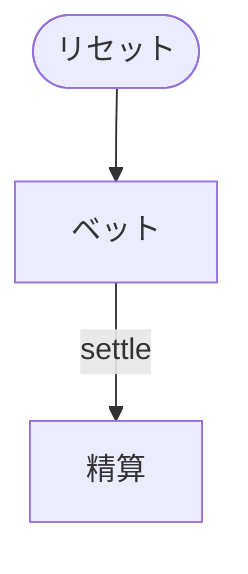

# 闘牛（CUI版）遊び方

## ゲーム概要

52 枚 1 組で遊ぶ中国のギャンブルゲーム。人間 1 人 + CPU 3 人（うち 1 席が親）に **5 枚ずつ**配り、それぞれが親と 1 対 1 で勝負します。

**プレイヤーに手番の選択肢はありません。** 配られた 5 枚から作れる最良の役は一意に決まるので、賭けた時点で結果まで確定します。

## 起動方法

```sh
go run ./cmd/trumpcards niuniu
go run ./cmd/trumpcards --lang en niuniu   # 英語
```

## ルール

### 役の作り方

1. 5 枚のうち **3 枚の合計が 10 の倍数**になる組み合わせを探す（10 通りの総当たり）
2. 見つかれば「牛あり」。**残り 2 枚の合計の下 1 桁**が役の強さになる
3. 下 1 桁が **0 なら牛牛**（最強）、1〜9 ならそれぞれ **牛1〜牛9**
4. どの 3 枚でも作れなければ **無牛**（最弱）

点数は **A = 1、2〜10 は額面、絵札は 10**。

> 補足: 資料によっては絵札を 0 点としますが、**この 2 つは同値**です。判定はすべて 10 で割った余りしか使わないので（10 ≡ 0）、牛になる組み合わせも残り 2 枚の下 1 桁も完全に一致します。

### 強さの順

```
牛牛 > 牛9 > 牛8 > ... > 牛1 > 無牛
```

### 同点の決め方

役は 11 種類しかないので同点は頻繁に起きます。

1. **最高ランクの札**で比べる（K > Q > J > 10 > … > 2 > **A が最弱**）
2. それも同じなら**スート**で比べる（♠ > ♥ > ♣ > ♦）

A は 1 点ですが、**同点処理では最弱**である点に注意してください。

### 配当

| 役 | 倍率 |
|---|---|
| 牛牛 | **3 倍** |
| 牛7・牛8・牛9 | **2 倍** |
| 牛1〜牛6・無牛 | 等倍 |

**倍率は勝った側の役のもの**が適用されます。親が牛牛なら、子は賭け金の 3 倍を取られます。

> 補足: issue #4397 は同点処理と配当倍率に触れていませんが、どちらも実装には不可欠なため上記のとおり定めました（Wizard of Odds の配当表に準拠）。

## ゲームの流れ



## コマンド一覧

| コマンド | 短縮形 | 説明 |
|----------|--------|------|
| `bet <額>` | `b` | ベットして配り、その場で精算する |
| `log` | `l` | 棋譜（アクションログ）を表示する |
| `reset` | `r` | 次の局を始める |
| `quit` | `q` | 終了する |
| `help` | `?` | コマンド一覧を表示 |

## 画面の見方

```
----------
チップ: 900
親: *SPADE 10 *SPADE 10 *SPADE 10 SPADE 5 SPADE 5 牛牛 (x3)
----------
  あなた 賭け100 *SPADE 1 *SPADE 2 *SPADE 7 SPADE 3 SPADE 4 牛7 (x2) → -300
  CPU1 賭け20 [伏]
----------
```

- **`*` が付いた 3 枚が牛を作った札**です。5 枚のどれが役になったのかが分かるようにしています
- 役の後ろの `(x3)` はその役で勝ったときの倍率
- 親と CPU の手は局が終わるまで `[伏]` で伏せられます（**サーバーが中身を返さない**ため、API を直接叩いても読めません）

## 遊び方のコツ

- **絵札と 10 は同じ 10 点**なので、絵札が多い手は 3 枚で 30 を作りやすく、牛が付きやすい
- **牛7 以上で倍率が付く**ので、同じ「牛あり」でも価値が大きく違う
- **無牛でも等倍で勝てる**ことがある。親も無牛なら最高ランクの札で決まる
- 選択の余地がないゲームなので、賭け金の管理がすべて
