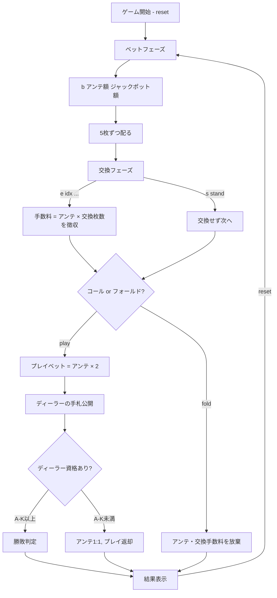
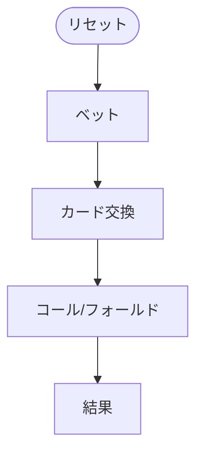

# オアシスポーカー（CUI版）遊び方

## ゲーム概要

カリビアンスタッドポーカーをベースに、ベットとコール/フォールドの判断の間に **手札交換フェーズ** を加えたカジノポーカーです。手数料（アンテと同額 × 交換枚数）を支払って 1〜5 枚のカードを交換できるため、プレイヤーの裁量が広がります。

## 起動方法

```sh
go run ./cmd/trumpcards oasispoker
go run ./cmd/trumpcards --lang en oasispoker   # 英語モード
```

別名: `oasis` / `oasp`

## ルール

### 基本ルール

- 52枚のトランプ（ジョーカーなし）を使用
- プレイヤーとディーラーにそれぞれ 5 枚ずつ配る
- プレイヤーはアンテベット後、必要に応じて手札を 1〜5 枚交換できる（または交換しない）
- 交換手数料は **アンテ × 交換枚数**（1 枚交換するごとにアンテと同額）
- 交換完了後、コール（プレイ）かフォールドを決定
- ディーラーは「A と K を含む」または「ペア以上」でクオリファイ

### フェーズ遷移



### 手札ランキング（強い順）

カリビアンスタッドと同じ 5 枚役判定です。

| ランク | 説明 |
|--------|------|
| ロイヤルフラッシュ | 同じスートの A-K-Q-J-10 |
| ストレートフラッシュ | 同じスートの連続 5 枚 |
| フォーカード | 同じランク 4 枚 |
| フルハウス | スリーカード + ペア |
| フラッシュ | 同じスートの 5 枚 |
| ストレート | 連続する 5 枚 |
| スリーカード | 同じランク 3 枚 |
| ツーペア | ペア 2 組 |
| ワンペア | 同じランク 2 枚 |
| ハイカード | 上記以外 |

### ベットタイプと配当

**プレイ配当倍率（プレイヤー勝ち時、ディーラー資格あり）:**

| 役 | 倍率 |
|----|------|
| ロイヤルフラッシュ | 100:1 |
| ストレートフラッシュ | 50:1 |
| フォーカード | 20:1 |
| フルハウス | 7:1 |
| フラッシュ | 5:1 |
| ストレート | 4:1 |
| スリーカード | 3:1 |
| ツーペア | 2:1 |
| ペア以下 | 1:1 |

**ジャックポット（サイドベット）:** カリビアンスタッドと同一倍率（ロイヤルフラッシュ 20000x ほか）。

## ゲームの流れ

ゲームの進行は `internal/domain/OasisPoker.go` のフェーズ機械そのものです。各ノードは同ファイルの `OasisPokerPhase` 定数、矢印ラベルはその遷移を行うメソッド名です。



## コマンド一覧

| コマンド | 短縮形 | 説明 |
|----------|--------|------|
| `reset` | `r` | 新しいゲームを開始 |
| `bet <amount> [jackpot]` | `b` | アンテベット（金額と任意のジャックポット額を指定） |
| `exchange [idx ...]` | `e` | 指定インデックスのカードを交換（0〜4、最大 5 枚） |
| `stand` | `s` | 交換せずアクションフェーズへ進む |
| `play` | `p` | プレイベットを置いて勝負（コール） |
| `fold` | `f` | フォールド（アンテ・交換手数料を放棄） |
| `log` | `l` | アクションログを表示 |
| `quit` | `q` | ゲーム終了 |
| `help` | `?` | コマンド一覧を表示 |

### コマンド例

- `r` → ゲームリセット
- `b 100` → 100 チップをアンテベット
- `b 100 10` → 100 チップをアンテ、10 チップをジャックポット
- `e 0 2 4` → 手札の 1・3・5 枚目を交換（手数料 = アンテ × 3）
- `s` → 交換せず次のフェーズへ
- `p` → コール
- `f` → フォールド
