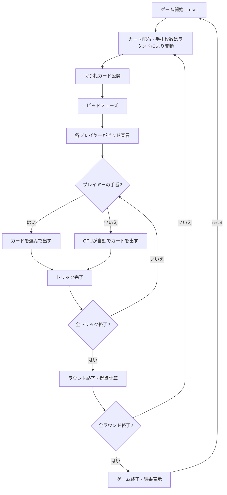

# オー・ヘル（CUI版）遊び方

## ゲーム概要

4人（プレイヤー1人 + CPU 3人）で遊ぶトリックテイキング型カードゲームです。ラウンドごとに手札枚数が変動し、各ラウンドでビッド（獲得予想トリック数）を宣言します。全ラウンド終了後、累計得点が最も高いプレイヤーが勝者です。

## 起動方法

```sh
go run ./cmd/trumpcards ohhell
go run ./cmd/trumpcards --lang en ohhell  # 英語モード
```

## ルール

### 基本ルール

- 52枚のトランプを4人に配布（手札枚数はラウンドごとに変動）
- 配り終わった山札の一番上のカードが**切り札（トランプ）スート**を決定
- 山札が残らないラウンドでは切り札なし
- 各ラウンド開始時にビッド（0〜手札枚数）を宣言
- **ディーラー制限（フック）**: ディーラーは全員のビッド合計が手札枚数と同じになるビッドを選べない
- リードスートに従う（フォロースート）
- トリックの勝者: 切り札が出ていれば最高の切り札、なければリードスートの最高値

### 得点

- **ビッド成功（正確に一致）**: 10 + ビッド数
- **ビッド失敗**: 0点（スタンダード方式）または -|差分|点（ペナルティ方式）

### ラウンド進行

- **減少のみ**: 最大手札枚数 → 1枚
- **減少後増加**: 最大手札枚数 → 1枚 → 最大手札枚数

### ゲーム終了

- 全ラウンド終了後、累計得点が最も高いプレイヤーが勝利

### CPU難易度

- **Easy** (0): ランダムにビッド・カードを出す
- **Normal** (1): 基本的なトリック戦略（デフォルト）
- **Hard** (2): 戦略的なプレイ

## ゲームの流れ



## コマンド一覧

| コマンド | 短縮形 | 説明 |
|----------|--------|------|
| `reset` | `r` | ゲームリセット（設定保持） |
| `bid <n>` | `b <n>` | ビッドを宣言（0〜手札枚数） |
| `play <idx>` | `p <idx>` | カードをプレイ（インデックス指定） |
| `next` | `n` | 次のトリックへ |
| `nextround` | `nr` | ラウンドをスコアリングして次のラウンドへ |
| `setdifficulty <0-2>` | `sd <0-2>` | CPU難易度設定（0=Easy, 1=Normal, 2=Hard） |
| `setmaxhand <n>` | `sm <n>` | 最大手札枚数設定（1-13） |
| `setscoring <n>` | `ss <n>` | 得点方式設定（0=外れは0点 / 1=外れはビッドとの差分だけマイナス） |
| `hint` | `h` | 推奨カード/ビッドのヒントを表示 |
| `log` | `l` | 棋譜表示 |
| `quit` | `q` | ゲーム終了 |
| `help` | `?` | ヘルプ表示 |

### コマンド例

- `b 3` → ビッド3を宣言
- `b 0` → ビッド0を宣言
- `p 2` → インデックス2のカードを出す
- `sd 2` → CPU難易度をHardに設定
- `sm 7` → 最大手札枚数を7に設定
- `h` → 推奨カード/ビッドのヒントを表示

## 画面の見方

```
==========
Oh Hell (オー・ヘル)
==========
ラウンド 3/19 / トリック 2 (手札 8枚)
切り札: HEART (♥K)
----------
[You]: 30点 (ビッド: 2, 獲得: 1)
[0]SPADE 5  [1]CLOVER 8  [2]HEART K  [3]DIAMOND 3  ...
CPU 1: 20点 (ビッド: 3, 獲得: 2)
CPU 2: 40点 (ビッド: 1, 獲得: 1)
CPU 3: 10点 (ビッド: 2, 獲得: 0)
----------
現在のトリック:
  CPU 1: CLOVER 10
  CPU 2: CLOVER K
手番: あなた
p <idx>・・・カードを出す
==========
```

- `ラウンド N/M / トリック T (手札 X枚)`: 現在のラウンド/全ラウンド数、トリック番号、手札枚数
- `切り札: SUIT (カード)`: 切り札スートと決定カード
- `[You]: N点 (ビッド: X, 獲得: Y)`: プレイヤーの累計得点、ビッド数、獲得トリック数
- `[0]SPADE 5`...: インデックス付きの手札カード
- `現在のトリック`: 現在のトリックに出されたカード

## 遊び方のコツ

- ビッドは手札の強さ（切り札の枚数、高いカード）を考慮して慎重に宣言しましょう
- ディーラーの場合はフック制限を意識してビッドしましょう
- 切り札が少ないラウンドではビッドを控えめにするのが安全です
- 手札枚数が少ないラウンドほど運の要素が強くなります
- 正確なビッドが高得点の鍵です（多くても少なくてもダメ）
- 迷った時は `h` コマンドでヒントを表示できます
