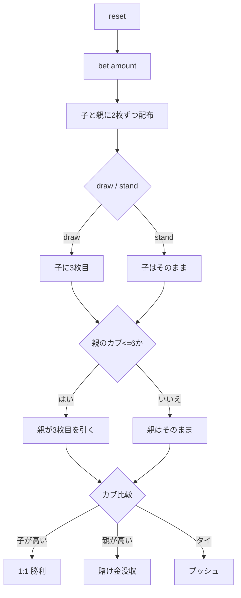

# おいちょかぶ（CUI版）遊び方

## ゲーム概要

おいちょかぶ（Oicho-Kabu）は、カブ札（1〜10 が各 4 枚、計 40 枚）で遊ぶ日本の伝統的なバンキングゲームです。子（プレイヤー）が親（CPU）を相手に、手札合計の 1 の位（カブ）を競います。9 が最強、0（ブタ）が最弱です。

## 起動方法

```sh
go run ./cmd/trumpcards oichokabu
go run ./cmd/trumpcards --lang en oichokabu
```

## ルール

### 得点（カブ）の数え方

- 手札の点数（各札の数字、10 は 0）を合計し、その **1 の位** がカブになります。
- CUI では、目の計算方法（合計を 10 で割った余り）を**どのフェーズでも**画面に表示します。伏せ札を見ながら数えるのは DRAW フェーズなので、BET のときだけ出しても遅い。
- 例: 4 + 5 = 9 → カブ 9。8 + 9 = 17 → カブ 7。10 + 10 = 20 → カブ 0。

### 基本ルール

1. `bet <amount>` で賭け金を置くと、子と親に 2 枚ずつ配られます（親の手は結果まで伏せ）。
2. 子は `draw`（3 枚目を引く）か `stand`（そのまま勝負）を選びます。
3. 親は自分のカブが **6 以下なら 3 枚目を引き**、7 以上ならそのまま勝負します。
4. カブが高い方が勝ち。**子 > 親**で 1:1、**子 < 親**で没収、**タイ**でプッシュ（返却）。

### 配当一覧

| 結果 | 配当 |
|------|------|
| 子 > 親 | 賭け金に対して 1:1 |
| 子 < 親 | 賭け金を没収 |
| 子 = 親（タイ） | プッシュ（賭け金は返却） |

## ゲームの流れ



## コマンド一覧

| コマンド | 短縮形 | 説明 |
|----------|--------|------|
| `reset` | `r` | 新しいゲームを開始 |
| `bet <amount>` | `b <amount>` | 賭け金をベットして2枚ずつ配る |
| `draw` | `d` | 3 枚目を引く |
| `stand` | `s` | そのまま親と勝負する |
| `log` | — | 棋譜を表示 |
| `quit` | `q` | ゲーム終了 |
| `help` | `?` | コマンド一覧を表示 |

## 画面の見方

次は実際に `go run ./cmd/trumpcards oichokabu` を実行した BET フェーズの画面です。目の計算方法の 1 行は BET に限らず**毎回**この位置に出ます。

```
----------
チップ: 1000
フェーズ: BET
目は手札の点数（10は0）を合計し、その合計を10で割った余りです。
最大ベット: 1000（bet <額> で賭ける）
--- 親 (胴元) ---
?? (伏せ札)
----------
```

- `chips` — 手持ちチップ
- `phase` — 現在のフェーズ（BET / DRAW / END）
- `bet` — 現在の賭け金
- `Child` / `Banker` — 配られたカードとカブ（親は END でのみ公開）
- `親のドロー方針` — END で親の手と一緒に出る、引いた／止まった理由。親は目が **6 以下なら 3 枚目を引く**固定ルールで、手札が 3 枚なら引いた・2 枚なら止まったと分かります

## 遊び方のコツ

- カブが 0〜3 のような低い手は伸びしろが大きく、`draw` が有利です。
- カブが 7 以上の高い手は `stand` が基本です。
- 親はカブ 6 以下で必ず引くため、子は中途半端な手での判断が勝負の分かれ目になります。
