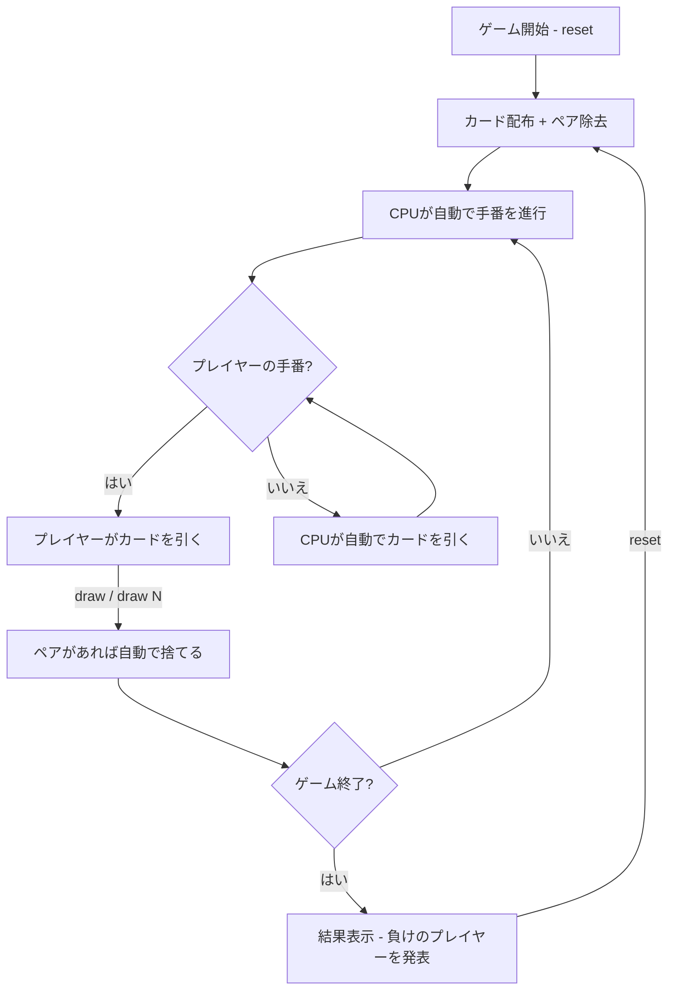

# ババ抜き（CUI版）遊び方

## ゲーム概要

4人（プレイヤー1人 + CPU 3人）で遊ぶカードゲームです。ペアを揃えて手札をなくしていき、最後にジョーカーを持っているプレイヤーが負けです。

## 起動方法

```sh
go run ./cmd/trumpcards oldmaid
go run ./cmd/trumpcards --lang en oldmaid  # 英語モード
```

## ルール

### 基本ルール

- 52枚のトランプ + ジョーカー1枚（合計53枚）を使用
- 全カードを4人に配布し、最初に手札内のペア（同じ数字2枚）を全て捨てる
- 順番に次のプレイヤーの手札から1枚引き、ペアができたら捨てる
- 手札がなくなったプレイヤーから上がり
- 最後にジョーカーが残ったプレイヤーが負け

### ジジ抜きモード

- ジョーカーを使わず、52枚から1枚をランダムに除外して51枚で遊ぶ
- 除外されたカードの対となるカードが「奇数カード」（=ババ）となる
- `sm 1` コマンドで切り替え可能

### プレイ順

- 4人のプレイ順はラウンド開始時にランダムに決定されます
- 上がったプレイヤーはスキップされます

## ゲームの流れ



## コマンド一覧

### 基本コマンド

| コマンド | 短縮形 | 説明 |
|----------|--------|------|
| `reset` | `r` | 新しいゲームを開始（現在の設定を維持） |
| `draw` | `d` | 次のプレイヤーからランダムに1枚引く |
| `draw N` | `d N` | 次のプレイヤーの手札からインデックスNのカードを引く（例: `d 2`） |
| `shuffle` | `s` | 自分の手札をランダムに並べ替える |
| `reorder i0 i1 ...` | `ro i0 i1 ...` | 自分の手札を指定した順番に並べ替える（例: `ro 2 0 1`） |
| `quit` | `q` | ゲーム終了 |
| `help` | `?` | コマンド一覧を表示 |

### 設定コマンド

| コマンド | 短縮形 | 説明 |
|----------|--------|------|
| `setmode N` | `sm N` | ゲームモード変更（0=ノーマル, 1=ジジ抜き） |
| `setplacementstrategy N` | `sps N` | CPU心理戦の切替（0=OFF, 1=ON） |
| `setmemoryai N` | `sma N` | CPU記憶AIの切替（0=OFF, 1=ON） |
| `setmetaai N` | `smai N` | Meta-AI の切替（0=OFF, 1=ON） |
| `resetprofile` | `rp` | Meta-AI のプロファイル（学習データ）をリセット |

> **Note**: 設定コマンドを実行するとゲームがリセットされます。`r`（reset）コマンドは現在の設定を維持してリセットします。

## CPU AI機能

### CPU心理戦（`sps 1`で有効化）

CPUが人間プレイヤーのドロー対象となった際に、奇数カード（ジョーカーまたはペアにならないカード）を手札の端（先頭か末尾）に配置します。端のカードを引く傾向がある場合に有利になる心理戦略です。

### CPU記憶AI（`sma 1`で有効化）

CPUが人間プレイヤーから引く際に、過去の引き位置を記憶して戦略的にカードを選択します：
- 前回引いた位置でペアができた場合、その近傍（±1）を優先
- 前回引いた位置でペアができなかった場合、その位置を回避
- 人間が手札をシャッフルまたは並べ替えた場合、記憶をリセット

## 画面の見方

```
==========
Old Maid (ババ抜き)
==========
[You]: 12枚
[0]SPADE 3  [1]HEART 5  [2]DIAMOND 9  ...
CPU 1: 13枚
CPU 2: 上がり
CPU 3: 12枚
----------
あなたがCPU 1から1枚引きました (HEART 9)。1組捨てました
[CPUの行動]
CPU 1がCPU 3から1枚引きました。2組捨てました
...
[引き履歴]
1. Player 1 → CPU 1: 1組捨て
2. CPU 1 → CPU 3: 2組捨て
手番: あなた → CPU 1から引きます
==========
```

- `[You]: N枚`: プレイヤーの手札枚数（カード内容も表示）
- `CPU N: M枚`: CPUの手札枚数（カード内容は非表示）
- `上がり`: そのプレイヤーは手札がなくなり終了
- `[0]`, `[1]`...: カードのインデックス（`draw N` で指定可能）
- `手番: あなた → CPU Nから引きます`: 誰から引くかの案内
- `[引き履歴]`: ゲーム全体の引きの履歴（番号付き、誰が誰から引いたか・捨てたペア数・上がりフラグを表示）

## 遊び方のコツ

- `draw`（ランダム）でも `draw N`（インデックス指定）でもカードを引けます
- 相手の手札は裏向きなので、インデックス指定でも何が引けるかはわかりません
- CPUの行動は自動で進行し、結果がログに表示されます
- CPUは端のカードを優先して引く傾向があるので、`shuffle` や `reorder` で手札を並べ替え、ジョーカーを端から遠ざけると有利です
- `reorder` コマンドで手札の順番を自由に指定できます（例: 手札が5枚の場合 `ro 4 3 2 1 0` で逆順に）
