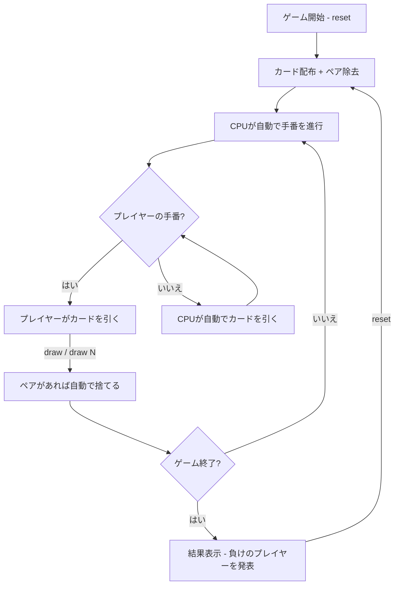

# ババ抜き（CUI版）遊び方

## ゲーム概要

4人（プレイヤー1人 + CPU 3人）で遊ぶカードゲームです。ペアを揃えて手札をなくしていき、最後にジョーカーを持っているプレイヤーが負けです。

## 起動方法

```sh
go run ./cmd/cli oldmaid
```

## ルール

### 基本ルール

- 52枚のトランプ + ジョーカー1枚（合計53枚）を使用
- 全カードを4人に配布し、最初に手札内のペア（同じ数字2枚）を全て捨てる
- 順番に次のプレイヤーの手札から1枚引き、ペアができたら捨てる
- 手札がなくなったプレイヤーから上がり
- 最後にジョーカーが残ったプレイヤーが負け

### プレイ順

- 4人のプレイ順はラウンド開始時にランダムに決定されます
- 上がったプレイヤーはスキップされます

## ゲームの流れ



## コマンド一覧

| コマンド | 短縮形 | 説明 |
|----------|--------|------|
| `reset` | `r` | 新しいゲームを開始 |
| `draw` | `d` | 次のプレイヤーからランダムに1枚引く |
| `draw N` | `d N` | 次のプレイヤーの手札からインデックスNのカードを引く（例: `d 2`） |
| `quit` | `q` | ゲーム終了 |

## 画面の見方

```
==========
Old Maid (ババ抜き)
==========
[You]: 12枚
[0]SPADE 3  [1]HEART 5  [2]DIAMOND 9  ...
CPU 1: 13枚
CPU 2: 上がり
CPU 3: 12枚
----------
あなたがCPU 1から1枚引きました (HEART 9)。1組捨てました
[CPUの行動]
CPU 1がCPU 3から1枚引きました。2組捨てました
...
手番: あなた → CPU 1から引きます
==========
```

- `[You]: N枚`: プレイヤーの手札枚数（カード内容も表示）
- `CPU N: M枚`: CPUの手札枚数（カード内容は非表示）
- `上がり`: そのプレイヤーは手札がなくなり終了
- `[0]`, `[1]`...: カードのインデックス（`draw N` で指定可能）
- `手番: あなた → CPU Nから引きます`: 誰から引くかの案内

## 遊び方のコツ

- `draw`（ランダム）でも `draw N`（インデックス指定）でもカードを引けます
- 相手の手札は裏向きなので、インデックス指定でも何が引けるかはわかりません
- CPUの行動は自動で進行し、結果がログに表示されます
