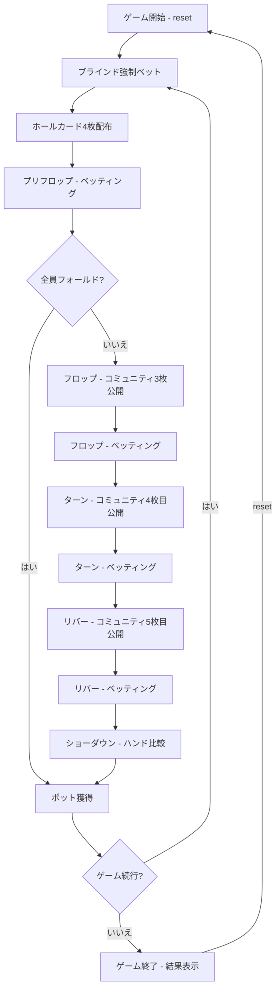

# オマハホールデム（CUI版）遊び方

## ゲーム概要

オマハホールデムポーカーです。テキサスホールデムの派生ゲームで、各プレイヤーに4枚のホールカードが配られます。テーブルサイズは4-max（デフォルト、1人+CPU 3人）、6-max（1人+CPU 5人）、9-max（1人+CPU 8人）から選択できます。各CPUは異なるプレイスタイル（TAG/LAP/TAP/LAG/GTO）を持ち、ブラフを含む戦略的なプレイをします。サイドポットにも対応しています。

HUD統計（VPIP%/PFR%/3Bet%/AF）が全プレイヤーに表示され、トーナメントモードではブラインドが自動上昇します。リバイとアドオンにも対応しています。

## 起動方法

```sh
go run ./cmd/trumpcards omaha
go run ./cmd/trumpcards --lang en omaha  # 英語モード
```

## ルール

### 基本ルール

- 52枚のトランプを使用
- 各プレイヤーに**4枚**のホールカード（手札）が配られる
- 場にコミュニティカード（共有カード）が最大5枚公開される
- **ホールカードから必ず2枚**、**コミュニティカードから必ず3枚**を使って5枚の役を作る（テキサスホールデムとの最大の違い）
- 最も強い役を持つプレイヤーがポットを獲得する

### ゲームの進行

1. **ブラインド**: ディーラーの左隣がスモールブラインド（デフォルト5）、その左隣がビッグブラインド（デフォルト10）を強制ベット
2. **プリフロップ**: ホールカード4枚配布後、最初のベッティングラウンド
3. **フロップ**: コミュニティカード3枚公開後、ベッティングラウンド
4. **ターン**: コミュニティカード4枚目公開後、ベッティングラウンド
5. **リバー**: コミュニティカード5枚目公開後、最後のベッティングラウンド
6. **ショーダウン**: 残ったプレイヤーのハンドを比較

### ベッティングリミット

- **Fixed Limit** (0): レイズ額が固定
- **Pot Limit** (1): ポット額までレイズ可能（デフォルト）
- **No Limit** (2): 全チップまでレイズ可能

### ゲーム終了

- チップが0になったプレイヤーは脱落（トーナメントモードではリバイ可能）
- 最後の1人になったらゲーム終了

### 学習モード表示

自分の手番では、盤面の下に `[学習モード]` として**勝率**と**ポットオッズ**が出ます。
勝率がポットオッズを上回っていれば +EV（コール有利）、下回っていれば -EV です。
降りている場合や CPU の手番では出ません。

## ゲームの流れ



## コマンド一覧

| コマンド | 短縮形 | 説明 |
|----------|--------|------|
| `reset` | `r` | ゲームリセット（設定保持） |
| `fold` | `f` | フォールド |
| `check` | `ck` | チェック |
| `call` | `c` | コール |
| `bet <額>` | `b <額>` | ベット |
| `raise <額>` | `ra <額>` | レイズ |
| `allin` | `a` | オールイン |
| `muck` | `m` | マック（手札を伏せる） |
| `show` | `sh` | ショー（手札を公開する） |
| `rebuy` | `rb` | リバイ |
| `skiprebuy` | `sr` | リバイスキップ |
| `addon` | `ad` | アドオン |
| `skipaddon` | `sa` | アドオンスキップ |
| `bettinglimit <0-2>` | `bl <0-2>` | ベッティングリミット (0=Fixed, 1=PotLimit, 2=NoLimit) |
| `tournament <0-1>` | `tm <0-1>` | トーナメントモード切替 |
| `smallblind <額>` | `sb <額>` | スモールブラインド設定 |
| `bigblind <額>` | `bb <額>` | ビッグブラインド設定 |
| `levelhand <数>` | `lh <数>` | ブラインドレベルアップハンド数 |
| `tablesize <4\|6\|9>` | `ts <4\|6\|9>` | テーブルサイズ変更 |
| `metaai <0\|1>` | `mai <0\|1>` | メタAI切替 (CPUがプレイスタイルを学習) |
| `log` | `l` | 棋譜表示 |
| `quit` | `q` | ゲーム終了 |
| `help` | `?` | ヘルプ表示 |

### コマンド例

- `c` → コール
- `ra 100` → 100にレイズ
- `b 50` → 50をベット
- `a` → オールイン
- `ts 6` → テーブルサイズを6-maxに変更
- `bl 2` → ノーリミットに変更

## 画面の見方

```
==========
Omaha Hold'em (オマハホールデム)
==========
※手札4枚のうちちょうど2枚＋ボード3枚を使用
テーブル: 4-max
ディーラー: あなた
コミュニティ: (なし)
ポット: 15
リミット: Fixed
----------
あなた チップ:1000 VPIP:0% PFR:0% 3Bet:0% AF:-
  手札: ♥3  ♥4  ♠8  ♠11
CPU 1 (LAP) チップ:995 VPIP:0% PFR:0% 3Bet:0% AF:- ベット:5
CPU 2 (TAP) チップ:990 VPIP:0% PFR:0% 3Bet:0% AF:- ベット:10
CPU 3 (GTO) チップ:1000 VPIP:0% PFR:0% 3Bet:0% AF:- [フォールド]
----------
[学習モード]
  勝率: 31.8% / ポットオッズ: 40.0%
  -EV (勝率がポットオッズ以下です。コール不利)
----------
[CPU行動]/c/b <額>/ra <額>/a
==========
```

- `※手札4枚のうちちょうど2枚＋ボード3枚を使用`: オマハ固有の制約を
  常に画面上部に出しています
- `テーブル:` / `ディーラー:` / `コミュニティ:` / `ポット:` / `リミット:`:
  **それぞれ独立した行**です（1 行にまとめては出ません）。
  コミュニティが未公開のうちは `(なし)`
- プレイヤー行: `名前 チップ:N VPIP:0% PFR:0% 3Bet:0% AF:-` — 統計は
  **同じ行に並びます**（`HUD:` という行はありません）。CPU には
  `(LAP)` `(TAP)` `(GTO)` のような打ち筋のラベルが付き、
  `ベット:5` や `[フォールド]` が状況に応じて後ろに付きます
- `  手札: ♥3  ♥4  ♠8  ♠11`: あなたの 4 枚。**スート記号で表示されます**
- `[学習モード]` の 3 行: **勝率とポットオッズを並べて、コールが
  +EV か -EV かまで出します**。オマハで最も判断の助けになる表示です
- `[CPU行動]`: 直前に CPU が何をしたか

## 遊び方のコツ

- テキサスホールデムと異なり、**必ずホールカード2枚を使う**ルールに注意しましょう
- ダブルスーテッド（2組のスートペア）のハンドは強力です
- コネクター（連続した数字）を多く含むハンドはストレートの可能性が高まります
- ナッツ（最強ハンド）を狙える状況でのみ大きくベットするのが安全です
- ポットリミットのため、テキサスホールデムよりもポットコントロールが重要です
