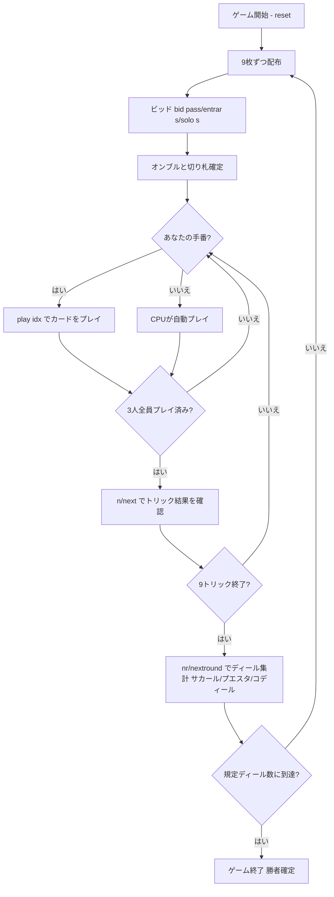

# オンブル（CUI版）遊び方

## ゲーム概要

Ombre（Hombre / オンブル）は17世紀ヨーロッパを席巻したスペイン発祥の**トリックテイキングゲーム**です。40枚のスペイン式デッキ（8/9/10 を除く）を3人でプレイし、入札で名乗りを上げた1人の**オンブル（Ombre）**が残り2人の**連合（coalition）**を相手に9トリックを1人で戦います。

## 起動方法

```sh
go run ./cmd/trumpcards ombre
go run ./cmd/trumpcards --lang en ombre  # 英語モード
```

## ルール

### デッキと配布

- **デッキ**: 40枚のスペイン式カード（A, 2, 3, 4, 5, 6, 7, J, Q, K × 4スート。8/9/10 は除外）。
- **プレイヤー**: 3人（プレイヤー0 = あなた、プレイヤー1〜2 = CPU）
- **配布**: 各プレイヤー9枚（合計27枚）。残り13枚はストックとして未使用のまま残ります。

### ビッド（オークション）

- 前手（forehand = ディーラーの左隣）から順に、各プレイヤーは次のいずれかを宣言します。
  - **パス（pass）**: 降りる。
  - **エントラール（entrar）**: 名乗りを上げる（切り札スートを指定）。
  - **ソロ（solo）**: より強い名乗り（切り札スートを指定）。
- 最も高い宣言をしたプレイヤーが**オンブル**になり、その指定した**切り札スート**が決まります。

### 切り札とカードの強さ

切り札グループの強さ（強い順）:

**スパディーユ（♠A）＞マニーユ（切り札の7）＞バスト（♣A）＞プント（切り札のA、赤の切り札のみ）＞K＞Q＞J＞6＞5＞4＞3＞2**（切り札）

- スパディーユ（♠A）とバスト（♣A）は常に切り札（マタドール）として扱われます。
- 非切り札の強さは、黒スート: K>Q>J>7>6>5>4>3>2、赤スート: K>Q>J>A>2>3>4>5>6>7。

### フォロー義務

- リードスートを持っていれば**必ず従わなければなりません（must-follow）**。ボイド時は任意の札（切り札を含む）を出せます。

### 得点と勝利条件

- 1ディールごとに、オンブルが最多トリックを取れば**サカール（Sacar）**でオンブルの勝ち、オンブル +2 / 各相手 -1。
- オンブルが相手と並ばれた場合は**プエスタ（Puesta）**でオンブルの負け、オンブル -2 / 各相手 +1。
- 相手の1人がオンブルを上回った場合は**コディール（Codille）**で、オンブル -4 / 各相手 +2（失点が倍）。
- **マッチ勝利**: 規定ディール数（既定 **5**）を配り終えた時点で累積得点が最上位のプレイヤーが勝者。

## ゲームの流れ



## コマンド一覧

| コマンド | 短縮形 | 説明 |
|----------|--------|------|
| `bid pass` | `b` | パス（降りる） |
| `bid entrar <s\|c\|h\|d>` | `b` | エントラールを切り札スート指定で宣言 |
| `bid solo <s\|c\|h\|d>` | `b` | ソロを切り札スート指定で宣言 |
| `play <idx>` | `p` | 手札のidx番目のカードを出す |
| `next` | `n` | 次のトリックへ進む |
| `nextround` | `nr` | 次のディールへ進む |
| `setdifficulty <0-2>` | `sd` | CPU難易度設定（0=Easy, 1=Normal, 2=Hard） |
| `hint` | `h` | 推奨アクションを表示 |
| `log` | `l` | アクションログを表示 |
| `reset` | `r` | 新しいゲームを開始（設定保持） |
| `quit` | `q` | ゲーム終了 |
| `help` | `?` | コマンド一覧を表示 |

## 画面の見方

- **手札**: プレイ可能な札（フォロー義務でフィルタ済み）が表示されます。
- **プレイヤー情報**: 各プレイヤーの累積得点・オンブルの表示・獲得トリック数。
- **現在のトリック**: 場に出ている札とリードプレイヤー。
- **ディール結果**: サカール／プエスタ／コディールと点数の移動。

## 遊び方のコツ

- **強い手のときだけ宣言せよ**: マタドール（スパディーユ・マニーユ・バスト）や長い切り札を持っているかを見て、エントラールかソロかを判断しましょう。
- **切り札スートの選択が要**: 手札で最も長く強いスートを切り札に選ぶのが基本です。
- **フォロー義務を意識する**: リードスートを持っていれば必ず従う必要があります。ボイド時に切り札を切って主導権を握りましょう。
- **連合側は協力プレイ**: あなたがオンブルでない場合、もう1人の連合と協力してコディール（相手勝ち）を狙い、失点を倍にしましょう。
