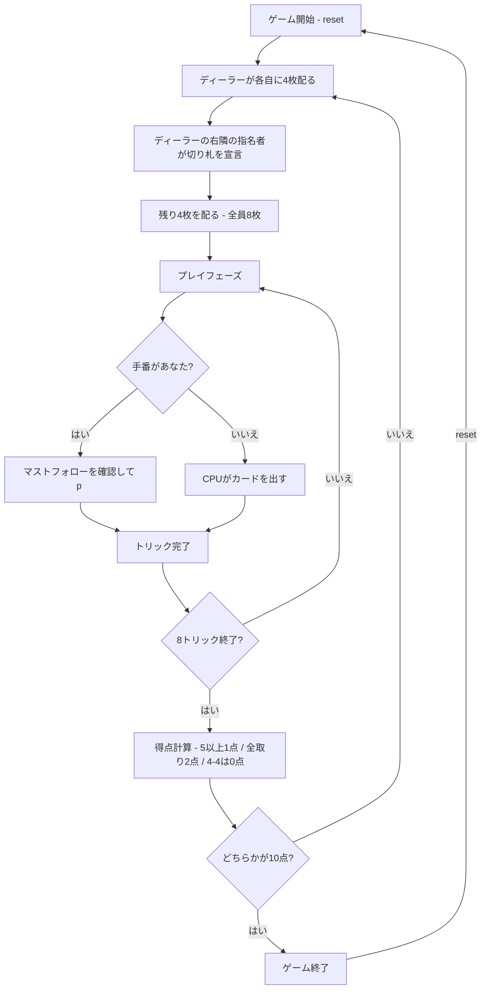

# オミ（CUI版）遊び方

## ゲーム概要

オミは、4人（あなたとCPU 3人）が向かい合う2チーム（席0+2 対 席1+3）で競う、8トリックのマストフォロー型ゲームです。32枚（各スート7, 8, 9, 10, J, Q, K, A）を使い、先に10点に到達したチームが勝ちます。

## 起動方法

```sh
go run ./cmd/trumpcards omi
go run ./cmd/trumpcards --lang en omi  # 英語モード
```

## ルール

### 配りと切り札

- ディーラーの右隣（`(dealerIdx+1)%4`）の1人だけが指名者です。パスはなく、毎ラウンド必ず指名者が切り札を宣言します。
- まず各自に4枚を配り、指名者が切り札を宣言した後、残り4枚を配ります。宣言後は全員の手札が8枚になります。
- 切り札はスペード、クラブ、ハート、ダイヤのいずれかです。CUI では `t <1-4>` を使い、1=♠、2=♣、3=♥、4=♦ です。
- 同じスートでは `A > K > Q > J > 10 > 9 > 8 > 7` の順です。ジャックの昇格（右バウアー/左バウアー）はありません。

### トリック

- 4人で8トリックを行います。
- リードされたスートを持っていれば、必ずそのスートを出します（マストフォロー）。
- リードスートを持っていなければ、切り札を含む任意の札を出せます。切り札を強制するルールはありません。
- 切り札が出ていれば最も強い切り札、なければリードスートの最も強い札がトリックを取り、勝者が次のトリックをリードします。

### 得点と終局

- 5トリック以上を取ったチームは1点です。
- 8トリックをすべて取る「オミ」は、合計2点です（1点にボーナスを加える表現ではありません）。
- 4-4 の引き分けは、両チームとも0点です。
- どちらかが10点に到達した時点でゲーム終了です。

## ゲームの流れ



## コマンド一覧

| コマンド | 短縮形 | 説明 |
|----------|--------|------|
| `reset` | `r` | ゲームをリセット（設定を保持） |
| `trump <1-4>` | `t <1-4>` | 切り札を宣言（1=♠、2=♣、3=♥、4=♦）。`c` / `call` も同じ |
| `play <i>` | `p <i>` | 手札インデックス `i`（0始まり）のカードを出す |
| `next` | `n` | トリック終了後、次のトリックへ進む |
| `nextround` | `nr` | ラウンド終了後、得点を確定して次ラウンドへ進む |
| `setdifficulty <0-2>` | `sd <0-2>` | CPU難易度を設定（0=Easy、1=Normal、2=Hard） |
| `setlimit <n>` | `sl <n>` | 終了点を設定 |
| `hint` | `h` | 切り札またはプレイのヒントを表示 |
| `log` | `l` | 棋譜を表示 |
| `quit` | `q` | ゲームを終了 |
| `help` | `?` | コマンド一覧を表示 |

ピックアップ、パス、捨て札のコマンドはありません。

## 画面の見方

切り札宣言前（日本語、実際の `go run ./cmd/trumpcards omi` の出力）:

```
==========
Omi (オミ)
==========
ラウンド: 4  トリック: 0
ディーラー: CPU 3
指名者: あなた
切り札: 未決定
各自に4枚配られました。切り札を宣言してください。
得点規則: 5トリック以上で1点、全取り(8トリック)で2点、4-4引き分けは0点
チーム0: 0点 (0トリック)  チーム1: 2点 (0トリック)
あなた: チーム0 獲得0トリック 4枚
[0]SPADE 9  [1]SPADE 11  [2]CLOVER 10  [3]HEART 1
...
----------
コールトランプフェーズ: あなたの番
t <1-4> (1=♠ 2=♣ 3=♥ 4=♦)
==========
```

切り札宣言後（日本語、実際の出力形式）:

```
==========
Omi (オミ)
==========
ラウンド: 1  トリック: 1
ディーラー: あなた
指名者: CPU 1
切り札: SPADE (指名: CPU 1 / チーム1)
残り4枚が配られ、全員の手札が8枚になりました。
得点規則: 5トリック以上で1点、全取り(8トリック)で2点、4-4引き分けは0点
チーム0: 0点 (0トリック)  チーム1: 0点 (0トリック)
あなた: チーム0 獲得0トリック 8枚
[0]SPADE 8*  [1]SPADE 10*  [2]CLOVER 8  [3]CLOVER 13  [4]HEART 8  [5]HEART 11  [6]HEART 12  [7]DIAMOND 11
CPU 1: チーム1 獲得0トリック 7枚
CPU 2: チーム0 獲得0トリック 7枚
CPU 3: チーム1 獲得0トリック 7枚
----------
トリック: CPU 1=SPADE 1, CPU 2=SPADE 7, CPU 3=SPADE 9
手番: あなた
p <i> (play)
==========
```

英語モードでは、例えば宣言後に次のように表示されます（実際に `go run ./cmd/trumpcards --lang en omi` を実行した出力形式です）。

```
Round: 1  Trick: 1
Dealer: You
Trump caller: CPU 1
Trump: SPADE (Caller: CPU 1 / Team 1)
Remaining 4 cards dealt. Hands are now 8 cards.
Scoring: 1 pt for 5+ tricks, 2 pts for all 8 tricks (Omi), 0 pts for 4-4 draw
You: Team 0 tricks=0 cards=8
[0]SPADE 9*  [1]CLOVER 11  [2]HEART 9  [3]HEART 11  [4]DIAMOND 8  [5]DIAMOND 9  [6]DIAMOND 13  [7]DIAMOND 1
You to play
p <i> (play)
```

- 手札の番号は0始まりです。`*` は現在の状況で合法なカードです。
- `切り札: 未決定` と4枚表示の間は宣言前、`残り4枚が配られ...` と8枚表示の後は宣言済みです。
- `チームN: ...` は累計得点とそのラウンドの獲得トリック数です。
- `CPU 1` などのCPUの手札は枚数だけが表示されます。

## 遊び方のコツ

- 指名者は必ず宣言するため、最初の4枚で切り札の長さと高い札を見極めます。
- リードスートを持たないときは切り札で勝ちに行くか、不要な札を捨てるかを選べます。
- 5トリック以上を確実に狙うか、8トリック全取りの2点を狙うかを、パートナーの獲得トリックも見ながら判断します。
