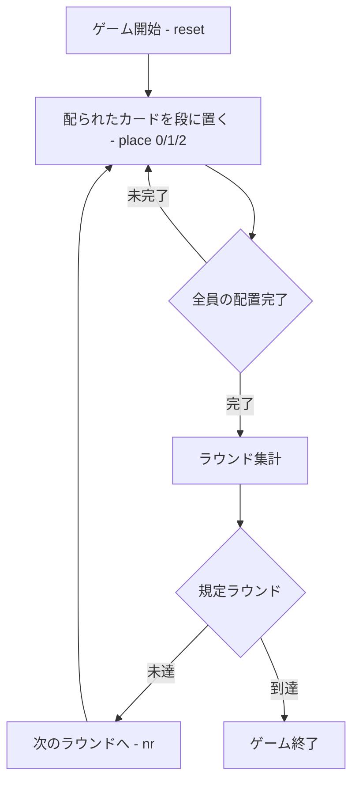

# オープンフェイス・チャイニーズポーカー（CUI版）遊び方

## ゲーム概要

オープンフェイス・チャイニーズポーカー（Open Face Chinese Poker / OFC）は、CPU を相手に 2〜4 人で対戦する、ソリティアとポーカーを融合させたゲームです。標準52枚デッキを使い、配られたカードをトップ（3枚）・ミドル（5枚）・ボトム（5枚）の3段に置いていきます。一度置いたカードは動かせません。規定ラウンド終了時に累計得点が最も高いプレイヤーが勝者です。

## 起動方法

```sh
go run ./cmd/trumpcards openfacechinese
go run ./cmd/trumpcards --lang en openfacechinese  # 英語モード
```

## ルール

### 基本の流れ

1. **配置**: カードは1枚ずつ配られます。配られるたびに、トップ・ミドル・ボトムのいずれかの段へ即座に置きます。
2. **段の強さ**: 3段はトップからボトムへ向かって強さが弱くならない順（非減少）に並べる必要があります。トップ < ミドル < ボトム の強さ順を崩すと「ファウル」となり、そのラウンドは得点なしになります。
3. **得点**: 各ラウンドの終了時に段ごとに他プレイヤーと比較し、勝った段の数を得点化します。強い役を作るとロイヤリティ（ボーナス点）が加算されます。
4. **ファンタジーランド**: トップに高い役（クイーンのペア以上）を作るとファンタジーランドに到達します。

### CPU難易度

`sd` コマンドで CPU の難易度（0〜2）を設定できます。

### ゲーム終了

規定ラウンド数を消化すると終了し、累計得点が最も高いプレイヤーが勝者です。

## ゲームの流れ



## コマンド一覧

| コマンド | 短縮形 | 説明 |
|----------|--------|------|
| `place <0/1/2>` | `p` | 保留カードを段に置く（0=トップ, 1=ミドル, 2=ボトム） |
| `front` | `f` | 上段（トップ）に置く（`place 0`と同じ） |
| `middle` | `m` | 中段（ミドル）に置く（`place 1`と同じ） |
| `back` | `b` | 下段（ボトム）に置く（`place 2`と同じ） |
| `nextround` | `nr` | 次のラウンドへ |
| `setdifficulty <0-2>` | `sd` | CPU難易度を設定 |
| `setplayers <2-4>` | `sp` | プレイヤー数を設定 |
| `log` | `l` | 棋譜を表示 |
| `reset` | `r` | 新しいゲームを開始 |
| `quit` | `q` | ゲーム終了 |
| `help` | `?` | コマンド一覧を表示 |

## 画面の見方

```
----------
round: 1
phase: PLACING
pending: ♠A
--- YOU ---
  front : ♥3 ♣4
  middle: ♠5 ♥6
  back  : ♠10 ♥J
----------
```

- `round` … 現在のラウンド数
- `phase` … 現在のフェーズ（PLACING / ROUND END / GAME END）
- `pending` … これから置くカード
- `front` / `middle` / `back` … 各段に置かれているカード

## 遊び方のコツ

- ボトムから強い役を作り、トップが最も弱くなるよう逆算して置いていくとファウルを避けやすくなります。
- 高得点を狙ってトップにペアを作りすぎると、ミドル・ボトムが弱くなりファウルしやすい点に注意しましょう。
