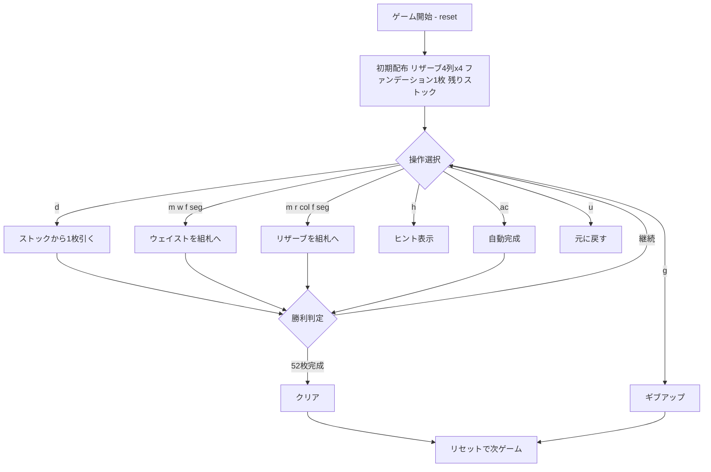

# オズモシス（CUI版）遊び方

## ゲーム概要

オズモシス（Osmosis、別名 Treasure Trove）は1人用ソリティア。4列×4枚のリザーブ、縦4段のファンデーション、ストックとウェイストを使い、52枚すべてをファンデーションに積み上げることを目指す。連番ではなく「上の段に置かれたランクが下の段に浸透していく」という独特のルールを持つ。

## 起動方法

```sh
go run ./cmd/trumpcards osmosis
go run ./cmd/trumpcards --lang en osmosis  # 英語モード
```

## ルール

- 各ファンデーション段は1スート専用。最初に配られた1枚のランクが「ベースランク」となる。
- 1段目（最上段）には、その段のスートのカードを**順不同**で積める。
- 2段目以降は、置こうとするランクのカードが**すぐ上の段に既に存在する**場合のみ置ける（＝浸透）。
- 空いている下段に最初のカードを置くには、そのカードがベースランクで、かつスートが他段で未使用、さらにすぐ上の段が開始済みである必要がある。
- リザーブは4列・各4枚。各列の一番上のカードのみ使用できる（補充なし・列間移動なし）。
- ストックは1枚ずつウェイストへめくる。ストックが尽きたら再利用（リサイクル）できる。
- 4段すべてが13枚（合計52枚）になればクリア。

## ゲームの流れ



## コマンド一覧

| コマンド | 短縮形 | 説明 |
|----------|--------|------|
| `d` / `draw` | `d` | ストックから1枚引く |
| `m w f <seg>` | — | ウェイストからファンデーション（seg段目）へ |
| `m r <col> f <seg>` | — | リザーブ（col列）からファンデーション（seg段目）へ |
| `g` / `giveup` | `g` | ギブアップ |
| `hint` | `h` | ヒント |
| `ac` / `autocomplete` | `ac` | 自動完成 |
| `u` / `undo` | `u` | 元に戻す |
| `log` | `l` | 棋譜表示 |
| `reset` | `r` | リセット |
| `quit` | `q` | 終了 |
| `help` | `?` | コマンド一覧を表示 |

## 画面の見方

```
==========
Osmosis (オズモシス / 浸透)
==========
ベースランク: 8
組札0段: ♠8 (3枚)
組札1段: ♥8 (2枚)
組札2段: [空]
組札3段: [空]
----------
リザーブ0列: ♣K (4枚)
リザーブ1列: ♦5 (3枚)
リザーブ2列: ♠J (4枚)
リザーブ3列: ♥9 (2枚)
----------
ストック: 21枚 | ウェイスト: ♠4
----------
手数: 12 （戻せる手はありません）
```

- **ベースランク**: 全段の最初に置くべきランク
- **組札（ファンデーション）**: 縦4段。各段1スート。1段目は順不同、下段は上段からの浸透のみ
- **リザーブ**: 4列。各列の一番上のカードのみ使用可
- **ストック / ウェイスト**: 山札の残り枚数とウェイストのトップカード

## 遊び方のコツ

- まず1段目（最上段）をできるだけ進め、下段が積めるランクを増やす（浸透の元を作る）。
- 同じランクが複数スートで早めに揃うと連鎖的に下段が開く。
- リザーブの一番上で詰まったら、ストックを回して別の手を探す。
- 行き詰まったら `u`（元に戻す）で読み直す。
