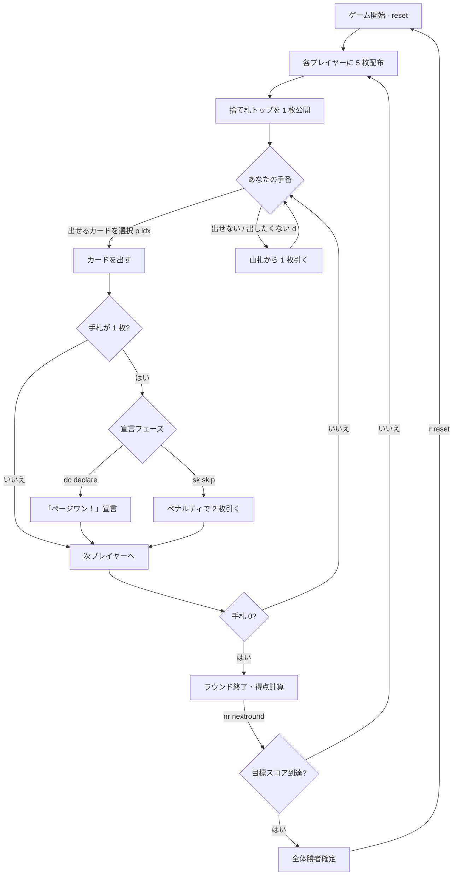

# ページワン（CUI版）遊び方

## ゲーム概要

ページワン（Page One）は日本で馴染み深い4人用マッチング系カードゲームです。UNOの原型とされ、親が出したカードと同じスートまたは同じ数字のカードを順に出していきます。手札が残り1枚になったとき「ページワン！」と宣言する必要があり、宣言を忘れるとペナルティとして山札から2枚引かされます。先に手札をすべて出し切った人がラウンドの勝者で、他プレイヤーの残り手札の合計点を獲得します。目標スコアに到達したプレイヤーが全体の勝者です。

## 起動方法

```sh
go run ./cmd/trumpcards pageone
go run ./cmd/trumpcards --lang en pageone  # 英語モード
```

## ルール

- プレイ人数: 4人（あなた + CPU 3人）
- デッキ: ジョーカー抜き52枚
- 初期配布: 各プレイヤー 5枚
- 勝利条件: 先に目標スコア（デフォルト 200点）に達したプレイヤー

### カードの出し方

- 捨て札トップと **同じスート** または **同じ数字** のカードのみ出せる
- 出せるカードがない場合は山札から1枚引く（引いたカードが出せればプレイ可、出せなければパス）

### 「ページワン！」宣言

- カードを出して手札が残り1枚になった時点で宣言フェーズに入る
- `dc` / `declare` で宣言する
- `sk` / `skip` で宣言をスキップ（ペナルティで山札から2枚引く）
- CPU は Normal / Hard 難易度では必ず宣言する。Easy 難易度は 25% の確率で宣言を忘れる

### スコア

ラウンド終了時、勝者以外の手札について以下のように加算し、合計点を勝者が獲得する。

- A = 1点
- 2〜10 = その数字と同じ点数
- J / Q / K = 各10点

## ゲームの流れ



## コマンド一覧

| コマンド | 短縮形 | 説明 |
|----------|--------|------|
| `play <idx>` | `p` | 指定インデックスのカードを出す |
| `draw` | `d` | 山札から1枚引く |
| `declare` | `dc` | 「ページワン！」と宣言する |
| `skip` | `sk` | 宣言をスキップ（2枚引くペナルティ） |
| `nextround` | `nr` | 次のラウンドに進む |
| `setdifficulty <0-2>` | `sd` | CPU 難易度（0=Easy / 1=Normal / 2=Hard） |
| `setlimit <n>` | `sl` | 目標スコアを設定 |
| `reset` | `r` | ゲームをリセット |
| `log` | `l` | 棋譜を表示 |
| `quit` | `q` | 終了 |
| `help` | `?` | コマンド一覧を表示 |

## 画面の見方

```
==========
Page One
==========
Round 1 / Target 200
Discard top: ♠ 7
Deck: 27

-- CPU1 (hand: 4, score: 0)
-- CPU2 (hand: 5, score: 0)
-- CPU3 (hand: 5, score: 0)

Your hand:
  [0] ♠ 3   [1] ♥ 7   [2] ♦ Q   [3] ♣ 9   [4] ♦ 7

Your turn > p 1
```

- `Round` : 現在のラウンド番号 / 目標スコア
- `Discard top` : 捨て札の一番上のカード（このカードとスートか数字が一致するカードのみ出せる）
- `Deck` : 山札残り枚数
- `CPU<n>` : 各 CPU の手札枚数と累積スコア
- `Your hand` : あなたの手札（`[idx]` の番号を `p <idx>` で指定して出す）

## 遊び方のコツ

- 高得点カード（J/Q/K や 10）は早めに処理し、他プレイヤーに勝たれた時の失点を抑える
- 手札が 2 枚になった時点で「次に出せるカード」を 1 枚は残しておくと、宣言後のスキップ待ちリスクを減らせる
- 山札残りが少ないときは、CPU の手札枚数から残りスートを逆算すると有利
