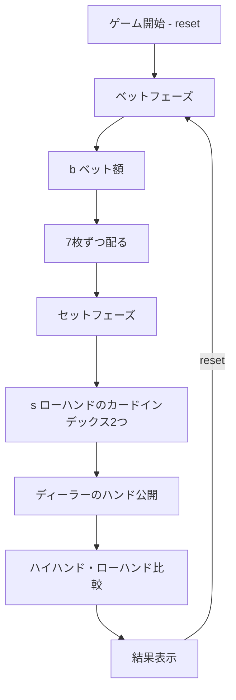

# パイゴウポーカー（CUI版）遊び方

## ゲーム概要

カジノの人気カードゲームです。7枚のカードを5枚のハイハンドと2枚のローハンドに分けてディーラーと勝負します。

## 起動方法

```sh
go run ./cmd/trumpcards paigow
go run ./cmd/trumpcards --lang en paigow  # 英語モード
```

## ルール

### 基本ルール

- 52枚のトランプ + ジョーカー1枚（計53枚）を使用
- プレイヤーとディーラーにそれぞれ7枚ずつ配る
- プレイヤーは7枚を5枚のハイハンド（高い手）と2枚のローハンド（低い手）に分ける
- ハイハンドはローハンドより強くなければならない
- ディーラーは「ハウスウェイ」に従って自動的にハンドを設定

### ジョーカーの使い方

- エースとして使用可能
- ストレート、フラッシュ、ストレートフラッシュを完成させるために使用可能

### 手札ランキング

**ハイハンド（5枚）**: 通常のポーカーハンドランキング

| ランク | 説明 |
|--------|------|
| ファイブオブアカインド | 同じランク4枚 + ジョーカー |
| ロイヤルフラッシュ | 同じスートのA-K-Q-J-10 |
| ストレートフラッシュ | 同じスートの連続5枚 |
| フォーオブアカインド | 同じランク4枚 |
| フルハウス | スリーオブアカインド + ペア |
| フラッシュ | 同じスートの5枚 |
| ストレート | 連続する5枚 |
| スリーオブアカインド | 同じランク3枚 |
| ツーペア | 2組のペア |
| ワンペア | 1組のペア |
| ハイカード | 上記以外 |

**ローハンド（2枚）**: ペア > ハイカード

### 勝敗判定と配当

| 条件 | 結果 |
|------|------|
| 両方勝ち | プレイヤー勝利（1:1 − 5%コミッション） |
| 両方負け | プレイヤー敗北（ベット没収） |
| 1勝1敗 | プッシュ（引き分け、ベット返却） |
| タイ（コピーハンド） | ディーラーの勝ち |

## ゲームの流れ



## コマンド一覧

| コマンド | 短縮形 | 説明 |
|----------|--------|------|
| `reset` | `r` | 新しいゲームを開始 |
| `bet <amount>` | `b <amount>` | ベット（金額を指定） |
| `set <low0> <low1>` | `s <low0> <low1>` | ローハンドに置くカードのインデックスを指定（0〜6） |
| `log` | `l` | アクションログ（棋譜）を表示 |
| `quit` | `q` | ゲーム終了 |
| `help` | `?` | コマンド一覧を表示 |

### コマンド例

- `r` → ゲームリセット
- `b 100` → 100チップをベット
- `s 2 5` → インデックス2と5のカードをローハンドに設定
- `l` → 棋譜を表示

## 画面の見方

```
==========
パイゴウポーカー
==========
チップ: 1000
フェーズ: BET
----------

> b 100

----------
チップ: 900
フェーズ: SET HANDS
--- PLAYER ---
カード: [0]DIAMOND 13 [1]DIAMOND 11 [2]SPADE 12 [3]CLOVER 10 [4]HEART 8 [5]HEART 11 [6]CLOVER 5
反則になる分割: [0,1] [0,5] [1,5]
----------

> s 5 6

----------
チップ: 900
フェーズ: END
--- PLAYER ---
カード: [0]DIAMOND 13 [1]DIAMOND 11 [2]SPADE 12 [3]CLOVER 10 [4]HEART 8 [5]HEART 11 [6]CLOVER 5
  ハイ: DIAMOND 13, DIAMOND 11, SPADE 12, CLOVER 10, HEART 8 (High Card)
  ロー: HEART 11, CLOVER 5 (High Card)
--- DEALER ---
  ハイ: CLOVER 13, DIAMOND 9, SPADE 9, SPADE 11, HEART 12 (One Pair)
  ロー: SPADE 10, HEART 10 (Pair)
----------
ベット: 100
ディーラーの勝ち！
----------
```

- `チップ: N` / `フェーズ: BET|SET HANDS|END`: 所持チップと現在のフェーズ
- `--- PLAYER ---` / `--- DEALER ---`: 区切りの見出し
- `カード: [0]... [6]...`: 7 枚のカード。番号がそのまま
  `s <low0> <low1>` の引数になります
- **`反則になる分割: [0,1] [0,5] [1,5]`**: **選んではいけない 2 枚の組**を
  先に教えてくれます。ローがハイより強くなる分割 (ファウル) を避けるための
  行で、ここに出ている組を指定しなければ反則にはなりません
- `  ハイ: ... (High Card)` / `  ロー: ... (Pair)`: 決着時の 5 枚 / 2 枚と役名。
  **`あなたのハイハンド` ではなく `ハイ:`** です

## 遊び方のコツ

- ハイハンドとローハンドの両方をバランスよく強くすることが重要です
- ハイハンドに全力を注いでローハンドが弱すぎると、スプリット（引き分け）になりやすいです
- ペアが2組ある場合、1組をローハンドに回すことを検討しましょう
- ジョーカーはエースとして使えるため、ローハンドのペアを作るのに有効です
- コミッション（5%）があるため、勝率50%以上を維持することが重要です
