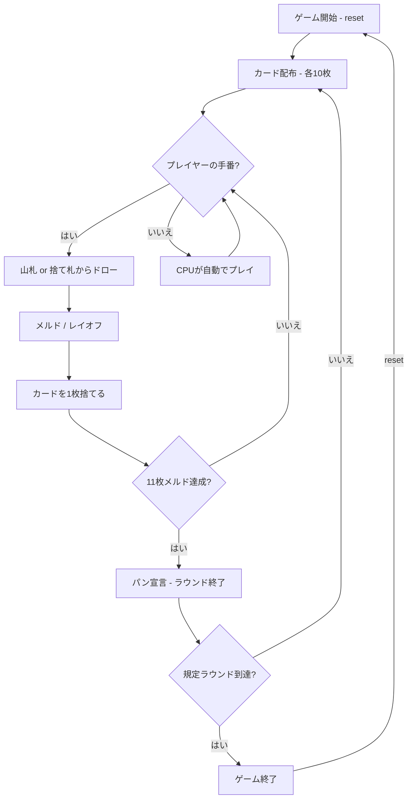

# パングインゲ（CUI版）遊び方

## ゲーム概要

3〜6人（プレイヤー1人 + CPU 2〜5人）で遊ぶ、メキシコ／アメリカ南西部のサロンで親しまれた大型多デッキラミーです。8組の40枚デッキ（8・9・10を抜いた A,2-7,J,Q,K の40枚 × 8組 = 計320枚）を使い、各プレイヤーに10枚を配ります。手番では山札または捨て札からドローし、セットやロープ（ラン）を場に出して（メルド）、既存のメルドにレイオフし、最後に1枚捨ててターンを終えます。最初に合計11枚をメルドしたプレイヤーが「パン」を宣言して勝利します。有効なメルドを出すと自動的に他プレイヤーからチップが支払われます。

## 起動方法

```sh
go run ./cmd/trumpcards pan
go run ./cmd/trumpcards --lang en pan  # 英語モード
```

## ルール

### 基本ルール

- 8デッキ（各40枚、8・9・10なし、計320枚）を使用、3〜6人プレイ
- 各プレイヤーに10枚ずつ配り、1枚を表向きにして捨て札の山を開始、残りは山札（ストック）
- 手番ではまず山札または捨て札の山からカードを1枚ドローする
- その後、メルド（セットやロープを場に出す）やレイオフを行い、最後に1枚捨ててターンを終える
- 合計11枚をメルドしたプレイヤーが「パン」を宣言して勝利

### メルド（セットとロープ）

- **セット**: 同ランク3枚以上（スートの扱いはパン独自ルールに従う）
- **ロープ（ラン）**: 同スート3枚以上の連続。8・9・10がないため 7 の次は J として扱う
- メルドは3枚以上で場に出す。既存のメルドには1枚ずつレイオフできる

### チップ

- 条件を満たすメルド（コンディション）を出すと、他プレイヤーから自動的にチップが支払われる
- 各プレイヤーのチップ残高が画面に表示される
- 3・5・7 のセットは「バジェ（valle）」でチップ条件のひとつ。該当するメルドの行末に `★バジェ` が付く

### ゲーム終了

- 誰かが「パン」（11枚メルド）に達するとラウンド終了。規定ラウンド消化時点のチップ／スコアで勝敗を決める

### CPU難易度

- **Easy** (0): ランダムに近いプレイ
- **Normal** (1): 基本的なメルド戦略（デフォルト）
- **Hard** (2): 戦略的なプレイ

## ゲームの流れ



## コマンド一覧

| コマンド | 短縮形 | 説明 |
|----------|--------|------|
| `reset` | `r` | ゲームリセット（設定保持） |
| `drawstock` | `ds` | 山札から1枚ドロー |
| `drawdiscard` | `dd` | 捨て札の山から1枚ドロー |
| `meld <idx...>` | `m <idx...>` | 手札から3枚以上を選んでメルドを場に出す |
| `layoff <owner> <meld> <idx>` | `lo <owner> <meld> <idx>` | 既存のメルドに手札1枚をレイオフ |
| `discard <idx>` | `d <idx>` | カードを捨ててターン終了 |
| `nextround` | `nr` | ラウンドをスコアリングして次のラウンドへ |
| `setplayers <3-6>` | `pc <3-6>` | プレイヤー数設定 |
| `setdifficulty <0-2>` | `sd <0-2>` | CPU難易度設定（0=Easy, 1=Normal, 2=Hard） |
| `setrounds <n>` | `sr <n>` | ラウンド数設定 |
| `log` | `l` | 棋譜表示 |
| `quit` | `q` | ゲーム終了 |
| `help` | `?` | ヘルプ表示 |

### コマンド例

- `ds` → 山札から1枚ドロー
- `dd` → 捨て札の山からトップカードをドロー
- `m 0 1 2` → インデックス0・1・2のカードでメルドを場に出す
- `lo 1 0 3` → プレイヤー1のメルド0に、手札インデックス3のカードをレイオフ
- `d 3` → インデックス3のカードを捨ててターン終了

## 画面の見方

```
==========
Panguingue / Pan
==========
ラウンド: 1/3  山札: 250枚
捨て札: HEART 7
----------
[You]: 累積0点 チップ50 メルド0枚 手札11枚
[0]SPADE 3  [1]SPADE 4  [2]SPADE 5  ...
CPU 1: 累積0点 チップ50 メルド0枚 手札10枚
----------
手番: あなた (プレイフェーズ)
m <idx...>・・・メルドを場に出す
lo <owner> <meld> <idx>・・・レイオフ
d <idx>・・・カードを捨てる
==========
```

## 遊び方のコツ

- 早めにセットやロープを場に出して11枚メルドを目指しましょう
- 8・9・10がないため、ロープでは 7 と J が連続する点に注意
- 条件を満たすメルドはチップ収入になります。狙える手役を意識しましょう
- レイオフを使うと既存のメルドに素早く枚数を足せます
