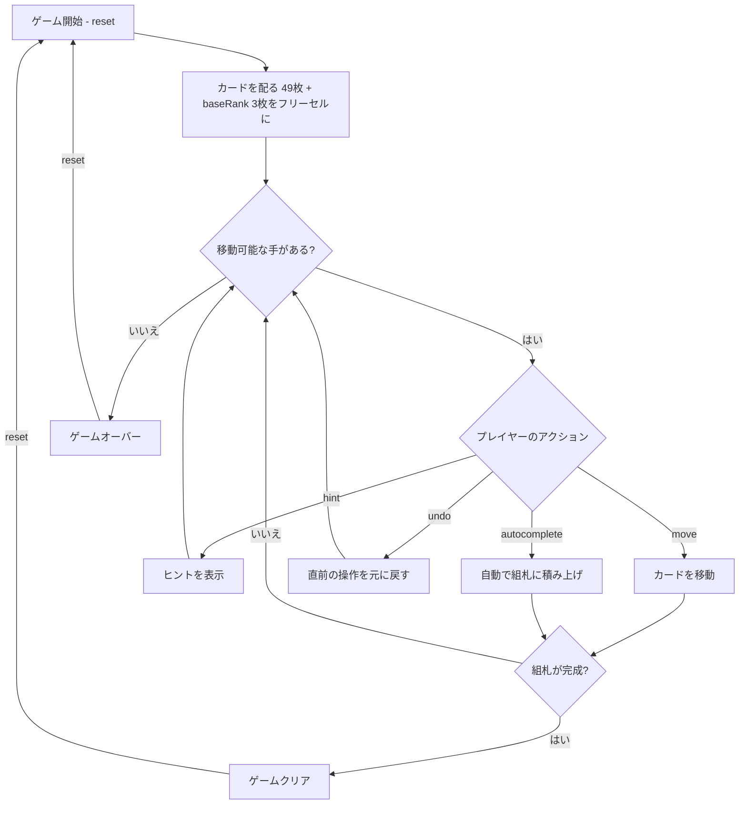

# ペンギン（CUI版）遊び方

## ゲーム概要

1人用のソリティアカードゲームで、FreeCellのバリアントです。52枚のカードを使い、7列のタブロー、7つのフリーセル（初期状態で3つが埋まっている）、4つの組札で構成されます。最初に配られたカードのランクがbaseRankとなり、同じランクの残り3枚がフリーセルに配置されます。組札にbaseRankからK→Aのラップアラウンドでスート別に積み上げればクリアです。

## 起動方法

```sh
go run ./cmd/trumpcards penguin
go run ./cmd/trumpcards --lang en penguin  # 英語モード
```

## ルール

### 基本ルール

- 52枚のトランプ（ジョーカーなし）を使用
- 最初に配られたカードのランク（baseRank）が組札の開始ランクを決定する
- baseRankと同じランクの残り3枚はフリーセルに自動配置される
- 7列のタブローに各列7枚ずつ配る（計49枚）、すべて表向き
- フリーセルは7つあり、それぞれ1枚のカードを一時的に保持できる（初期状態で3つ使用済み）
- 4つの組札（ファンデーション）はスート別にbaseRankから始め、K→Aのラップアラウンドで積み上げる
- **タブローでは「同じスート」の降順でのみ重ねる**（K→Aのラップアラウンド対応）
- **空いた列にはprevRank(baseRank)のカードのみ置くことができる**（例 = baseRankが5なら4のみ）

### スーパームーブ

一度に移動できるカード数は以下の計算式で決まります:

```
最大移動枚数 = (1 + 空きフリーセル数) × 2^(空きタブロー列数)
```

### ゲームクリア

- 4つの組札すべてに13枚ずつ積み上げるとゲームクリア

### ゲームオーバー

- これ以上移動可能な手がない場合はゲームオーバー（ギブアップ時）

### 手詰まり検出

- 各操作の後、ソルバーがボード全体を解析し、解法が存在しないと判定された場合「手詰まりです」と表示します
- 手詰まり状態では「元に戻す」またはギブアップを選択できます

## ゲームの流れ



## コマンド一覧

| コマンド | 短縮形 | 説明 |
|----------|--------|------|
| `reset` | `r` | 新しいゲームを開始 |
| `move` | `m` | カードを移動する（サブ引数で移動元・移動先を指定） |
| `undo` | `u` | 直前の操作を元に戻す |
| `giveup` | `g` | ギブアップしてゲームを終了 |
| `hint` | `h` | 次の一手のヒントを表示 |
| `autocomplete` | `ac` | 自動的に組札へ積み上げ可能なカードを移動 |
| `log` | `l` | アクションログ（棋譜）を表示 |
| `quit` | `q` | ゲーム終了 |
| `help` | `?` | コマンド一覧を表示 |

### 移動コマンドの構文

- `m t <列> f` — タブローから組札へ
- `m t <列> t <列>` — タブローの一番上のカードを別タブロー列へ
- `m t <列> <カードIdx> t <列>` — タブローのカード列をまとめて別タブロー列へ
- `m t <列> c <セル>` — タブローからフリーセルへ（0〜6）
- `m c <セル> t <列>` — フリーセルからタブローへ
- `m c <セル> f` — フリーセルから組札へ

### コマンド例

- `m t 0 c 4` → タブロー列0の一番上のカードをフリーセル4へ
- `m t 0 2 t 1` → タブロー列0の2番目以降のカード列をタブロー列1へ
- `h` → ヒントを表示

## 画面の見方

```
==========
Penguin (ペンギン)
==========
baseRank: 5
FreeCells: [♠5] [♥5] [♦5] [  ] [  ] [  ] [  ]
Foundation:  [♣5] | [空] | [空] | [空]
----------
列0: [0]♥Q [1]♥J [2]♥10 [3]♥9 [4]♥8 [5]♥7 [6]♥6
列1: [0]♠J [1]♠10 [2]♠9 [3]♠8 [4]♠7 [5]♠6 [6]♠4
列2: [0]♦Q [1]♦J [2]♦10 [3]♦9 [4]♦8 [5]♦7 [6]♦6
列3: [0]♣Q [1]♣J [2]♣10 [3]♣9 [4]♣8 [5]♣7 [6]♣6
列4: [0]♥4 [1]♥3 [2]♥2 [3]♥A [4]♥K [5]♦4 [6]♦3
列5: [0]♠3 [1]♠2 [2]♠A [3]♠K [4]♦2 [5]♦A [6]♦K
列6: [0]♣4 [1]♣3 [2]♣2 [3]♣A [4]♣K [5]♠Q [6]♠4
----------
手数: 0
==========
```

- `baseRank: 5`: 組札の開始ランク
- `FreeCells: [♠5] [♥5] ...`: 7つのフリーセルの状態（カードまたは空）
- `Foundation:`: 各スートの組札の状態（[空]は何も置かれていない状態）
- `列0: ...`: タブロー列（すべて表向き、初期は各列7枚）
- `手数: N`: 現在の手数

## 遊び方のコツ

- フリーセルは7つありますが、初期状態で既に3つ埋まっています
- タブロー移動は「同じスート」の降順でK→Aラップアラウンドが可能です
- 空いた列にはprevRank(baseRank)のカードしか置けないため、計画的に列を空けましょう
- 序盤はbaseRank+1のカードを組札に送ることを目指し、フリーセルを活用して邪魔なカードを退避させましょう
- ヒントコマンドで詰まった時のアドバイスを得られます
- オートコンプリートは組札に安全に移動できるカードがある場合に便利です
