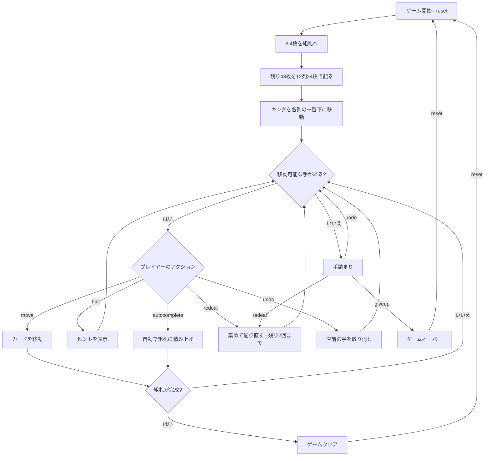

# パーシビアランス（CUI版）遊び方

## ゲーム概要

1人用のソリティアカードゲームで、**ベーカーズ・ダズンの派生**です。1デッキ（52枚）から **A 4枚を先に抜いて組札に置き**、残り48枚を **12列のタブロー（各4枚）** に配ります。配られた時点で全てのカードが表向きで、ストックやウェイストはありません。組札にA→Kまでスート別に積み上げればクリアです。

ベーカーズ・ダズンとの違いは4点。**タブローは同スート降順**（本家はスート不問）、**同スート降順の並びは一括で動かせる**（本家は1枚ずつ）、**A は最初から組札に乗っている**、そして**行き詰まったら2回まで配り直せる**。

## 起動方法

```sh
go run ./cmd/trumpcards perseverance
go run ./cmd/trumpcards --lang en perseverance  # 英語モード
```

## ルール

### 基本ルール

- 1デッキ（52枚、ジョーカーなし）を使用
- **A 4枚は配る前に組札へ置く**。残り48枚を **12列**に各4枚ずつ表向きで配る
- 配り時、各列のキング（K）は自動的に列の一番下（最初に配られた位置）へ移動する
- 4つの組札（ファンデーション）はスート別にA→Kの順に積み上げる（Aは最初から乗っている）
- タブローは**同スートでランクが1つ下**のカードにだけ重ねる（例: ♠5の上に置けるのは♠4だけ）
- **同スート降順に並んでいる部分は、まとめて動かせる**（並びが崩れていれば1枚も動かない）
- **空の列にはカードを置けない**
- 行き詰まったら `rd` で**残り札を集めて配り直せる（最大2回）**

### ゲームクリア

- 4つの組札すべてにA→Kまで13枚ずつ積み上げるとゲームクリア

### 配り直し（リディール）

- 末尾の列から順に手前の列へ重ね（列11を列10の上、それを列9の上…）、**シャッフルせずに**先頭から4枚ずつ配り直す
- したがって**配り直した並びは直前の盤から一意に決まる**。集める前にどう並べておくかがそのまま次の盤になる
- **最大2回**。使い切ると `rd` は拒否される

### ゲームオーバー

- これ以上移動可能な手がなく、配り直しも残っていなければ手詰まり（アンドゥでも打開可能）

## ゲームの流れ



## コマンド一覧

| コマンド | 短縮形 | 説明 |
|----------|--------|------|
| `reset` | `r` | 新しいゲームを開始 |
| `move` | `m` | カードを移動する（サブ引数で移動元・移動先を指定） |
| `targets` | `t` | その列の一番下のカードを置ける先を一覧する |
| `undo` | `u` | 直前の操作を元に戻す |
| `giveup` | `g` | ギブアップしてゲームを終了 |
| `hint` | `h` | 次の一手のヒントを表示 |
| `autocomplete` | `ac` | 自動的に組札へ積み上げ可能なカードを移動 |
| `redeal` | `rd` | 集めてシャッフルせずに配り直す（最大2回） |
| `log` | `l` | アクションログ（棋譜）を表示 |
| `quit` | `q` | ゲーム終了 |
| `help` | `?` | コマンド一覧を表示 |

### コマンド例

- `m 0 1` → 列0の最上段カードを列1へ移動
- `m 3 f` → 列3の最上段カードを組札（ファンデーション）へ移動
- `t 3` → 列3のカードを置ける列・組札を一覧（置ける先が無ければその旨を表示）
- `u` → 直前の操作を元に戻す
- `h` → ヒントを表示
- `ac` → オートコンプリート
- `rd` → 集めて配り直す（残り回数は画面に表示）

## 画面の見方

```
==========
Perseverance (パーシビアランス)
==========
Foundation: ♠A | ♥A | ♦A | ♣A
----------
列0: [0]♠K [1]♠5 [2]♥Q [3]♣8
列1: [0]♠K [1]♥3 [2]♦9 [3]♥7
...
列11: [0]♦K [1]♥J [2]♦9 [3]♥6
----------
注意: 空列は再利用できません
残り再配り: 2回
手数: 0
==========
```

- `Foundation`: 4つのスート別の組札の状態（開始時点で各スートのAが乗っている）
- `列N`: タブロー列（左がベース、右が最上段）。**0〜11 の12列**
- `[0]♠K`: 列内の位置インデックスとカード
- `残り再配り: N回`: `rd` をあと何回使えるか
- `手数: N`: 現在の手数

## 遊び方のコツ

- すべてのカードが表向きなので、先を見越した計画が重要です
- Aは最初から乗っているので、**早めに2を掘り出す**のが最初の目標です
- **同スートでしか重ねられない**ので、ベーカーズ・ダズンの感覚で探すと行き先を見つけられません。逆に、並びを一括で動かせるぶん深い列も崩せます
- キングは初期配置で必ず列の底に来るため、その上のカードから順に動かす計画を立てます
- 空の列ができても**カードを置けない**ため、無闇に列を空にする必要はありません
- **配り直しはシャッフルしない。**集める直前の並びが次の盤をそのまま決めるので、詰んだと思ったら「どう並べてから集めるか」を考える余地があります
- ヒント機能で詰まった時のアドバイスを得られます
