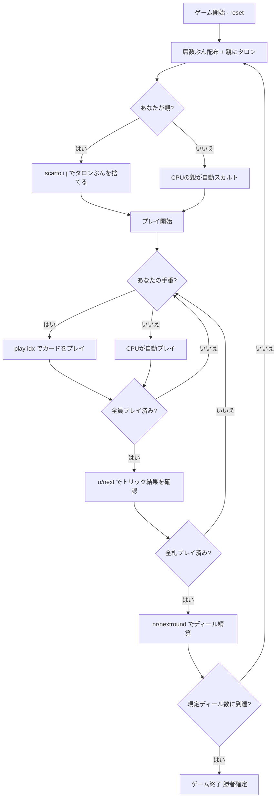

# ピエモンテ・タロッコ（CUI版）遊び方

## ゲーム概要

Tarocco Piemontese（ピエモンテ・タロッコ）はイタリア・ピエモンテ州の**78枚タロッキ・トリックテイキング**です。3〜4人で遊び、あなた（プレイヤー0）はCPUと対戦します。親（ディーラー）が余剰札（タロン）を拾って同じ枚数を伏せて捨てる「スカルト」を行い、残り札でトリックを戦います。

同じデッキを使う [スカルト](scarto.md) との違いは 2 つです。

- **人数と配り**: スカルトは3人固定ですが、こちらは**4人卓（19枚配り＋タロン2枚）**が標準で、3人卓（25枚＋タロン3枚）も選べます。
- **点の数え方**: **3枚組ごとに2点を引く**古典イタリア式で、デッキ全体でちょうど**78点**になります。

## 起動方法

```sh
go run ./cmd/trumpcards piedmontesetarot
go run ./cmd/trumpcards --lang en piedmontesetarot  # 英語モード
```

## ルール

### デッキと配布

- **デッキ**: 78枚（4スート×14枚＝1〜10・V・C・D・R、切り札1〜21、マット）。
- **プレイヤー**: 3〜4人（プレイヤー0 = あなた、残りがCPU）。既定は4人。
- **配布**: 4人卓は各19枚＋タロン2枚、3人卓は各25枚＋タロン3枚。タロンは親が拾います。

### スカルト（親の捨て札）

親はタロンぶんの札を伏せて捨てます。捨てた札は**親の獲得札に数えます**。**オヌール（切り札1＝Bagatto、切り札21＝Mondo、マット）とコート札（V・C・D・R）は捨てられません。** 捨てられるピップ札が足りないときに限り、オヌールでない切り札を捨てられます。

### フォロー義務とカードの強さ

- リードスートを持っていれば**必ず従います**。持っていなければ**切り札を出す義務**があります。
- すでに切り札が出ていれば、**可能な限りそれより上位の切り札**で応じます。
- **マット（Matto）はいつでも出せ**、フォロー義務を免れます。トリックには取られず、出した本人の獲得札に残ります。
- 最も高い切り札、なければリードスートの最も高い札がトリックを取ります。

### 得点（3枚組で数える）

| 札 | 値 |
|----|----|
| オヌール（切り札1・切り札21・マット） | 5 |
| R（Roi / キング） | 5 |
| D（Dame） | 4 |
| C（Cavalier） | 3 |
| V（Valet） | 2 |
| その他（ピップ・オヌールでない切り札） | 1 |

獲得札を**3枚ずつの組**にして、**組ごとに合計から2を引きます**。デッキ全体では 130 − 2×26 = **78点**です。

獲得枚数は3の倍数とは限らないので、内部では**1/3単位**（1枚あたり `3×値 − 2`）で持ちます。画面には `26 1/3` のように出ます ── 端数を切り捨てると卓の合計が78点になりません。

### 精算と勝利条件

- ディール得点は**ゼロサム**です: `変動 = 席数 × 自分のカード点 − 卓の合計`。合計は必ず0になります。
- **マッチ勝利**: 規定ディール数（既定 **4**）を終えた時点で累計得点が最上位の席が勝者です。同点は引き分け。

## ゲームの流れ



## コマンド一覧

| コマンド | 短縮形 | 説明 |
|----------|--------|------|
| `scarto <i> <j>` | `discard` | 親のときタロンぶんを伏せて捨てる（4人卓=2枚 / 3人卓=3枚） |
| `play <idx>` |  | 手札のidx番目のカードを出す |
| `next` | `n` | 次のトリックへ進む |
| `nextround` | `nr` | 次のディールへ進む |
| `setseats <3\|4>` | `ss` | 席数を変更（配りとタロンが変わります） |
| `setdifficulty <0-2>` | `sd` | CPU難易度（0=Easy, 1=Normal, 2=Hard） |
| `hint` | `h` | 推奨アクションを表示 |
| `log` | `l` | アクションログを表示 |
| `reset` | `r` | 新しいゲームを開始（設定保持） |
| `quit` | `q` | ゲーム終了 |
| `help` | `?` | コマンド一覧を表示 |

## 画面の見方

```
==========
ピエモンテ・タロッコ
==========
ディール: 1  トリック: 3/19
あなた (親): 17 枚  得点: 0  トリック: 0  カード点: 0 2/3
[0]♣8  [1]♣R  [2]♥6  [3]♥V  [4]♥R  [5]♦2  ...
CPU 1 (子): 17 枚  得点: 0  トリック: 0  カード点: 0
CPU 2 (子): 16 枚  得点: 0  トリック: 1  カード点: 1 1/3
----------
トリック: CPU 2=♠1, CPU 3=♠10
手番: あなた  (リードスートに従う。ボイド時は切り札。可能ならオーバートランプ)
出せる札: [9]T2  [10]T3  [11]T5  ...
play <idx> ... カードを出す
```

- **手札**は `[番号]札` の形で並びます。切り札は `T5`、マットは `MATTO`、スート札は `♠5`（コート札は `V`・`C`・`D`・`R`）。
- **出せる札**の行が、フォロー義務・切り札義務・オーバートランプ義務を満たす番号を教えます。総当たりで探す必要はありません。
- **カード点**は 1/3 単位の端数まで出ます（`0 2/3` など）。親のスカルトぶんも最初から入っています。
- ディール終了時には**卓の合計（78点）と換算式**が出るので、得点の増減を検算できます。

## 遊び方のコツ

- **オヌールを最後まで守る**: 切り札1（Bagatto）は最弱の切り札なのに5点あります。取られやすいので、切り札が枯れるまで温存するか、確実に取れる場面で使いましょう。
- **マットは「1枚の保険」**: フォロー義務を免れる唯一の札で、取られずに自分の獲得札に残ります。出しどころを作れれば、苦しいトリックを1つ捨てられます。
- **スカルトで弱いスートを消す**: 捨てられるのはピップ札だけです。短いスートを消しておくと、そのスートがリードされたときに切り札を切れます。
- **点は3枚組で動く**: 1枚の高得点札より、コート札を絡めた組をいくつ作れるかが効きます。ピップだけの組は 1+1+1−2 = 1点にしかなりません。
