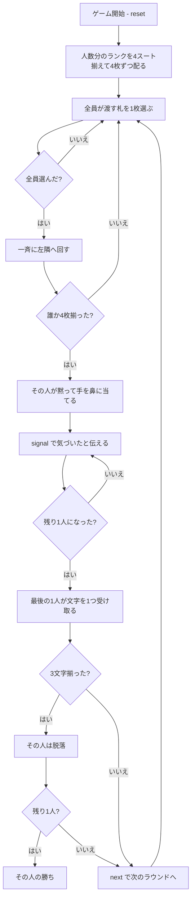

# ピッグ（CUI版）遊び方

## ゲーム概要

アメリカ・イギリスの子供向け定番パーティゲーム（ドンキーとも）。**同じランク4枚を揃えた人は、声を出さず黙って手を鼻に当てます。** 他の人はそれに気づいて真似るだけ——**取り合うものは何もありません**。最後まで気づかなかった1人が P・I・G の文字を1つ受け取り、3文字揃うと脱落します。3〜6人で遊べます。

## 起動方法

```sh
go run ./cmd/trumpcards pig
go run ./cmd/trumpcards --lang en pig  # 英語モード
```

## ルール

### 配りとデッキ

**人数と同じ種類のランクを、4スート揃えて使います。** 各自に4枚ずつ配ると、ちょうど使い切ります。

| 人数 | ランク | デッキ | 1人の手札 |
|------|--------|--------|-----------|
| 3人 | A・K・Q | 12枚 | 4枚 |
| 4人 | A・K・Q・J | 16枚 | 4枚 |
| 5人 | A・K・Q・J・10 | 20枚 | 4枚 |
| 6人 | A・K・Q・J・10・9 | 24枚 | 4枚 |

標準52枚からランクを絞った部分集合なので、特別なカードは使いません。

### パス

**全員が同時に1枚ずつ左隣へ回します。** 渡すのと受け取るのが同時なので、**手札はずっと4枚のまま**です。全員が渡す札を選ぶまで、札は動きません。

### 合図

同じランク4枚が揃った人は、**声を出さず黙って手を鼻に当てます**。宣言はしません。

他の人は**それに気づいて真似るだけ**です。奪い合うものは何もなく、早く気づくことに得点もありません。

### 罰

**最後まで気づかなかった1人**が P・I・G の文字を1つ受け取ります。**3文字揃うと脱落**です。

遅れることだけが負けの条件で、揃えること自体には得も損もありません。

### 勝敗

**最後まで残った1人の勝ち**です。

### 終わらない心配はありません

毎ラウンド必ず1人に文字が付くので、文字は単調に増えていずれ脱落者が出ます。

## ゲームの流れ



## コマンド一覧

| コマンド | 短縮形 | 説明 |
|----------|--------|------|
| `pass <idx>` | `p` | 手札の `<idx>` 番目を左隣へ渡す |
| `signal` | `s` | 合図に気づいたと伝える（**遅れた1人だけが文字をもらう**） |
| `next` | `n` | 次のラウンドを配る |
| `hint` | `h` | 渡すべき札、または合図に気づくべきことを提示する |
| `giveup` | `g` | 投了する |
| `log` | `l` | 棋譜（アクションログ）を表示する |
| `reset` | `r` | 最初からやり直す |
| `quit` | `q` | 終了する |
| `help` | `?` | コマンド一覧を表示 |

**`signal` は `pass` の引数を省いたものではありません。** 「気づいた」という別の行動なので、別のコマンドです。合図が出ていないのに `signal` すると弾かれます。

## 画面の見方

```
==========
Pig (ピッグ／ドンキー)
==========
ラウンド: 3  デッキ: 16枚  このラウンドのパス: 5回
同じランク4枚を揃えた人は、声を出さず黙って手を鼻に当てます。他の人はそれに気づいて真似るだけ——取り合うものは何もありません。最後まで気づかなかった1人が P・I・G の文字を1つ受け取り、3文字揃うと脱落します。最後まで残った1人が勝ちです。手札は全員ずっと4枚のままで、渡すのと受け取るのは同時です。
>あなた: 手札4枚 文字[P]
  [0]♠K [1]♥K [2]♣A [3]♦Q
 CPU1[渡す札を選択済み]: 手札4枚 文字[-]
 CPU2[2番目に気づいた]: 手札4枚 文字[PI]
 CPU3[脱落]: 手札0枚 文字[PIG]
----------
手番: あなた
pass <idx>・・・左隣へ渡す札を選ぶ
```

- **デッキ行**: この卓の総枚数と、このラウンドで何回回したか
- **手札の枚数**: **常に4枚**です。渡すのと受け取るのが同時なので変わりません
- **文字**: 溜まった P・I・G。**3文字で脱落**なので、これがそのまま残機です
- **`[渡す札を選択済み]`**: 同時に渡すので、選び終えた席には待ちが出ます
- **`[N番目に気づいた]`**: 合図に気づいた順。**盤面には痕跡が残らない**ので明示します
- **`[脱落]`**: PIG が揃って抜けた席

## 遊び方のコツ

- **揃えることに得はありません。** 4枚集めても点は入らず、合図を出す権利が来るだけです
- **他人の手元より、他人の様子を見る。** 勝敗を決めるのは自分の手札ではなく、合図に気づく速さです
- **同じランクが隣り合って並びます。** 揃いかけが一目で分かるので、手放す札は自然に決まります
- **バラバラのときは何を捨てても大差ありません。** 全部1枚ずつなら、どれを回しても揃いやすさは変わりません
- **脱落しても盤面は続きます。** あなたが抜けても残りのCPUが決着するまで進みます
