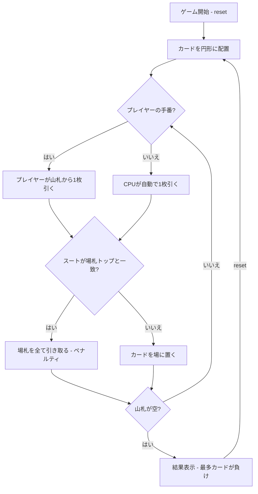

# ぶたのしっぽ（CUI版）遊び方

## ゲーム概要

4人（プレイヤー1人 + CPU 3人）で遊ぶマッチング系カードゲームです。52枚のカードを裏向きに円形に並べ、順番に1枚ずつめくって中央の場に出します。出したカードのスートが場の一番上と一致すると、場のカードを全て引き取るペナルティを受けます。円形の山札がなくなった時点で最も多くカードを持っているプレイヤーの負けです。

## 起動方法

```sh
go run ./cmd/trumpcards pigtail
go run ./cmd/trumpcards --lang en pigtail  # 英語モード
```

## ルール

### 基本ルール

- 52枚のトランプ（ジョーカーなし）を使用
- カードを裏向きに円形の山札として配置
- プレイヤーが順番に山札から1枚引き、中央の場札の上に表向きで置く
- 出したカードのスートが場札の一番上のカードと同じスートの場合、場札を全て引き取る（ペナルティ）
- 場札が空の場合はペナルティなし
- CPUの手番は自動で進行する

### ゲーム終了

- 円形の山札が全てなくなったらゲーム終了
- 手札（ペナルティで引き取ったカード）が最も多いプレイヤーの負け
- 手札が最も少ないプレイヤーの勝ち

## ゲームの流れ



## コマンド一覧

| コマンド | 短縮形 | 説明 |
|----------|--------|------|
| `reset` | `r` | 新しいゲームを開始 |
| `draw` | `d` | 山札からカードを1枚引く |
| `setplayers <2-6>` | `sp` | 参加人数を変更して新しいゲームを開始 |
| `log` | `l` | 棋譜（アクションログ）を表示 |
| `quit` | `q` | ゲーム終了 |
| `help` | `?` | コマンド一覧を表示 |

## 画面の見方

```
==========
Pig's Tail (ぶたのしっぽ)
==========
山札: 40枚
場札: [HEART 7]
直前に引いた札: [CLOVER 9] → セーフ
[You]: 3枚
CPU 1: 2枚
CPU 2: 4枚
CPU 3: 1枚
----------
CPU 1 が DIAMOND 5 を出した
CPU 2 が DIAMOND K を出した → スート一致! 場札を引き取る (3枚)
CPU 3 が CLOVER 9 を出した
手番: あなた
==========
```

- `山札: N枚`: 円形の山札の残り枚数
- `場札: [SUIT VALUE]`: 中央の場札のトップカード
- `直前に引いた札: [SUIT VALUE] → セーフ / ペナルティ！ 場札を全て引き取り`: 直前に引かれた札とその判定（自分・CPU 共通、まだ誰も引いていなければ出ません）
- `[You]: N枚`: プレイヤーの手札（ペナルティカード）枚数
- `CPU N: M枚`: CPUの手札枚数
- `スート一致!`: 出したカードのスートが場札トップと一致した場合

## 遊び方のコツ

- このゲームは完全な運ゲームです。戦略的な要素はありません
- 場札のスートを確認し、ペナルティの結果を観察しましょう
- `log` コマンドで過去のアクションを振り返ることができます
