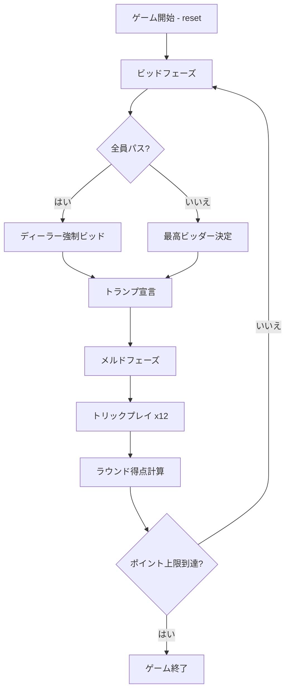

# ピノクル（CUI版）遊び方

## ゲーム概要

4人2チーム（チーム0+2 vs チーム1+3）のトリックテイキング＋メルドゲーム。48枚の専用デッキ（各スート9,10,J,Q,K,Aが2枚ずつ）を使用。ビッド、メルド（役の宣言）、トリックの3つのフェーズで構成され、先にポイント上限（デフォルト1500）に到達したチームが勝利。

## 起動方法

```sh
go run ./cmd/trumpcards pinochle
go run ./cmd/trumpcards --lang en pinochle  # 英語モード
```

## ルール

### デッキ

各スート（スペード、クラブ、ハート、ダイヤ）の9, 10, J, Q, K, Aが2枚ずつ、計48枚。

### カードランク

A > 10 > K > Q > J > 9（10がKより強い）

### カードポイント

A=11, 10=10, K=4, Q=3, J=2, 9=0。最終トリックボーナス=10点。合計250点/ラウンド。

### ビッドフェーズ

ディーラーの左隣から順に、予想合計ポイント（メルド＋トリック）をビッド。最低ビッド20、1刻み。パスするか、現在の最高ビッドより高くビッド。最高ビッダーがトランプスートを宣言。

### メルドフェーズ

全プレイヤーが手札のメルド（役）を公開。メルドポイントはラウンド終了時に加算（ただしチームが1トリックも取れなかった場合は没収）。

### トリックフェーズ

12トリック。リードスートに従う義務、リードスートがなければトランプを出す義務、可能なら勝てるカードを出す義務がある。

### 得点計算

- ビッドチーム: メルド＋トリックポイントの合計がビッド以上なら加算、未満ならビッド額を失う
- ディフェンダーチーム: 常に得点を加算

### CPU難易度

- Easy (0): ランダム
- Normal (1): メルド評価によるビッド判断、基本戦略
- Hard (2): 積極的ビッド、高度なトリック管理

## ゲームの流れ



## コマンド一覧

| コマンド | 短縮形 | 説明 |
|----------|--------|------|
| `reset` | `r` | 新しいゲームを開始 |
| `bid <n>` | `b <n>` | ビッド（20以上） |
| `pass` | `pa` | パス |
| `trump <suit>` | `t <suit>` | トランプスート宣言（1=S,2=C,3=H,4=D） |
| `meld` | `m` | メルド確認して次へ |
| `play <i>` | `p <i>` | カードをプレイ |
| `next` | `n` | 次のトリックへ |
| `nextround` | `nr` | 次のラウンドへ |
| `setdifficulty <0-2>` | `sd <0-2>` | CPU難易度設定 |
| `setlimit <n>` | `sl <n>` | ポイント上限設定 |
| `hint` | `h` | ヒント表示 |
| `log` | `l` | 棋譜表示 |
| `quit` | `q` | ゲーム終了 |
| `help` | `?` | コマンド一覧を表示 |

## 画面の見方

```
==========
Pinochle
==========
Phase: BID     Round: 1
Scores: Team0/2=0   Team1/3=0
Trump: -       High Bid: 25 (P1)
Your Hand:
  0:♠A 1:♠A 2:♠10 3:♠K 4:♠Q 5:♠J
  6:♥A 7:♥10 8:♦K 9:♦Q 10:♣J 11:♣9
Meld: (メルドフェーズで表示)
Trick: (トリックフェーズで表示)
```

- **Phase**: 現在のフェーズ（BID / TRUMP / MELD / TRICK / END）
- **Scores**: 各チームの累計スコア
- **Trump / High Bid**: 宣言済みトランプスートと最高ビッド
- **Your Hand**: 自分の手札（インデックス付き）
- **Meld**: メルドフェーズで各プレイヤーの役を表示
- **Trick**: 現在のトリックに出されたカード

## 遊び方のコツ

- トランプスートはメルドポイントが最も高いスートを選ぶと有利
- Runはメルドの中で最も高得点（150点）なので、トランプスートのA,10,K,Q,Jが揃っているか確認
- トリックでは高ポイントカード（A=11, 10=10）を確実に取ることが重要
- パートナーがトリックを取っている場合は、ポイントの高いカードを出して得点を稼ぐ
