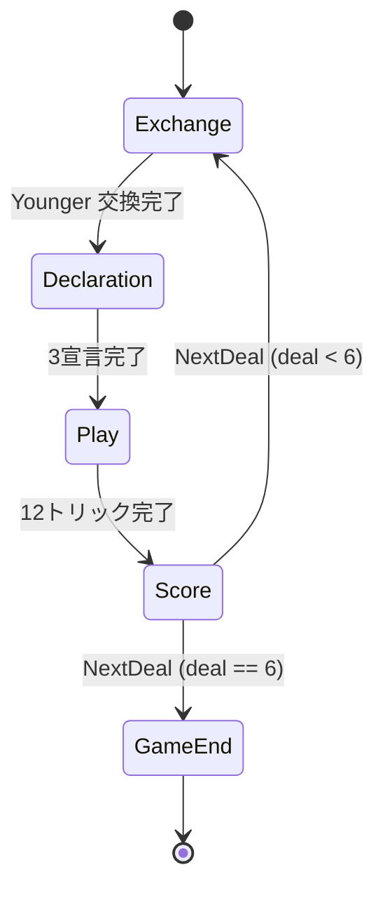

# ピケ（CUI版）遊び方

## ゲーム概要

Piquetは2人用の古典的トリックテイキング。32枚デッキ（7〜A）を使い、交換・宣言・12トリックのプレイを6ディール繰り返してパルティ通算で勝敗を決める。

## 起動方法

```sh
go run ./cmd/trumpcards piquet
go run ./cmd/trumpcards --lang en piquet  # 英語モード
```

## ルール

Webマニュアル ([../web/piquet.md](../web/piquet.md)) と同じ。簡潔に：

- Point / Sequence / Set の3宣言。
- Carte blanche +10、Repique +60、Pique +30、Cards +10、Capot +40。
- 6ディールのパルティ。ルビコン: 敗者 < 100 → 勝者 += 100 + W + L。

## ゲームの流れ



## コマンド一覧

| コマンド | 短縮形 | 説明 |
|----------|--------|------|
| `elder <i,j,k>` | `e` | Elder交換 (1..5枚) |
| `younger <i,j,k>` | `y` | Younger交換 (0..3枚)。`y` 単独で0枚交換 (パス) |
| `declare` | `d` | 次の宣言を1ステップ進める |
| `play <i>` | `p` | 手札 i 番目をプレイ |
| `nextdeal` | `nd` | 次ディールへ |
| `hint` | `h` | ヒント |
| `log` | `l` | アクションログ |
| `reset` | `r` | リセット |
| `quit` | `q` | 終了 |
| `help` | `?` | コマンド一覧を表示 |
