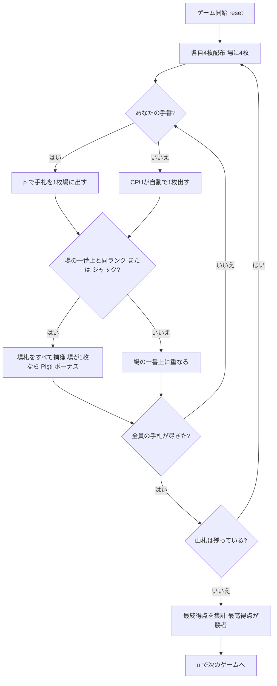

# ピシュティ（CUI版）遊び方

## ゲーム概要

Pişti（ピシュティ）はトルコ生まれの2〜4人用**捕獲（フィッシング）系カードゲーム**です。52枚デッキを使い、各自4枚ずつ配って中央の場に1枚ずつカードを出していきます。場の一番上のカードと**同じランク**を出すか、**ジャック**（どんな札も捕獲できるワイルド）を出すと、場札をすべて捕獲できます。場に1枚しかない札を捕獲すると「**Pişti（ピシュティ）**」となりボーナスが入ります。手札が尽きるたびに山札から4枚ずつ配り直し、山札がなくなるまで続けます。最終得点が最も高いプレイヤーの勝利です。

## 起動方法

```sh
go run ./cmd/trumpcards pishti
go run ./cmd/trumpcards --lang en pishti  # 英語モード
```

## ルール

### デッキと配布

- **デッキ**: 52枚（標準デッキ）
- **プレイヤー**: 2〜4人（あなた + CPU、デフォルト4人）
- **配布**: 各プレイヤーに4枚ずつ。さらに場の中央に4枚を置きます。
- 手札が全員尽きたら、山札から4枚ずつ配り直します。

### カードを出す・捕獲する

- 自分の手番では、手札を1枚選んで中央の場に出します（`p <手札番号>`）。
- 出したカードが**場の一番上のカードと同じランク**なら、場札をすべて捕獲します。
- **ジャック**はワイルドで、いつでも場札をすべて捕獲できます。
- 捕獲できなかった場合、出したカードは場の一番上に重なります。

### Pişti（ピシュティ）ボーナス

- 場に**1枚だけ**の札を捕獲すると「**Pişti**」となり **+10点**。
- ジャックを**単独のジャック**に重ねて捕獲すると **+20点**。

### 最終得点

ゲーム終了時、捕獲した札に応じて得点を集計します。

| 項目 | 得点 |
|------|------|
| 最多捕獲枚数 | +3 |
| エース各1枚 | +1 |
| 2♣ | +2 |
| 10♦ | +3 |
| ジャック各1枚 | +1 |
| Pişti ボーナス | +10 / +20（上記） |

- 総得点が最も高いプレイヤーの勝利です。

### CPU難易度

- **Easy（0）**: ランダムな合法手を選びます。
- **Normal（1）**: 捕獲できる手を優先します。
- **Hard（2）**: Pişti や高得点札を狙います。

## ゲームの流れ



## コマンド一覧

| コマンド | 短縮形 | 説明 |
|----------|--------|------|
| `play <h>` | `p` | 手札h番を場に出す（同ランクまたはJで場札を捕獲） |
| `next` | `n` | 次のゲームを開始する |
| `setdifficulty <0-2>` | `sd` | CPU難易度設定（0=Easy, 1=Normal, 2=Hard）。リセットされます |
| `setplayers <2-4>` | `sp` | プレイヤー数設定。リセットされます |
| `log` | `l` | アクションログを表示 |
| `reset` | `r` | 新しいゲームを開始（設定保持） |
| `quit` | `q` | ゲーム終了 |
| `help` | `?` | コマンド一覧を表示 |

## 画面の見方

```
==========
Pişti (ピシュティ)
==========
山札: 残り36枚
場: 上=♣7 (1枚)
あなた: 手札4枚 / 捕獲0枚 / Pişti0点
CPU 1: 手札4枚 / 捕獲0枚 / Pişti0点
CPU 2: 手札4枚 / 捕獲0枚 / Pişti0点
CPU 3: 手札4枚 / 捕獲0枚 / Pişti0点
手番: あなた
p <hand> で手札を場に出す (同ランクまたはJで場札を捕獲)
```

- **山札行**: 山札の残り枚数。
- **場行**: 場の一番上のカードと場札の枚数。
- **プレイヤー行**: 各プレイヤーの手札枚数・捕獲枚数・Pişti ボーナス点。
- **手番表示**: 現在の手番のプレイヤー。

## 遊び方のコツ

- **ジャックは切り札**: ジャックはいつでも場札を一掃できます。場札がたまったタイミングで使うと効果的です。
- **Pişti を狙う**: 場が1枚のときに同ランクで捕獲すると+10点。相手が単独札を残したら積極的に狙いましょう。
- **高得点札を意識**: 2♣・10♦・エース・ジャックは終盤の得点源です。これらを含む場札は確実に捕獲したいところ。
- **難易度調整**: Hard のCPUは Pişti を狙ってきます。慣れないうちは Easy から始めましょう。
