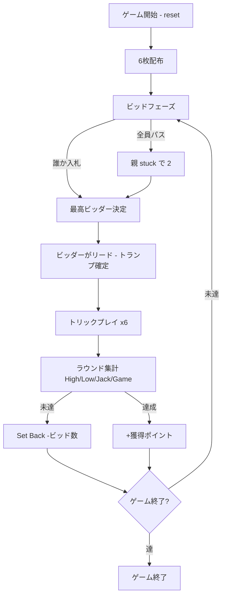

# ピッチ（CUI版）遊び方

## ゲーム概要

Pitch (別名: Setback / Auction Pitch) は4人 (人間1 + CPU3) のシングルハンド トリックテイキングゲームです。
6枚のカードを使い、High / Low / Jack / Game の4つのポイントを競ってビッドします。
最初に PointLimit (デフォルト 7) に到達したプレイヤーが勝利します。

## 起動方法

```sh
go run ./cmd/trumpcards pitch
go run ./cmd/trumpcards --lang en pitch  # 英語モード
```

## ルール

### 基本ルール

- 4人プレイ (人間 1 + CPU 3)、52枚デッキから6枚ずつ配り、24枚使用
- 親 (dealer) はラウンドごとに左回りでローテーション
- 親の左隣 (eldest hand) からビッド開始

### ビッド

- 各プレイヤーは順番に **pass (0)**, **2**, **3**, **4** のいずれかを宣言
- 非ゼロのビッドは現在の最高ビッドを上回る必要がある
- 全員パスの場合は親が **stuck** で 2 を強制ビッド

### プレイ

- ビッド勝者がリードし、最初に出されたカードの **スート** が切り札になる
- フォロー時は **リードスートに従う**、もしくは **トランプ (切り札) を出す** 必要がある
- リードスートを持っていなければ任意のカードをプレイ可

### 得点 (1ラウンド最大4点)

| 得点 | 内容 |
|------|------|
| **High** | 配られた中で最強のトランプを獲得した者に +1 |
| **Low** | プレイされた最弱のトランプを獲得した者に +1 |
| **Jack** | トランプの J を獲得した者に +1 (出た場合のみ) |
| **Game** | カードのピップ合計 (A=4, K=3, Q=2, J=1, 10=10) が単独最大の者に +1 (同点なし) |

### Set Back (ビッド失敗)

- ビッダーが宣言数に達しなかった場合、累積スコアが **-ビッド数** される
- 達成すれば獲得ポイントが累積に加算される
- ビッダー以外は獲得ポイントがそのまま累積に加算

### ゲーム終了

- いずれかのプレイヤーが PointLimit に到達した時点で終了
- ビッダーが到達した場合はビッダー優先で勝利

### CPU難易度

| レベル | 動作 |
|--------|------|
| Easy (0) | ランダム入札・ランダムプレイ |
| Normal (1) | 手札の高札数からビッドを推定、トリックを取りに行く |
| Hard (2) | Normal + Low/Jack のリスク考慮、トランプ温存 |

## ゲームの流れ



## コマンド一覧

| コマンド | 短縮形 | 説明 |
|----------|--------|------|
| `reset` | `r` | 新しいゲームを開始 (設定保持) |
| `quit` | `q` | ゲーム終了 |
| `bid <n>` | `b <n>` | ビッドを宣言 (0=pass, 2-4) |
| `play <i>` | `p <i>` | カードをプレイ (インデックス) |
| `next` | `n` | 次のトリックへ |
| `nextround` | `nr` | ラウンド集計 + 次のラウンドへ |
| `setdifficulty <n>` | `sd <n>` | CPU難易度設定 (0=Easy, 1=Normal, 2=Hard) |
| `setlimit <n>` | `sl <n>` | ポイント上限設定 |
| `hint` | `h` | ヒント表示 |
| `log` | `l` | 棋譜表示 |
| `help` | `?` | コマンド一覧を表示 |

## 画面の見方

```
==== Pitch (ピッチ) ====
ラウンド: 1  トリック: 0  親: CPU 3
ビッド: 0  トランプ: (未確定)
あなた: ビッド=未ビッド 獲得0トリック 累積0点 ラウンド0点 6枚
[0]SPADE 5  [1]HEART 9  [2]CLUB J  ...
CPU 1: ビッド=未ビッド 獲得0トリック 累積0点 ラウンド0点 6枚
...
----------
ビッドフェーズ: あなたの番
b <n>・・・ビッドを宣言 (0=pass, 2-4)
```

- 「親」 はラウンドごとにローテーション
- 「トランプ」 はビッダーがリードした最初のカードのスート
- 手札はインデックス付きで表示

## 遊び方のコツ

- A・K のトランプを多く持っているときは強気にビッド
- J of trump (J♠ など) は積極的に取りにいくと Jack 点が確定
- Low ポイントは最弱トランプを取った者に入る → 低トランプを温存しすぎると逆に取られる
- Game ポイントは 10・A の取り合い、引き分けでは誰にも入らない
