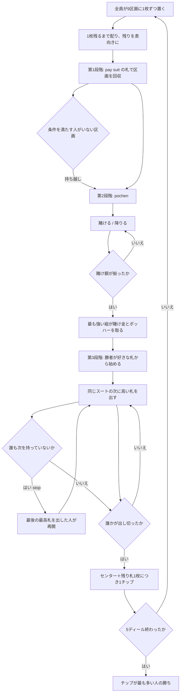

# ポッホ（CUI版）遊び方

## ゲーム概要

15 世紀ドイツの 3 段階構成ゲーム。ポーカーの祖先の一つとされます。**32 枚**（A-K-Q-J-10-9-8-7）と、**9 区画の専用盤**を使います。

出典: [pagat.com の Poch](https://www.pagat.com/stops/poch.html)

## 起動方法

```sh
go run ./cmd/trumpcards poch
go run ./cmd/trumpcards --lang en poch   # 英語表示
```

## ルール

### 盤の 9 区画

| 区画 | 取る条件 |
|---|---|
| **A / K / Q / J / 10** | **めくり札と同じスート**のその札を持っていること |
| **マリッジ** | めくり札と同じスートの **K と Q を両方**持っていること |
| **シーケンス** | めくり札と同じスートの **7・8・9 を三枚とも**持っていること |
| **ポッハー** | 第 2 段階（組の比べ合い）の勝者 |
| **センター** | 第 3 段階で先に手札を出し切った人 |

**区画に札は置きません。**毎ディール、全員が **9 区画すべてに 1 枚ずつ**チップを置きます。

### 配り方

1 枚だけ残るまで 1 枚ずつ配り、**残った 1 枚を表向きにします**。その札のスートが **pay suit（めくり札のスート）**です。第 1 段階はこの 1 枚で全部決まります。

### 第 1 段階 — 区画の精算

**ランクだけでは取れません。**pay suit の札でなければ 1 チップも入りません。条件を満たす人がいない区画のチップは**そのまま残り、次のディールへ持ち越されます**。全員がまた 1 枚ずつ足すので、マリッジやシーケンスのような条件の厳しい区画は膨らんでいきます。

手札は配った時点で確定しているので、この段階に選択の余地はありません。自動で解決します。

### 第 2 段階 — pochen（組の比べ合い）

**宣言もブラフもありません。**手札の**同ランクの組**（ペア／スリー／フォー）の強さを比べます。

> **4 枚 ＞ 3 枚 ＞ 2 枚。**枚数が先で、同数ならランクで決まります（A が最上位）。

手番順に 1 単位ずつ賭けるか降りるかを選び、降りなかった人の賭け額が揃った時点で締めます。最も強い組を持つ人が、**賭けチップ全部とポッハー区画**を取ります。

賭ける/降りるを選ぶ画面には **`あなたの組:`** が出ます（例 `あなたの組: 9 の 2枚`、組が無ければ `なし`）。自分の手札は自分にとって既知の情報なので、数え直さずに判断できます。

### 第 3 段階 — ストップス

pochen を制した人が好きな札から始めます。以降は**同じスートの次に高い札**を順に出していきます（例: ♠7 → ♠8 → ♠9 …）。

誰も次の札を持っていなければ「**stop**」です。**最後に最高札を出した人**が、また好きな札から始めます。

先に手札を出し切った人が、**センター区画に加えて、他家から残り札 1 枚につき 1 チップ**を受け取ります。

5 ディール戦い、チップが最も多い人の勝ちです。

## ゲームの流れ



## コマンド一覧

| コマンド | 短縮形 | 説明 |
|----------|--------|------|
| `bet` | `b` | 1 単位賭ける |
| `fold` | `f` | 降りる |
| `play <i>` | `p` | 手札 `i` を出す |
| `next` | `n` | 次のディールへ進む |
| `hint` | `h` | ヒントを表示する |
| `log` | `l` | 棋譜を表示する |
| `reset` | `r` | ゲームごとリセットする |
| `quit` | `q` | 終了する |
| `help` | `?` | コマンド一覧を表示 |

## 画面の見方

```
ディール1/5 · めくり札 SPADE 9
区画は「めくり札と同じスート」の札でしか取れません／pochen は宣言ではなく同ランクの組の比べ合い（4枚＞3枚＞2枚）
盤: A:0 K:4 Q:4 J:0 10:4 マリッジ:12 シーケンス:20 ポッハー:4 センター:4
あなた が A を獲得（4）
あなた: チップ-5 手札8枚 賭け0
  [0]SPADE 1 [1]HEART 11 [2]CLOVER 5 ...
CPU 1: チップ-9 手札8枚 賭け1
```

- **盤の 9 区画は毎回すべて出ます。**数字が膨らんでいる区画が、そのディールの狙いどころです
- **第 1 段階の結果は行として出ます。**自動で解決するので、これが無いと何が起きたのか読めません
- **手札の枚数は全員ぶん公開**されます。出し切られると 1 枚につき 1 チップ払うので、そのまま負債額です
- CPU の**手札の中身**は伏せられます

## 遊び方のコツ

- **持ち越し区画を狙う。**マリッジとシーケンスは条件が厳しいぶん貯まりやすく、数ディール放置されたあとは一撃で取り返せます
- **pay suit を見てから手札を数える。**めくり札のスートが分かった時点で、第 1 段階で自分が何を取れるかは確定しています
- **pochen は確定情報の勝負です。**組が無いなら安く降りるほうが得です。相手を降ろす手段は賭け額しかありません
- **ストップスでは低い札から出す。**高い札を抱えると、並びが自分のところで止まらず手札が減りません
- 逆に、**相手が残り 1〜2 枚のときは止めにいく**価値があります。出し切られると全員が枚数ぶん払います
