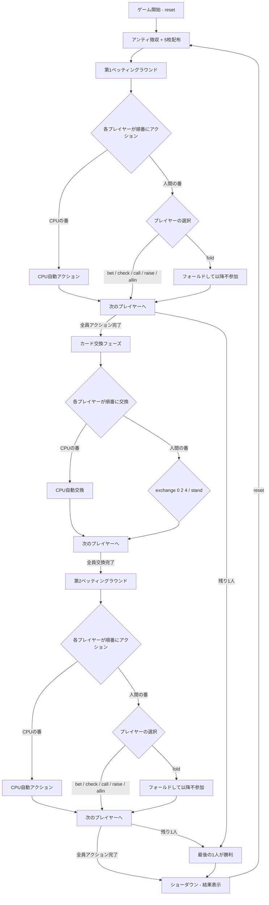

# ポーカー（CUI版）遊び方

## ゲーム概要

プレイヤーと1〜3人のCPU（設定可能）がテーブルで対戦する5カードドローポーカーです。4種のプレイスタイル（Conservative / Balanced / Aggressive / Bluffer）を持つCPU AI、オプションのジョーカーワイルドカード（0〜2枚）に対応しています。2回のベッティングラウンドと1回のカード交換を経て、最も強い役を持つプレイヤーが勝利します。

## 起動方法

```sh
go run ./cmd/cli poker
```

## ルール

### 役の強さ（弱い順）

| 順位 | 役名 | 説明 |
|------|------|------|
| 0 | ハイカード | 役なし |
| 1 | ワンペア | 同じ数字2枚 |
| 2 | ツーペア | ペアが2組 |
| 3 | スリーカード | 同じ数字3枚 |
| 4 | ストレート | 連続する5枚（A-2-3-4-5 や 10-J-Q-K-A を含む） |
| 5 | フラッシュ | 同じスート5枚 |
| 6 | フルハウス | スリーカード + ワンペア |
| 7 | フォーカード | 同じ数字4枚 |
| 8 | ストレートフラッシュ | 同スート連続5枚 |
| 9 | ロイヤルフラッシュ | 10-J-Q-K-A の同スート |
| 10 | ファイブカード | 同じ数字5枚（ジョーカー使用時のみ成立） |

### チップシステム

- 初期チップ: 1000
- アンティ（参加費）: 10（各ラウンド開始時に全プレイヤーから自動徴収）
- 最低ベット: 10

### マルチプレイヤー

- プレイヤー1人 + CPU 1〜3人（`scc` コマンドで変更可能、デフォルト3人）
- ディーラーはラウンドごとに時計回りで交代します
- アクション順はディーラーの左隣から時計回りです

### ジョーカー

- CUI版ではデフォルト0枚（`sjc` コマンドで0〜2枚に変更可能）
- ジョーカーはワイルドカードとして任意のカードの代わりになります
- ジョーカーが含まれる場合のみ、ファイブカード（同じ数字5枚）が成立します

### CPU プレイスタイル

| スタイル | 特徴 |
|----------|------|
| Conservative | 保守的。強い手でのみベットし、ブラフ率が低い |
| Balanced | バランス型。標準的なベット判断とブラフ率 |
| Aggressive | 攻撃的。高額ベットとレイズを多用する |
| Bluffer | ブラフ重視。弱い手でも積極的にベット・レイズする |

CPU はプレイスタイルに基づいてベット額、レイズ額、フォールド判断、ブラフ頻度を自動決定します。交換フェーズでは、フラッシュドロー・ストレートドロー等を考慮した戦略的な交換を行います。

## ゲームの流れ



## コマンド一覧

| コマンド | 短縮形 | 説明 |
|----------|--------|------|
| `reset` | `r` | 新しいゲームを開始（アンティ徴収） |
| `bet N` | `b N` | N チップをベット（例: `b 20`） |
| `call` | `c` | 直前のベットと同額を支払う |
| `raise N` | `ra N` | 直前のベットに上乗せ（例: `ra 20`） |
| `check` | `ck` | チェック（未ベット時のみ） |
| `fold` | `f` | フォールド（降りる） |
| `allin` | `a` | オールイン（全チップを賭ける） |
| `exchange [0-4...]` | `e [0-4...]` | 指定インデックスのカードを交換（例: `e 0 2 4`） |
| `stand` | `s` | カード交換なしで次へ進む |
| `bettinglimit [0-2]` | `bl [0-2]` | ベッティングリミット変更（0=Fixed, 1=PotLimit, 2=NoLimit） |
| `setcpucount [1-3]` | `scc [1-3]` | CPU人数を変更してリセット |
| `setjokercount [0-2]` | `sjc [0-2]` | ジョーカー枚数を変更してリセット |
| `lowball` | `lw` | 2-7 ローボールモードの切り替え（最弱の手が勝利） |
| `odds [0-4...]` | `o [0-4...]` | 交換候補のドローオッズを表示（例: `o 0 2 4`） |
| `metaai` | `mai` | メタAIの ON/OFF を切り替え（CPUが人間のプレイスタイルを学習） |
| `quit` | `q` | ゲーム終了 |
| `help` | `?` | コマンド一覧を表示 |

## 各フェーズの詳細

### 第1ベッティングラウンド（DEAL フェーズ）

5枚配布後、ディーラーの左隣から時計回りで各プレイヤーがアクションを行います。CPUは自動的にアクションを実行し、人間の番になるとコマンド入力を待ちます。

- 未ベット時: `bet` / `check` / `fold` / `allin` が選択可能
- ベット済み時: `call` / `raise` / `fold` / `allin` が選択可能
- 1ラウンドあたりのレイズ上限は4回です

### カード交換フェーズ（EXCHANGE フェーズ）

ディーラーの左隣から時計回りで各プレイヤーがカード交換を行います。CPUはプレイスタイルに応じた戦略で自動交換し、人間の番ではインデックス（0〜4）を指定して交換します。交換しない場合は `stand` を入力します。

### 第2ベッティングラウンド（SECOND_BET フェーズ）

交換後の手札で再度ベッティングを行います。流れは第1ラウンドと同じです。CPUは交換後の手札評価と相手の交換枚数を考慮してアクションを決定します。

### ショーダウン（END フェーズ）

フォールドしていない全プレイヤーの手札を公開し、役を比較します。最も強い役のプレイヤーがポットを獲得します。サイドポットが発生した場合は、各ポットの対象プレイヤー間で個別に精算されます。

## 画面の見方

```
==========
5-Card Draw Poker
==========
ディーラー: Player 0
ポット: 40
----------
[You] チップ:980
  手札: [0]♠3  [1]♥7  [2]♦2  [3]♣9  [4]♥K
CPU 1 (Balanced) チップ:980
CPU 2 (Aggressive) チップ:980 ベット:10
CPU 3 (Bluffer) チップ:980 [フォールド]
----------
[CPU行動]
  Player 2: ベット (10)
  Player 3: フォールド
```

- `ディーラー`: 現在のディーラー位置（ラウンドごとに交代）
- `ポット`: 場に出ているチップ合計
- `[You]`: 人間プレイヤー
- `CPU N (スタイル名)`: CPU プレイヤー（プレイスタイル表示）
- `チップ`: 各プレイヤーの所持チップ
- `ベット`: 現ラウンドのベット額
- `[フォールド]` / `[オールイン]`: プレイヤーの状態バッジ
- `[0]`〜`[4]`: カードのインデックス（交換時に使用）
- CPUの手札はショーダウンまで非表示
- ショーダウン時: 全プレイヤーの手札と役名が表示されます
- `[CPU行動]`: CPU が実行したアクションの記録
- `[CPU交換]`: CPU が交換したカード枚数の記録（交換フェーズ後に表示）

### 結果表示の例

```
==========
[結果]
  You: Two Pair → 60チップ獲得
  CPU 1: One Pair
  CPU 2: High Card
```
