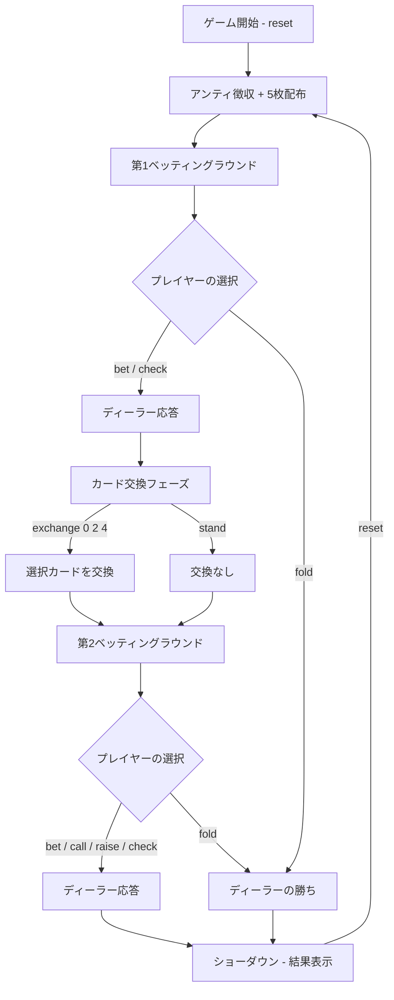

# ポーカー（5カードドロー・CUI版）遊び方

## ゲーム概要

プレイヤーとディーラー（CPU）が1対1で対戦する5カードドローポーカーです。2回のベッティングラウンドと1回のカード交換を経て、より強い役を持つ方が勝ちです。

## 起動方法

```sh
go run ./cmd/cli poker
```

## ルール

### 役の強さ（弱い順）

| 順位 | 役名 | 説明 |
|------|------|------|
| 0 | ハイカード | 役なし |
| 1 | ワンペア | 同じ数字2枚 |
| 2 | ツーペア | ペアが2組 |
| 3 | スリーカード | 同じ数字3枚 |
| 4 | ストレート | 連続する5枚（A-2-3-4-5 や 10-J-Q-K-A を含む） |
| 5 | フラッシュ | 同じスート5枚 |
| 6 | フルハウス | スリーカード + ワンペア |
| 7 | フォーカード | 同じ数字4枚 |
| 8 | ストレートフラッシュ | 同スート連続5枚 |
| 9 | ロイヤルフラッシュ | 10-J-Q-K-A の同スート |

### チップシステム

- 初期チップ: 1000
- アンティ（参加費）: 10（各ラウンド開始時に自動徴収）
- 最低ベット: 10

## ゲームの流れ



## コマンド一覧

| コマンド | 短縮形 | 説明 |
|----------|--------|------|
| `reset` | `r` | 新しいゲームを開始（アンティ徴収） |
| `bet N` | `b N` | N チップをベット（例: `b 20`） |
| `call` | `c` | ディーラーのベットと同額を支払う |
| `raise N` | `ra N` | ディーラーのベットに上乗せ（例: `ra 20`） |
| `check` | `ck` | チェック（ディーラーのベットがない場合のみ） |
| `fold` | `f` | フォールド（降りる） |
| `exchange [0-4...]` | `e [0-4...]` | 指定インデックスのカードを交換（例: `e 0 2 4`） |
| `stand` | `s` | カード交換なしで次へ進む |
| `quit` | `q` | ゲーム終了 |

## 各フェーズの詳細

### 第1ベッティングラウンド（DEAL フェーズ）

5枚配布後、ディーラーがワンペア以上なら先にベットします。プレイヤーは状況に応じて `bet` / `call` / `raise` / `check` / `fold` を選択します。

### カード交換フェーズ（EXCHANGE フェーズ）

手札のインデックス（0〜4）を指定して不要なカードを交換します。交換しない場合は `stand` を入力します。ディーラーも自動的にカード交換を行います。

### 第2ベッティングラウンド（SECOND_BET フェーズ）

交換後の手札で再度ベッティングを行います。コマンドは第1ラウンドと同じです。

## 画面の見方

```
----------
Pot: 30 | Player Chips: 980 | Dealer Chips: 980
Dealer Bet: 10
----------
player hand
[0]SPADE 3,[1]HEART 7,[2]DIAMOND 2,[3]CLOVER 9,[4]HEART K
----------
dealer hand
----------
```

- `Pot`: 現在のポット（場に出ているチップ合計）
- `Player Chips` / `Dealer Chips`: 各プレイヤーの所持チップ
- `Dealer Bet`: ディーラーの現在のベット額
- `[0]`〜`[4]`: カードのインデックス（交換時に使用）
- ディーラーの手札はショーダウンまで非表示
- ショーダウン時: `dealer hand [One Pair]` のように役名が表示されます
