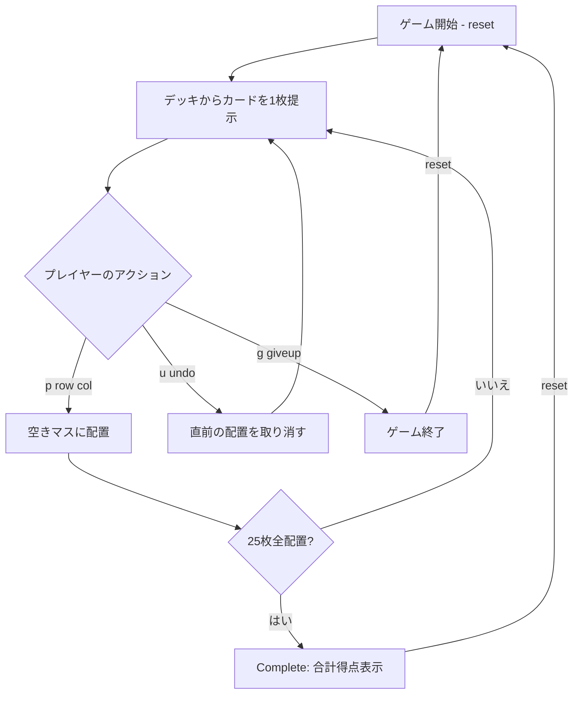

# ポーカー・スクエア（CUI版）遊び方

## ゲーム概要

1人用のソリティア・パズルです。52枚のシャッフル済みデッキから1枚ずつカードが配られ、5x5のグリッド（25マス）に配置します。配置後のカードは動かせません。全25マスが埋まると、5つの行と5つの列がそれぞれポーカーの手役となり、合計10個の役の得点の合計がファイナルスコアとなります。

## 起動方法

```sh
go run ./cmd/trumpcards pokersquares
go run ./cmd/trumpcards --lang en pokersquares  # 英語モード
```

## ルール

### 基本ルール

- 52枚のトランプ（ジョーカーなし）を使用
- 5x5 = 25マスのグリッドに1枚ずつカードを配置する
- 各ターン、現在のカード（current card）が提示される
- 空きマスの座標（行, 列; いずれも 0〜4）を指定して配置する
- 一度配置したカードは移動・変更できない（ただし直前の手は undo で取り消し可能）
- 25枚すべてを配置するとゲーム終了

### 得点（アメリカン採点法）

ゲーム終了時、5つの行と5つの列の計10個のポーカーハンドを評価し、以下の表で加点します。

| 役 | 得点 |
|----|------|
| Royal Flush（ロイヤルフラッシュ） | 100 |
| Straight Flush（ストレートフラッシュ） | 75 |
| Four of a Kind（フォーカード） | 50 |
| Full House（フルハウス） | 25 |
| Flush（フラッシュ） | 20 |
| Straight（ストレート） | 15 |
| Three of a Kind（スリーカード） | 10 |
| Two Pair（ツーペア） | 5 |
| One Pair（ワンペア） | 2 |
| High Card（ハイカード） | 0 |

### ゲーム終了

- 25枚すべてを配置し終えると Complete フェーズに移行し、合計得点が表示されます。
- ギブアップ（`g`）で任意のタイミングで終了できます。

## ゲームの流れ



## コマンド一覧

| コマンド | 短縮形 | 説明 |
|----------|--------|------|
| `reset` | `r` | 新しいゲームを開始 |
| `place <row> <col>` | `p` | 現在のカードを指定マス（行・列は 0〜4）に配置 |
| `undo` | `u` | 直前の配置を元に戻す |
| `giveup` | `g` | ギブアップしてゲーム終了 |
| `log` | `l` | アクションログ（棋譜）を表示 |
| `quit` | `q` | ゲーム終了（プロセス終了） |
| `help` | `?` | コマンド一覧を表示 |

### コマンド例

- `p 0 0` → 現在のカードを 0行0列 に配置
- `p 2 3` → 現在のカードを 2行3列 に配置
- `u` → 直前の配置を取り消す
- `g` → ギブアップ

## 画面の見方

```
==========
Poker Squares (ポーカー・スクエアズ)
==========
Current: [♥10]
配置数: 5 / 25
----------
       col0   col1   col2   col3   col4   | row score
row0 [ ♠A ] [    ] [    ] [    ] [    ] |  -
row1 [    ] [ ♥K ] [    ] [    ] [    ] |  -
row2 [    ] [    ] [ ♦7 ] [ ♣3 ] [    ] |  -
row3 [    ] [    ] [    ] [    ] [    ] |  -
row4 [    ] [    ] [ ♠Q ] [    ] [    ] |  -
----------
col score   -      -      -      -      -
合計得点: 0
p・・・配置  u・・・取り消し  g・・・ギブアップ
==========
```

- `Current`: 次に配置すべきカード
- `配置数`: 配置済みカード数 / 25
- グリッド本体: 5x5 のマス。`[    ]` は空きマス
- `row score` / `col score`: 各行・列の現時点での得点（5枚揃わない間は参考値）
- `合計得点`: すべての行＋列（10ハンド）の得点合計

## 遊び方のコツ

- 序盤はスートをある程度分けておくと、後半でフラッシュを狙いやすくなります
- ストレートを狙う行・列を早めに決め、同じランクが重ならないようにしましょう
- 中央付近のマスは行と列の両方に影響するため、強力な役を作りやすい反面、失敗すると両方の得点を落とします
- 高ランクのペア（10・J・Q・K・A）は行・列のどちらで活かすか決めてから配置すると得点効率が上がります
- `undo` を活用して、別の配置パターンを試しましょう
