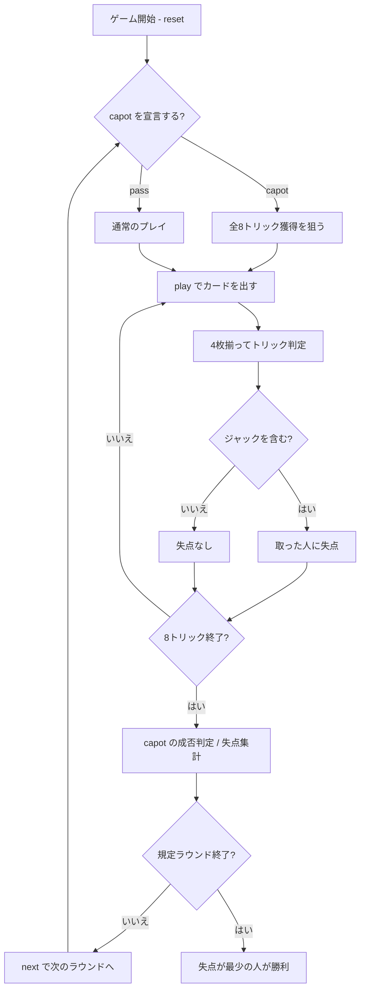

# ポリニャック（CUI版）遊び方

## ゲーム概要

フランス発祥の**回避型**トリックテイキング。別名「Quatre Valets（4人のジャック）」。4人（あなた＋CPU3人）で、ピケット32枚を使って8トリックを戦う。**失点するのはジャック4枚だけ**で、なかでも**スペードのジャック（＝Polignac）は2倍の重さ**を持つ。全トリック獲得を狙う「capot」宣言もある。

## 起動方法

```sh
go run ./cmd/trumpcards polignac
go run ./cmd/trumpcards --lang en polignac  # 英語モード
```

## ルール

### 配り方

- **ピケット32枚**（A・7・8・9・10・J・Q・K × 4スート）
- 4人に**8枚ずつ**配りきる。1ラウンドは8トリック
- 既定は**4ラウンド**（1〜12で変更可）

### トリックの取り方

- **切り札はありません。** リードされたスートの最強札がそのトリックを取る
- 強さは **A > K > Q > J > 10 > 9 > 8 > 7**
- **リードのスートを持っていれば必ず出す**（フォロー義務）

### 失点

| 札 | 失点 |
|----|------|
| ♠J（**Polignac**） | **2** |
| ♣J・♥J・♦J | 各 1 |
| それ以外の札 | 0 |

**1ラウンドで動く失点は必ず5点**（1+1+1+2）。失点は札を出した人ではなく、**そのトリックを取った人**に付きます。

プレイヤー行の `取ったJ:` に、そのラウンドで取ったジャックが**♠ を先頭に**並びます。合計失点だけでは「♠J を踏んだのか、軽いジャックを 2 枚拾ったのか」が分かりません。

**合計失点が最も少ないプレイヤーが勝ち**です。

### capot 宣言

配り終えた直後、プレイに入る前に **capot**（全8トリック獲得）を宣言できます。

- **成功**（8トリックすべて獲得）: 他の全員に **+5失点**。宣言者のジャック失点は帳消し
- **失敗**（1トリックでも落とす）: 宣言者に **+5失点**。加えてジャックの失点も通常どおり

宣言しない場合は `pass` で進みます。

## ゲームの流れ



## コマンド一覧

| コマンド | 短縮形 | 説明 |
|----------|--------|------|
| `capot` | `c` | 全8トリック獲得を宣言する |
| `pass` |  | 宣言せずにプレイへ進む |
| `play <idx>` | `p` | 手札の `<idx>` 番目のカードを出す |
| `next` | `n` | 次のラウンドを開始する |
| `hint` | `h` | 打つべき札とその狙いを表示する |
| `giveup` | `g` | 投了する |
| `log` | `l` | 棋譜（アクションログ）を表示する |
| `reset` | `r` | 最初からやり直す |
| `quit` | `q` | 終了する |
| `help` | `?` | コマンド一覧を表示 |

## 画面の見方

```
==========
Polignac (ポリニャック)
==========
ラウンド: 1/4  トリック: 3/8
切り札なし。ジャックを取ると1失点、ただし♠J（Polignac）は2失点。
あなた: 累計0失点 (今ラウンド2) 手札6枚
  [0]♠7 [1]♠K [2]♣9 [3]♥J ...
CPU1: 累計1失点 (今ラウンド0) 手札6枚
CPU2: 累計0失点 (今ラウンド0) 手札6枚
CPU3: 累計3失点 (今ラウンド0) 手札6枚
----------
手番: あなた
play <idx>・・・カードを出す
```

- **1行目**: 何ラウンド目の何トリック目か
- **2行目**: 切り札が無いことと、失点の重み付けの明示
- **`累計N失点 (今ラウンドM)`**: 左が全ラウンド通算、右がこのラウンド分。**小さいほど良い**
- **`[capot]`**: capot を宣言している席に付きます。宣言中は警告行も出ます
- **`[n]`**: `play <n>` で指定する手札の番号

## 遊び方のコツ

- **♠J が最大の地雷。** 1枚で2点、つまり1ラウンドの失点の4割を占めます
- **♠J を持っているなら早く手放す。** スペードがリードされたとき、フォロー義務で出さざるを得なくなります。ただし自分が取ってしまう場面で出しては意味がありません
- **スペードの高い札（A・K・Q）が危険。** ♠J が出ているトリックを自分が取ってしまいます
- **ジャックの無いトリックが処分どき。** 安全なうちに手札の高い札を捨てておく
- **capot は本当に強い手のときだけ。** 8トリック全部です。失敗すると5失点＋ジャックの失点で、一気に最下位になります
- **誰かが capot を宣言したら、全員で潰しにいく。** **1トリック取れば宣言は崩れ**、宣言者が5失点します
