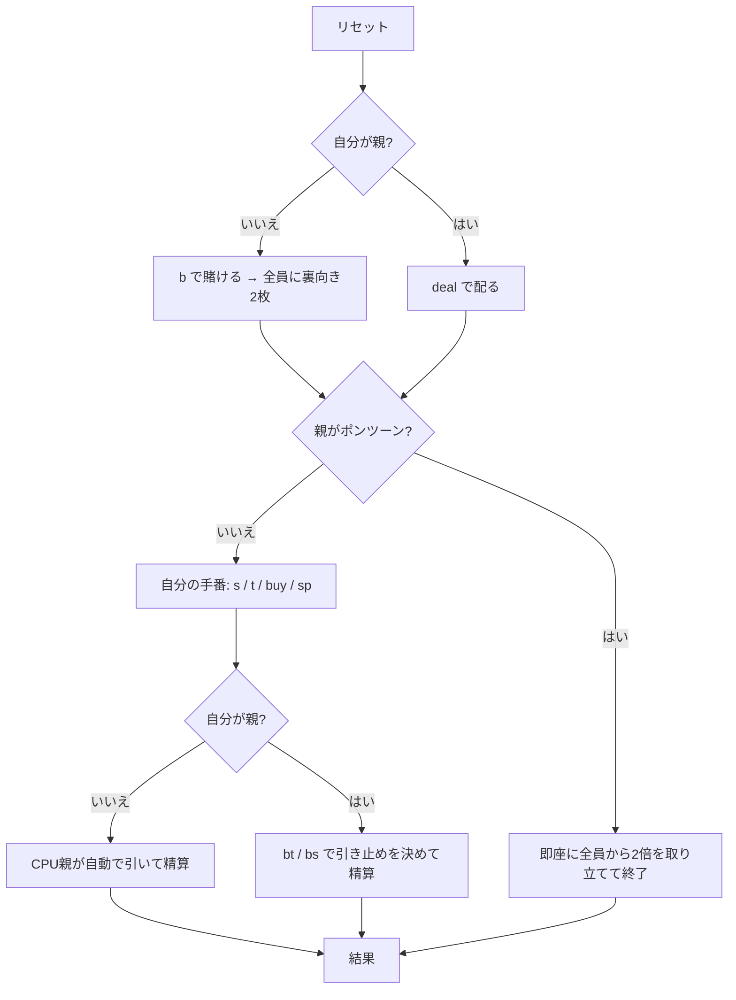

# ポンツーン (Pontoon) — CUI マニュアル

## ゲーム概要

52 枚 1 組で遊ぶ英国式ブラックジャック。人間 1 人 + CPU 2 人の 3 席で、そのうち 1 席が **親（バンカー）** を務めます。

ブラックジャックとの一番の違いは、**親を含む全員が 2 枚とも裏向き**で受け取ることです。親のアップカードが無いので、相手の手を読む材料がありません。

## 起動方法

```sh
go run ./cmd/trumpcards pontoon
go run ./cmd/trumpcards --lang en pontoon   # 英語
```

## ルール

### 手の格

点数だけでは順位が決まりません。

| 格 | 内容 | 配当 |
|---|---|---|
| **ポンツーン** | A + 10 点札の **2 枚**で 21 | 2 倍 |
| **ファイブカード・トリック** | **ちょうど 5 枚**で 21 以下 | 2 倍 |
| 点数 | 21 以下。数字が大きいほど強い | 等倍 |
| バースト | 22 以上 | 負け |

### 手番の選択肢

| 宣言 | 内容 | 制約 |
|---|---|---|
| **Stick** | 打ち止め | **合計 15 以上でなければ宣言できない**。14 以下は引くしかない |
| **Twist** | 1 枚引く | 賭け金は増えない |
| **Buy** | 賭け金を足して 1 枚引く | **一度 Twist したら以後は打てない**。上乗せ額は元の賭け金の 1〜2 倍 |
| **Split** | 同ランク 2 枚を分ける | **ランクが同じ**こと。Q と J は両方 10 点だが分けられない。最大 4 手 |

いずれも **5 枚に達したらそれ以上引けません**。

### 精算

- **同点は親の勝ち**
- 親がポンツーンなら、配った時点で全員から **2 倍**を取り立てて局が終わる
- 親がファイブカード・トリックを作ると、**ポンツーン以外の手は点数に関係なく 2 倍で負ける**
- 親がバーストすれば、バーストしていない全員が勝つ

### 親の交代

**スプリットしていない手でポンツーンを出したプレイヤーが、次の局から親になります**（親自身がポンツーンだった場合を除く）。自分が親の局は、賭けずに全員の賭けを受け、全員の手番のあとに `bt` / `bs` で引き止めを決めます。

> 補足: issue #4379 の仕様案とは 5 点異なるが、いずれも実際の規則（pagat.com）に合わせた。
> (1) ファイブカード・トリックは「5 枚以上」ではなく**ちょうど 5 枚**。5 枚で引けなくなるので 6 枚の手は存在しない。
> (2) 親を継ぐのは「ディーラーに勝った中で最高役の者」ではなく、**ポンツーンを出した者**。
> (3) **15 未満では Stick できない**（issue は触れていない）。
> (4) **Twist のあとは Buy できない**、上限 5 枚（issue は触れていない）。
> (5) **同点は親の勝ち**で、親のファイブカード・トリックはポンツーン以外に勝つ（issue は「ディーラー未満の手は敗北」としか書いていない）。

## ゲームの流れ



## コマンド一覧

| コマンド | 説明 |
|---------|------|
| `b <額>` | ベットして配る（親のときは使えない） |
| `deal` | 自分が親の局を配る |
| `s`, `stick` | スティック（合計 15 以上でのみ） |
| `t`, `twist` | ツイスト（1 枚引く・賭け金は増えない） |
| `buy <額>` | バイ（賭け金を足して 1 枚引く・ツイスト後は不可） |
| `sp`, `split` | スプリット（同ランク 2 枚を分ける） |
| `bt` | 親として 1 枚引く |
| `bs` | 親として引くのをやめて精算する |
| `l` | 棋譜（アクションログ）を表示する |
| `r`, `reset` | 次の局を始める |
| `q`, `quit` | 終了する |

## 画面の見方

```
----------
チップ: 900
親: CPU1
親: [伏] [伏]
----------
> あなた 賭け100 SPADE 10 HEART 5 (合計15)
  CPU2 賭け20 [伏] [伏]
----------
打てる手: s=スティック / t=ツイスト / buy=バイ
```

- 親と CPU の手は局が終わるまで `[伏]` で伏せられる（**サーバーが中身を返さない**ため、API を直接叩いても読めない）
- `>` が自分の手番の手
- 「打てる手」には**今その手で合法な宣言だけ**が並ぶ。15 未満なら `s` は出ない

## 遊び方のコツ

- **14 以下では止まれない。** 12〜14 は最も苦しい形で、引けばバーストしやすく、引かなければ宣言できない
- **Buy は最初の 1 枚に使う。** 一度 Twist すると二度と買えないので、伸ばす気があるうちに賭けておく
- **4 枚で 15〜16 は引く価値がある。** もう 1 枚で 21 以下ならファイブカード・トリックで 2 倍になる
- **同点は親の勝ち。** 親と同じ点で止まっても負けるので、迷ったらもう一段上を狙う
- **ポンツーンは親を取る手でもある。** 配当だけでなく、次の局の立場が変わる
