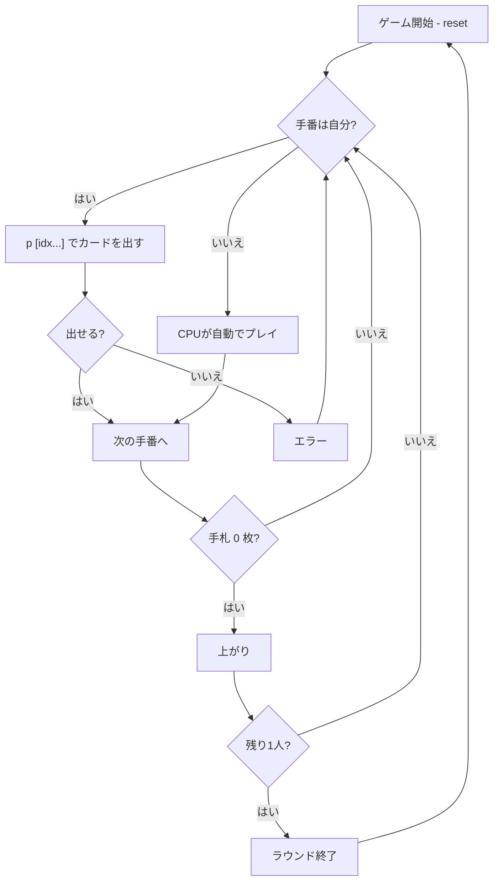

# President / プレジデント（CUI版）遊び方

## ゲーム概要

プレジデント（別名: スカム、キャピタリズム）は 4 人対戦のゴーイングアウト系カードゲームです。大富豪の欧米版にあたり、ジョーカー不使用・スート縛りなし・カード交換ルールが簡略化されています。手札を早く出し切った順に **大統領 → 副大統領 → 副スカム → スカム** の肩書きが付与されます。

## 起動方法

```sh
go run ./cmd/trumpcards president
go run ./cmd/trumpcards --lang en president   # 英語モード
```

## ルール

### 基本ルール

- デッキは **52 枚（ジョーカーなし）**、4 人で 13 枚ずつ配る
- カード強さ: `3 < 4 < 5 < ... < J < Q < K < A < 2`（**2 が最強**）
- 初回ラウンドは **♣3 保持者** から。以降は前ラウンドのスカムから開始
- プレイ単位: シングル／ペア／スリーカード／フォーカード（同値グループのみ）
- 場のカードと**同じ枚数**で**より強い**値を出す
- 出せない／出したくない場合は **パス**

### 革命

- 4 枚出しで革命発動 → 強さ逆転（2 が最弱、3 が最強）
- もう一度 4 枚出しで解除

### カード交換

- ラウンド開始時、前回の順位に応じてカードを交換：
  - Scum → President: 最強 2 枚
  - President → Scum: 最弱 2 枚
  - Vice Scum → Vice President: 最強 1 枚
  - Vice President → Vice Scum: 最弱 1 枚

### パス即場流れ

- デフォルト **有効**: パスすると即座に場がクリア
- **無効** (`sr passflush 0`) にすると、全員パスで場流れとなる大富豪式

### CPU 難易度

- `sd 0`: Easy（最弱の合法手）
- `sd 1`: Normal（デフォルト）
- `sd 2`: Hard（終盤に強いカードを使う）

## ゲームの流れ



## コマンド一覧

| コマンド | 短縮形 | 説明 |
|----------|--------|------|
| `reset` | `r` | 新しいラウンドを開始 |
| `play [idx ...]` | `p [idx ...]` | 指定インデックスのカードを出す（インデックスなし = パス） |
| `setdifficulty <0-2>` | `sd <0-2>` | CPU 難易度（0=Easy, 1=Normal, 2=Hard） |
| `setrule <rule> <0\|1>` | `sr <rule> <0\|1>` | ルール切替（`sr list` で一覧表示） |
| `log` | `l` | 棋譜を表示 |
| `quit` | `q` | ゲーム終了 |

### ルールキー

- `revolution` – 革命を有効化
- `exchange` – カード交換を有効化
- `passflush` – パス即場流れ

## 画面の見方

```
==========
President (プレジデント)
==========
あなた: 13枚
  [0]SPADE 3 [1]SPADE 5 [2]HEART 5 ...
CPU 1: 13枚
CPU 2: 13枚
CPU 3: 13枚
----------
場: なし (誰でも出せます)
手番: あなた
p [インデックス...] でカードを出す / p でパス
```

- `[i]SUIT VAL` … 手札のインデックス・スート・値
- `場:` … 現在の場札（出したプレイヤー名付き）
- `手番:` … 次にプレイするプレイヤー
- 革命中は `【革命中】` が表示される

## 遊び方のコツ

- **2 を温存**: 2 は最強。終盤まで取っておく
- **革命を狙う**: 弱札が多いなら 4 枚出しで革命を仕掛ける
- **スカムからの強札**: 序盤に強カードを組み合わせてフォーカードを作ると有利
- **パス即場流れ**を OFF にして、大富豪風の駆け引きを楽しむのも可
