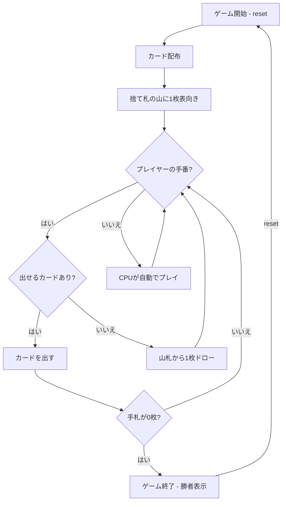

# プルシー（CUI版）遊び方

## ゲーム概要

4人（プレイヤー1人 + CPU 3人）で遊ぶチェコ発祥のクレイジーエイト系カードゲームです。32枚のデッキを使い、捨て札のトップカードとスートまたはランクが一致するカードを出していきます。先に手札を全て出し切ったプレイヤーが即座に勝者となります（得点・ラウンドはありません）。

## 起動方法

```sh
go run ./cmd/trumpcards prsi
go run ./cmd/trumpcards --lang en prsi  # 英語モード
```

## ルール

### 基本ルール

- 32枚のデッキを使用（各スートの A・7・8・9・10・J・Q・K）、4人プレイ
- 各プレイヤーに数枚ずつ配り、1枚を表向きにして捨て札の山を開始、残りは山札
- 捨て札の山のトップカードと **スートまたはランク** が一致するカードを出す（ワイルドカードは無し）
- 出せるカードがなければ山札から1枚ドロー
- 山札が空になったら捨て札（トップを除く）をリサイクルして山札にする

### 特殊カード

- **7**: 次のプレイヤーは2枚引く。7を重ねて出すとペナルティが累積する（重ね掛け）。ペナルティが累積している間は、7を出すか、累積分をまとめて引くかのどちらかのみ可能
- **A（エース）**: 次のプレイヤーをスキップ
- **Under（ジャック / 11）**: 次のプレイヤーをスキップ

### ゲーム終了

- 先に手札を全て出し切ったプレイヤーが勝者（得点計算は無し）

### CPU難易度

- **Easy** (0): ランダムにカードを出す
- **Normal** (1): 基本的な戦略（デフォルト）
- **Hard** (2): 戦略的なプレイ

## ゲームの流れ



## コマンド一覧

| コマンド | 短縮形 | 説明 |
|----------|--------|------|
| `reset` | `r` | ゲームリセット（設定保持） |
| `play <idx>` | `p <idx>` | カードをプレイ（インデックス指定） |
| `draw` | `d` | 山札から1枚ドロー |
| `log` | `l` | 棋譜表示 |
| `quit` | `q` | ゲーム終了 |
| `help` | `?` | ヘルプ表示 |

### コマンド例

- `p 2` → インデックス2のカードを出す
- `d` → 山札から1枚ドロー
- `l` → 棋譜を表示

## 画面の見方

```
==========
Prší (プルシー/チェコ版クレイジーエイト)
==========
draw pile: 18
discard: HEART 9
penalty: 2 (stack a 7 or draw)

[You]: cards=2
  [0]SPADE A  [1]HEART J
CPU 1: cards=5
CPU 2: cards=4
CPU 3: cards=6
----------
turn: You
==========
```

- `draw pile`: 山札の残り枚数
- `discard`: 捨て札の山の一番上のカード
- `penalty`: 7のペナルティ累積枚数（あれば）
- `[You]: cards=N`: プレイヤーの手札枚数とインデックス付きの手札
- `CPU N: cards=M`: CPUの手札枚数
- `turn`: 現在の手番

## 遊び方のコツ

- 7はペナルティの重ね掛けで相手に負担を押し付ける強力なカード。タイミングを見極めましょう
- A と Under（J）で相手の手番を飛ばし、テンポを握りましょう
- 出しにくいスートに切り替えると、相手をドローに追い込めます
