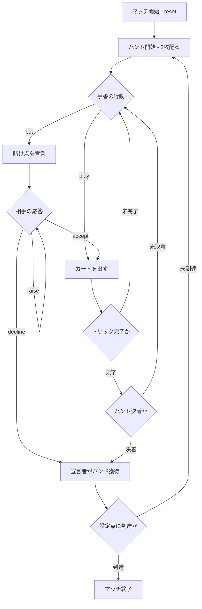

# プット（CUI版）遊び方

## ゲーム概要

Put（プット）はイングランドの古い 2 人対戦（あなた vs CPU）ギャンブル系トリックテイキングです。南米のトゥルコ（Truco）はこのゲームの子孫にあたります。52 枚の標準デッキから 3 枚配って 3 トリックを行い、2 トリック先取でそのハンドに勝利します。プレイ中いつでも「Put」を宣言して賭け点を倍にできる度胸試しが最大の特徴で、設定点（既定 15 点）に先に到達したプレイヤーがマッチに勝利します。

## 起動方法

```sh
go run ./cmd/trumpcards put
go run ./cmd/trumpcards --lang en put  # 英語モード
```

## ルール

### カードの強さ

**3 が最強で 4 が最弱**、スートは一切関係しません（強い順）。

```
3 > 2 > A > K > Q > J > 10 > 9 > 8 > 7 > 6 > 5 > 4
```

普段のトランプと違い、**3 と 2 がエースより強い**のがこのゲームの癖です。
同じ額面のカード同士は引き分けのトリックになります。

### ハンドの勝敗

- 2 トリック先取でハンドに勝利します（**マストフォローなし** — どの札を出しても構いません）。
- 1 トリック目が引き分けなら 2 トリック目の勝者がハンドを取ります。
- 1 トリック目を取り 2 トリック目が引き分けなら 1 トリック目の勝者がハンドを取ります。
- 全て引き分けの場合は親（非ディーラー）が勝ちます。

### Put（賭け点の釣り上げ）

自分の手番で `put` を宣言すると賭け点が倍になります。相手は**受諾か降参かの二択**です。

| 宣言 | 受諾時の賭け点 |
|------|----------------|
| なし | 1 点 |
| Put | 2 点 |

**引き上げ返す手はありません。** トゥルコは Truco → Retruco → Vale Cuatro と 3 段に伸ばせますが、プットの宣言は 1 段だけです。

降参すると、宣言者が直前の確定点でそのハンドを獲得します。

### ゲーム終了

ハンドの勝者に賭け点が加算され、設定点（既定 15 点）に先に到達したプレイヤーがマッチに勝利します。

## ゲームの流れ



## コマンド一覧

| コマンド | 短縮形 | 説明 |
|----------|--------|------|
| `reset` | `r` | 新しいマッチを開始 |
| `play <idx>` | `p <idx>` | 手札のカードを出す |
| `put` | `t` | Put を宣言（または Reput / Vale Cuatro へ引き上げ） |
| `accept` | `a` | Put を受諾する |
| `decline` | `d` | Put を拒否して降りる |
| `next` | `n` | 次のトリック / ハンドへ進む |
| `setmatchtarget <n>` | `sm` | マッチ目標点を変更してリセット（1〜60、既定 15） |
| `hint` | `h` | ヒントを表示 |
| `log` | `l` | 棋譜を表示 |
| `quit` | `q` | ゲーム終了 |
| `help` | `?` | コマンド一覧を表示 |

## 画面の見方

```
==========
Put (プット)
==========
ハンド: 1  トリック: 1  目標: 15点
マッチ得点: あなた=0  CPU=0
賭け点: 1  (通常)
あなた: 獲得0トリック 3枚
[0]♠1  [1]♥5  [2]♦11
CPU 1: 獲得0トリック 3枚
----------
手番: あなた
play <idx>・・・カードを出す
put・・・賭け点を引き上げる
```

- 1 行目: 現在のハンド番号・トリック番号・マッチ目標点。
- 2 行目: マッチ累積得点。
- 3 行目: 現在の賭け点と宣言レベル。
- 各プレイヤー行: 獲得トリック数と手札枚数（あなたの手札のみ番号付きで表示）。

## 遊び方のコツ

- 強い手（♠1・♣1・♠7・♦7 や 3・2）があるときは Put を宣言して点を釣り上げましょう。
- 弱い手で宣言されたら、無理せず降りて被害を 1 点に抑えるのも有効です。
- ブラフも武器です。弱い手でも強気に宣言すると相手が降りることがあります。
- 1 トリック目を捨てて 2・3 トリック目で勝つ「温存」も有効な戦術です。
