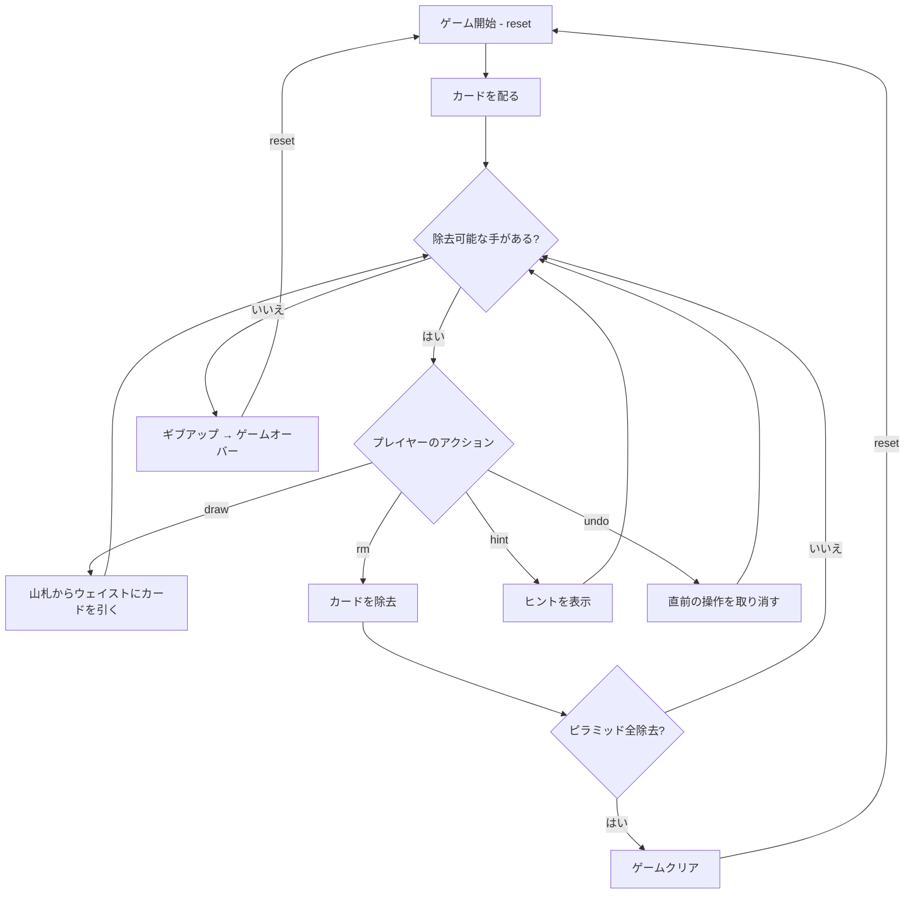

# ピラミッド（CUI版）遊び方

## ゲーム概要

1人用のソリティアカードゲームです。52枚のカードを使い、7段のピラミッド型に並べたカードから、合計13になるペアを見つけて除去していきます。ピラミッドのカードをすべて除去すればクリアです。

## 起動方法

```sh
go run ./cmd/trumpcards pyramid
go run ./cmd/trumpcards --lang en pyramid  # 英語モード
```

## ルール

### 基本ルール

- 52枚のトランプ（ジョーカーなし）を使用
- 7段のピラミッドに28枚を表向きで配る（段iにはi+1枚）
- 残りの24枚は山札（ストック）に裏向きで置く
- 「露出カード」（下の段の左右両方のカードが除去済み）のみ選択可能
- 最下段（7段目）のカードは常に露出状態

### カードの値

| カード | 値 |
|--------|-----|
| A | 1 |
| 2〜10 | 数字通り |
| J | 11 |
| Q | 12 |
| K | 13 |

### 除去ルール

- 露出カード2枚の合計が13になるペアを除去できる
- K（値13）は単独で除去できる
- 山札からウェイストに引いたカードとピラミッドの露出カードでペアを作れる
- ウェイストのトップがKの場合、単独で除去できる

### ゲームクリア

- ピラミッドの28枚すべてを除去するとゲームクリア

### ゲームオーバー

- これ以上除去可能な手がない場合はギブアップでゲームオーバー

### 手詰まり検出

- ヒントが存在せず、かつ山札が空の場合に「手詰まりです」と表示します
- 手詰まり状態では「元に戻す」またはギブアップを選択できます

## ゲームの流れ



## コマンド一覧

| コマンド | 短縮形 | 説明 |
|----------|--------|------|
| `reset` | `r` | 新しいゲームを開始 |
| `draw` | `d` | 山札からウェイストにカードを引く |
| `remove <r1> <c1> <r2> <c2>` | `rm` | ピラミッド上のペアを除去（合計13） |
| `remove <row> <col>` | `rm` | ピラミッド上のK（値13）を単独除去 |
| `remove w <row> <col>` | `rm w` | ウェイストのトップとピラミッドのカードをペアで除去 |
| `remove w` | `rm w` | ウェイストのトップのKを単独除去 |
| `giveup` | `g` | ギブアップしてゲームを終了 |
| `hint` | `h` | 次の一手のヒントを表示 |
| `undo` | `u` | 直前の操作を元に戻す |
| `log` | `l` | アクションログ（棋譜）を表示 |
| `quit` | `q` | ゲーム終了 |
| `help` | `?` | コマンド一覧を表示 |

### コマンド例

- `d` → 山札からカードを引く
- `rm 6 0 6 1` → 7段目の左端と2番目のカードをペア除去
- `rm 6 3` → 7段目の4番目のカード（K）を単独除去
- `rm w 6 2` → ウェイストのトップと7段目の3番目のカードをペア除去
- `rm w` → ウェイストのトップのKを除去
- `u` → 直前の操作を元に戻す
- `h` → ヒントを表示

## 画面の見方

```
==========
Pyramid (ピラミッド)
==========
            [--]HEART 7
          [--]SPADE 5  [--]CLOVER 10
        [--]SPADE 12  [--]SPADE 10  [--]CLOVER 5
      [--]DIAMOND 7  [--]HEART 13  [--]DIAMOND 9  [--]SPADE 7
    [--]CLOVER 11  [--]CLOVER 1  [--]SPADE 6  [--]HEART 9  [--]SPADE 1
  [--]DIAMOND 6  [--]DIAMOND 4  [--]HEART 6  [--]CLOVER 9  [--]HEART 8  [--]HEART 2
(6,0)HEART 5  (6,1)HEART 12  (6,2)CLOVER 7  (6,3)HEART 1  (6,4)SPADE 13[K]  (6,5)DIAMOND 11  (6,6)CLOVER 8
----------
Stock: 24枚 | Waste: [空]
----------
手数: 0 （戻せる手はありません）
==========
```

- ピラミッドは 7 段。**見出し行は付きません**
- `[--]HEART 7`: **まだ露出していない**カード。`[--]` は「操作できない」印で、
  裏向きという意味ではありません（札は最初から全部見えています）
- `(6,0)HEART 5`: 露出しているカード。`(段,位置)` がそのまま `rm` の引数に
  なります。**K には `[K]` が付き**、1 枚だけで除去できます
- `Stock: N枚 | Waste: X`: 山札の残り枚数とウェイストの一番上（空は `[空]`）
- `手数: N （戻せる手はありません）`: 現在の手数とアンドゥの可否

## 遊び方のコツ

- まずピラミッドの下段から除去できるペアを探しましょう
- Kが見えたらすぐに単独除去しましょう
- 上段のカードを露出させるために、下段のカードを優先的に除去します
- 山札を引く前に、ピラミッド内で除去できるペアがないか確認しましょう
- ヒントコマンドで詰まった時のアドバイスを得られます
- アンドゥを活用して、異なる戦略を試しましょう
