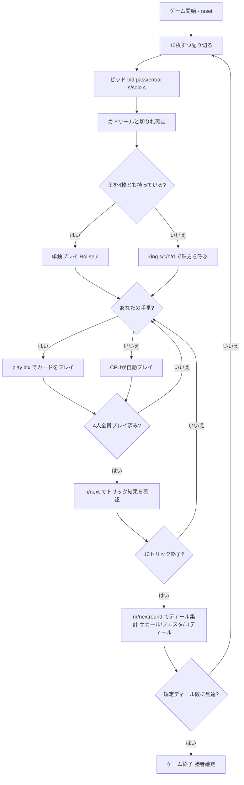

# カドリール（CUI版）遊び方

## ゲーム概要

Quadrille（カドリール）は18世紀フランスで生まれた**4人用のトリックテイキングゲーム**で、3人用のオンブル（Ombre）を4人に拡張したものです。40枚のスペイン式デッキ（8/9/10 を除く）を**10枚ずつ配り切り**、入札で名乗りを上げた**カドリール**が、**自分が持っていない王を1枚指名**して一時的な味方を作ります。呼ばれた王のスートは公開されますが、**誰がその王を持っているかは、その王が場に出るまで分かりません**。

## 起動方法

```sh
go run ./cmd/trumpcards quadrille
go run ./cmd/trumpcards --lang en quadrille  # 英語モード
```

## ルール

### デッキと配布

- **デッキ**: 40枚のスペイン式カード（A, 2, 3, 4, 5, 6, 7, J, Q, K × 4スート。8/9/10 は除外）。
- **プレイヤー**: 4人（プレイヤー0 = あなた、プレイヤー1〜3 = CPU）
- **配布**: 各プレイヤー10枚（合計40枚）。**山札は残りません**。3人用のオンブルは27枚を配って13枚を残しますが、こちらは配り切ります。

### ビッド（オークション）

- 前手（forehand = ディーラーの左隣）から順に、各プレイヤーは次のいずれかを宣言します。
  - **パス（pass）**: 降りる。
  - **エントラール（entrar）**: 名乗りを上げる（切り札スートを指定）。
  - **ソロ（solo）**: より強い名乗り（切り札スートを指定）。
- 最も高い宣言をしたプレイヤーが**カドリール**になり、その指定した**切り札スート**が決まります。
- 全員がパスした場合はディーラーが強制的にカドリールを引き受けます。

### 王呼び（このゲームの要）

カドリールが決まると、**王呼びフェーズ**に入ります。

- カドリールは**自分が持っていない王**を1枚指名します（`king <s|c|h|d>`）。
- その王を持っているプレイヤーが**一時的な味方**になります。
- **呼ばれた王のスートは全員に公開されます**（呼び声は卓で聞こえるため）。しかし**誰が持っているかは、その王が場に出るまで伏せられます**。それまで、カドリール以外は自分が味方かどうかも分かりません。
- カドリールが**王を4枚とも持っていた場合**は呼ぶ相手がいないので、**単独プレイ（Roi seul）**として1人で3人を相手にします。

### 切り札とカードの強さ

切り札グループの強さ（強い順）:

**スパディーユ（♠A）＞マニーユ（切り札の7）＞バスト（♣A）＞プント（切り札のA、赤の切り札のみ）＞K＞Q＞J＞6＞5＞4＞3＞2**（切り札）

- スパディーユ（♠A）とバスト（♣A）は常に切り札（マタドール）として扱われます。
- 非切り札の強さは、黒スート: K>Q>J>7>6>5>4>3>2、赤スート: K>Q>J>A>2>3>4>5>6>7。

### フォロー義務

- リードスートを持っていれば**必ず従わなければなりません（must-follow）**。ボイド時は任意の札（切り札を含む）を出せます。

### 得点と勝利条件

**勝敗は席ではなく「側」で決まります。** カドリールと呼ばれた王の持ち主が一方、残りの2人がもう一方です（単独プレイなら1人対3人）。

- 10トリックのうち、**カドリール側の合計が相手側を上回れば****サカール（Sacar）**。カドリール側の各人 +2 / 相手側の各人 -1。
- 5対5で**並んだ場合**は**プエスタ（Puesta）**。カドリール側の各人 -2 / 相手側の各人 +1。
- **相手側が上回った場合**は**コディール（Codille）**。カドリール側の各人 -4 / 相手側の各人 +2（失点が倍）。
- **マッチ勝利**: 規定ディール数（既定 **5**）を配り終えた時点で累積得点が最上位のプレイヤーが勝者。

## ゲームの流れ



## コマンド一覧

| コマンド | 短縮形 | 説明 |
|----------|--------|------|
| `bid pass` |  | パス（降りる） |
| `bid entrar <s\|c\|h\|d>` |  | エントラールを切り札スート指定で宣言 |
| `bid solo <s\|c\|h\|d>` |  | ソロを切り札スート指定で宣言 |
| `king <s\|c\|h\|d>` | `k` | 味方を呼ぶ王を指名（自分が持っていない王のみ） |
| `play <idx>` |  | 手札のidx番目のカードを出す |
| `next` | `n` | 次のトリックへ進む |
| `nextround` | `nr` | 次のディールへ進む |
| `setdifficulty <0-2>` | `sd` | CPU難易度設定（0=Easy, 1=Normal, 2=Hard） |
| `hint` | `h` | 推奨アクションを表示 |
| `log` | `l` | アクションログを表示 |
| `reset` | `r` | 新しいゲームを開始（設定保持） |
| `quit` | `q` | ゲーム終了 |
| `help` | `?` | コマンド一覧を表示 |

## 画面の見方

実際の出力例です。配りは毎回シャッフルされるので、カードの並びは実行ごとに変わります。

```
==========
カドリール
==========
ディール: 1  トリック: 1  切り札: スペード
呼ばれた王: ハート の K (持ち主は伏せられています)
あなた (カドリール): 10枚  得点: 0  トリック: 0
[0]SPADE 13  [1]SPADE 12  [2]SPADE 11  [3]SPADE 3  [4]CLOVER 5  [5]HEART 4  [6]DIAMOND 13  [7]DIAMOND 4  [8]DIAMOND 5  [9]DIAMOND 7
CPU 1 (連合): 10枚  得点: 0  トリック: 0
CPU 2 (連合): 10枚  得点: 0  トリック: 0
CPU 3 (連合): 10枚  得点: 0  トリック: 0
----------
手番: あなた  切り札: スペード
play <idx>・・・カードを出す（切り札 スパディーユ>マニーユ>バスト>プント>K>Q>J>6..2／マストフォロー）
==========
```

- **1〜3行目**: ゲーム名の見出し
- **ディール / トリック / 切り札**: 進行状況と切り札スート
- **王呼びの行**: 呼ばれた王のスート。持ち主が判明するまでは「持ち主は伏せられています」、判明したら味方の名前が出ます。単独プレイなら「単独プレイ (Roi seul)」
- **プレイヤー行**: 各席の役柄（カドリール／味方／連合）・残り手札枚数・累積得点・獲得トリック数。**味方の表示は呼ばれた王が場に出るまで出ません**
- **`[i]` 付きの行**: あなたの手札。`play <idx>` の `<idx>` はこの番号
- **`----------` の下**: 場に出ているカードと手番

## 遊び方のコツ

- **強い手のときだけ宣言せよ**: マタドール（スパディーユ・マニーユ・バスト）や長い切り札を持っているかを見て、エントラールかソロかを判断しましょう。
- **呼ぶ王は慎重に**: 自分の長いスートの王を呼んでも、その札は自分で引き当ててしまいがちです。手薄なスートの王を呼ぶと、味方がその場を支えてくれます。
- **味方が誰か分からないうちは無理をしない**: 呼ばれた王が場に出るまで、カドリール以外は敵味方が分かりません。強い札を早く使い切ると、味方だった相手を潰すことになります。
- **フォロー義務を意識する**: リードスートを持っていれば必ず従う必要があります。ボイド時に切り札を切って主導権を握りましょう。
