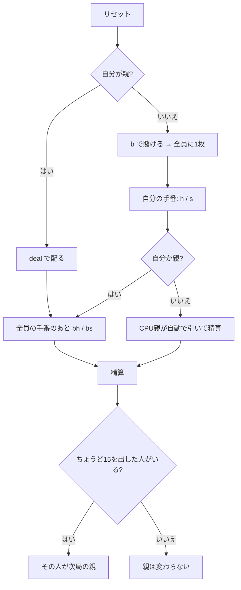

# カーンズ（CUI版）遊び方

## ゲーム概要

**15** を目指す18世紀フランスのバンキングゲーム。**標準52枚**で遊び、人間 1 人 + CPU 2 人の 3 席のうち 1 席が親（バンカー）を務めます。

点数は A=1、2〜10 は額面どおり、J/Q/K は 10 です。

## 起動方法

```sh
go run ./cmd/trumpcards quinze
go run ./cmd/trumpcards --lang en quinze   # 英語
```

## ルール

### 点数

| 札 | 点数 |
|---|---|
| A | 1 点 |
| 2〜10 | 数どおり |
| 絵札（J・Q・K） | **10 点** |


### 進行

1. 親以外が賭け、全員に **1 枚ずつ**配られる
2. 各プレイヤーが順に引く（`h`）か止める（`s`）かを選ぶ
3. **合計が 15 を超えたらバースト**
4. 全員の手番が終わったら、親も同じように引く／止める
5. **同点は親の勝ち**。親より高ければ賭け金と同額を得る

### 親の交代

**ちょうど 15 を出したプレイヤーが次の局の親になります。** 毎局まわるのではありません。15 に届いた時点でその手番は終わりますが、**親も 15 なら同点で親の勝ち**なので、15 は「負けない手」ではありません。

> 補足: issue #4388 の仕様案とは 2 点異なるが、いずれも実際の規則（pagat.com）に合わせた。
> (1) 親は「次のディールで交代」ではなく、**ちょうど 15 を出した者だけ**が取る。
> (2) 15 は「即座に勝利」ではない。手番は終わって公開されるが、**親も 15 なら同点で親の勝ち**。

## ゲームの流れ



## コマンド一覧

| コマンド | 短縮形 | 説明 |
|----------|--------|------|
| `bet <額>` | `b` | ベットして配る（親のときは使えない） |
| `deal` |  | 自分が親の局を配る |
| `hint` | `h` | 1 枚引く |
| `stand` | `s` | 引き止める |
| `bh` |  | 親として 1 枚引く |
| `bs` |  | 親として引き止めて精算する |
| `log` | `l` | 棋譜（アクションログ）を表示する |
| `reset` | `r` | 次の局を始める |
| `quit` | `q` | 終了する |
| `help` | `?` | コマンド一覧を表示 |

## 画面の見方

```
----------
チップ: 900
親: CPU1
親: [伏]
----------
  CPU2 賭け20 [伏]
----------
```

- 親と CPU の手は局が終わるまで `[伏]` で伏せられる（**サーバーが中身を返さない**ため、API を直接叩いても読めない）
- 「打てる手」には**今その手で合法な宣言だけ**が並ぶ

## 遊び方のコツ

- **15ちょうどでも、親と同点なら親の勝ち**
- **15 を出せば次の局の親になる。** 配当だけでなく立場が変わるので、際どい場面で狙う価値がある
- **同点は親の勝ち。** 親と同じ点で止まっても負ける
