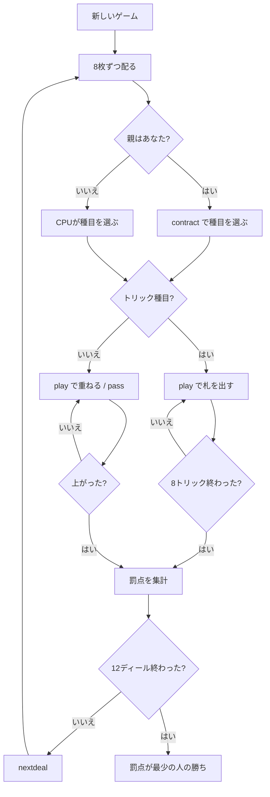

# クオドリベット（CUI版）遊び方

## ゲーム概要

クオドリベット（Quodlibet）はオーストリアの学生組合で遊ばれてきた**複合（コンペンディウム）型**のトリックテイキングです。フランスの Barbu、レバノンの Trex と同じ系統で、**性質のまったく違う 12 種目**を順に打ち、通しの成績で勝負します。

**このゲームの点は罰点です。** 12 ディールを終えて**累計が最も少ない人が勝ち**ます。多く取ったほうが勝ちではありません。

32 枚（7・8・9・10・J・Q・K・A）を 4 人に 8 枚ずつ配り、**切り札はありません**。あなたは席 0 で、CPU 3 人と卓を囲みます。

## 起動方法

```sh
go run ./cmd/trumpcards quodlibet
# または
go run ./cmd/trumpcards --lang en quodlibet
```

## ルール

### 12 ディール ＝ 3 つの「輪」× 4 種目

1 ゲームは 12 ディールで、**4 種目ずつの輪が 3 つ**あります。各ディールの親（Bierkönig）は、**その輪でまだ打たれていない種目**から 1 つを選びます。輪をまたいだ選択はできません。親は 1 ディールごとに移ります。

### 第 1 の輪

| 種目 | 罰点 |
|------|------|
| プラス | **取れなかった**トリック 1 つにつき 10 点。1 つも取れなければ 80 ではなく **100 点** |
| マイナス | 取ったトリック 1 つにつき 10 点。8 つ全部なら 80 ではなく **100 点** |
| 悪い隣人 | マイナスと同じ点が、**その人の右隣**に付く |
| アラリック | K♥ で 50 点、Q♦ で 30 点。**同じトリックで両方**取ると 80 ではなく **100 点** |

### 第 2 の輪

| 種目 | 罰点 |
|------|------|
| 1238 | 第 1・2・3 トリックが 10 / 20 / 30 点、最終トリックが 100 点。**間の 4 トリックは無料** |
| 赤なし | ハートを取ると罰点。**低い札のほうが重い** ── 7〜10 が 20 点、J〜A が 10 点。8 枚すべてを同じトリックで取ると **100 点** |
| オーバー／ウンター | Q が 30 点、J が 20 点。**同じトリックで Q と J を両方**取ると **100 点** |
| 賄賂 | トリックを取ると 30 点。そのトリックに**最も弱い札を出した人**にも 20 点。**最も弱い札で取ってしまう**と **100 点** |

### 第 3 の輪

| 種目 | 罰点 |
|------|------|
| 開いたズボン | **自分の手札だけが見えません**（他の 3 人には見えています）。トリック 1 つにつき 10 点、全部取ると 100 点 |
| 狩猟 | **全員の手札が見えた状態**で打ちます。トリック 1 つにつき 10 点、全部取ると 100 点 |
| 四分 | トリックではありません。**同じスートのちょうど 3 つ上**でしか札を重ねられず、誰も続けられなくなったら重ねを畳んで次の人が好きな札から始めます |
| 小食い | トリックではありません。**J を起点**にした 7 並べです（32 枚デッキは 7 から A なので、起点は 7 ではありません） |

四分と小食いは**早く手札を出し切る**遊びです。最初に上がった人は 0 点、以降は残した手札 1 枚につき 10 点・20 点・30 点と重くなります。出せる札が 1 枚も無いときだけ `pass` できます。

### 札の強さ

A > K > Q > J > 10 > 9 > 8 > 7。切り札は無いので、**台札スートの最強札**を出した人がトリックを取ります。台札スートを持っていれば必ずそれを出します（フォロー義務）。

### 典拠について

1238 の最終トリックの点は出典で割れます（Wikipedia は「50（または 80）」と自らも揺れており、catsatcards は 100）。この実装は **100** を採っています。どの種目も「破局は 100」で書式が揃っているためです。

## ゲームの流れ



## コマンド一覧

| コマンド | 短縮形 | 説明 |
|----------|--------|------|
| `contract <0-11>` | `c` | この輪の種目を選ぶ（親のときだけ） |
| `play <idx>` | `p` | 手札の idx 番目の札を出す |
| `pass` |  | パス（四分・小食いで出せる札が 1 枚も無いときだけ） |
| `nextdeal` | `nd` | 次のディールへ進む |
| `setdifficulty <0-2>` | `sd` | CPU難易度（0=Easy, 1=Normal, 2=Hard） |
| `auto` |  | 種目の自動選択を切り替えてリセット |
| `hint` | `h` | 推奨アクションを表示 |
| `log` | `l` | アクションログを表示 |
| `reset` | `r` | 新しいゲームを開始（設定保持） |
| `quit` | `q` | 終了 |
| `help` | `?` | コマンド一覧を表示 |

## 画面の見方

```
==========
クオドリベット
==========
ディール: 3/12（第 1 の輪）
種目: 悪い隣人
トリック: 2/8
あなた （子）: 手札 7 枚  取ったトリック 1  罰点 40
[0]♠A  [1]♠9  [2]♥K  [3]♥8  [4]♣Q  [5]♣7  [6]♦10
CPU 1 （親）: 手札 7 枚  取ったトリック 0  罰点 30
CPU 2 （子）: 手札 7 枚  取ったトリック 1  罰点 0
CPU 3 （子）: 手札 7 枚  取ったトリック 0  罰点 60
----------
場: CPU 1=♠K  CPU 2=♠7
手番: あなた
出せる札: [0]♠A  [1]♠9
play <idx> ... 札を出す
==========
```

各行の「罰点」は 12 ディール通算の累計です。**少ないほど良い**ので、この盤面では CPU 2 が首位です。「出せる札」はフォロー義務を反映した一覧で、シェディング種目では重ねられる札だけが並びます。
