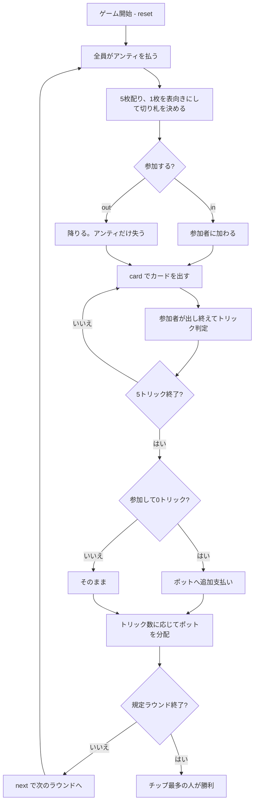

# ラムス（CUI版）遊び方

## ゲーム概要

ドイツ・フランスで遊ばれる**ポット式**トリックテイキング。**3〜5人**という可変人数が特徴で、ピケット32枚から5枚ずつ配る。毎ラウンド、手札を見て**参加するか降りるか**を選ぶ。降りれば失うのはアンティだけだが、**参加して1トリックも取れないとポットへ追加で支払う**。この一点の判断がゲームの全部。

## 起動方法

```sh
go run ./cmd/trumpcards rams
go run ./cmd/trumpcards --lang en rams  # 英語モード
```

## ルール

### 配り方

- **ピケット32枚**（A・7・8・9・10・J・Q・K × 4スート）
- **3〜5人**（既定4人）に**5枚ずつ**。1ラウンドは5トリック
- 配り切ったあとの**1枚を表向き**にし、**そのスートがそのラウンドの切り札**
- ラウンド開始時に全員が**3チップ**をポットへ

### 参加するか降りるか

手札と切り札を見て選びます。

| 選択 | 内容 |
|------|------|
| `in` | このラウンドに参加する |
| `out` | 降りる。失うのはアンティだけ |

**参加者だけ**でトリックテイキングを行います。

### トリックの取り方

- **切り札が最強**。次いでリードのスートの最強札
- 強さは **A > K > Q > J > 10 > 9 > 8 > 7**
- **リードのスートを持っていれば必ず出す**（フォロー義務）

### 精算

- **参加して0トリックだったプレイヤーは、ポットへ追加で5チップ支払う**
- トリックを取ったプレイヤーは、**獲得数に応じてポットを分ける**
- 割り切れない端数と、全員が降りたラウンドのポットは**次のラウンドへ持ち越し**
- **最終ラウンドでは残りを配り切る**（持ち越し先が無いため）
- 規定ラウンド終了時、**チップが最も多い**プレイヤーの勝ち

## ゲームの流れ



## コマンド一覧

| コマンド | 短縮形 | 説明 |
|----------|--------|------|
| `play` | `in` | このラウンドに参加する |
| `pass` | `out` | このラウンドは降りる |
| `card <idx>` | `c` | 手札の `<idx>` 番目のカードを出す |
| `next` | `n` | 次のラウンドを開始する |
| `hint` | `h` | 参加可否、または打つべき札を提示する |
| `giveup` | `g` | 投了する |
| `log` | `l` | 棋譜（アクションログ）を表示する |
| `reset` | `r` | 最初からやり直す |
| `quit` | `q` | 終了する |
| `help` | `?` | コマンド一覧を表示 |

## 画面の見方

```
==========
Rams (ラムス)
==========
ラウンド: 1/4  トリック: 1/5  (4人)
ポット: 12 チップ（トリック数に応じて分配）
切り札: ♥9
参加して1トリックも取れないと、ポットへ追加で 5 支払います。
あなた: 57チップ [未定] 獲得0 手札5枚
  [0]♠7 [1]♠K [2]♣9 [3]♥A [4]♥10
CPU1: 57チップ [未定] 獲得0 手札5枚
CPU2[親]: 57チップ [未定] 獲得0 手札5枚
CPU3: 57チップ [未定] 獲得0 手札5枚
----------
このラウンドに参加しますか？
in・・・参加する / out・・・降りる
```

- **1行目**: ラウンド、トリック、そして**参加人数**
- **ポット行**: 取り合っている額。参加者の追加支払いで増えます
- **切り札行**: 表向きになった1枚。参加判断の最大の材料
- **リスク行**: 参加して0トリックだと払う額
- **`[親]`**: このラウンドの親。**参加判断もリードも親の左隣から**始まるので、自分が何番目に決めるのかはここで読みます。親は毎ラウンド 1 つ回ります
- **`[...]`**: `未定` = まだ選んでいない / `参加` / `降り`
- **`[n]`**: `card <n>` で指定する手札の番号

## 遊び方のコツ

- **切り札のA・Kがあれば参加してよい。** 1トリック取れれば追加支払いを免れます
- **切り札が1枚も無く、平のエースも無い手は降りる。** アンティ3だけの損で済みます
- **人数が多いほど降りるべき。** 5人だと1トリック取るのが難しくなる一方、ポットは大きくなります
- **狙いは「まず1トリック」。** 追加支払いを避けるのが最優先で、そのあと取れるだけ取ります
- **持ち越しでポットが膨らんだラウンドは参加の価値が上がる。** 同じリスクで見返りが大きい
- **全員が降りたラウンドはポットがそのまま残る。** 次が勝負どころになります
