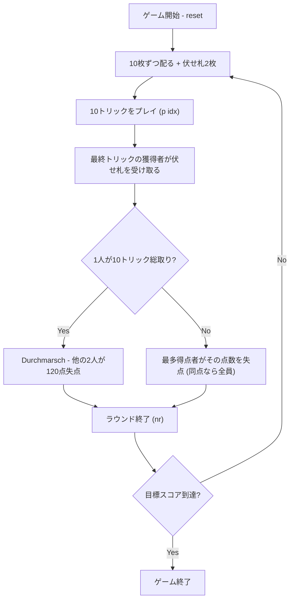

# ラムシュ（CUI版）遊び方

## ゲーム概要

ラムシュ（Ramsch）です。ドイツのスカート地方に伝わる**3人用の逆取り（misère）ゲーム**で、もとは Skat で誰も入札しなかったときの副次ルールでしたが、単独のゲームとして広く遊ばれています。

**目標は「点を取らないこと」です。** カードには点があり（A=11, 10=10, K=4, Q=3, J=2、合計120点）、**最も多く点を取ったプレイヤーがその点数を失点します**。最多が同点なら該当者全員が失点します。

**入札はありません。** Skat と違って競りもスカット取りもゲーム宣言も無く、配ったらすぐトリックが始まります。**切り札は常にジャック4枚**で、強い順に ♣J > ♠J > ♥J > ♦J。ジャックは印刷されたスートに属さないので、♣J でクラブをフォローすることはできません。

唯一の攻め手が **Durchmarsch（総取り）** です。10トリックを1人で全部取ると逆転勝ちになり、**他の2人が120点ずつ失点**します。

累計失点が最も少ないプレイヤーが勝者です。

## 起動方法

```sh
go run ./cmd/trumpcards ramsch
go run ./cmd/trumpcards --lang en ramsch
```

## ルール

### 基本

- 32枚のスカート牌（各スート A・K・Q・J・10・9・8・7）を使用
- 3人（あなた + CPU 2人）に10枚ずつ配り、残り2枚は**伏せ札（スカット）**
- **入札・スカット取り・ゲーム宣言はありません。** 配ったらすぐプレイ
- **切り札はジャック4枚のみ**、常に。強い順に ♣J > ♠J > ♥J > ♦J
- **ジャックは自分の印刷スートに属しません。** ♣J でクラブをフォローすることはできず、クラブの実札を持っていなければ切り札として自由に出せます
- 非切り札の序列は **A > 10 > K > Q > 9 > 8 > 7**（10 が K より強いのがスカート系）
- リードスートに追随する義務があります（持っていなければ何を出しても自由）
- 全10トリック

### 得点

| カード | 点 |
|--------|----|
| A | 11 |
| 10 | 10 |
| K | 4 |
| Q | 3 |
| J | 2 |
| 9 / 8 / 7 | 0 |

合計 **120点**。**これは罰点です。**

- 最も多く取った人がその点数を**失点**します
- 最多が同点なら、該当者**全員**が失点します（誰か1人を選ぶ根拠がないため）
- **伏せ札2枚は最終トリックの獲得者が受け取ります。** これにより120点は必ず誰かの負担になり、「取らなければ得」という前提が成立します
- **Durchmarsch**: 1人が10トリック全部を取ると逆転勝ちで、**他の2人が120点ずつ**失点します

### 勝敗

累計失点が最も少ないプレイヤーが勝者です。設定した目標スコアに達するとゲームが終了します。

### CPU難易度

- Easy: 確率的にビッドを受ける。
- Normal: 手札の強さでビッドを判断。
- Hard: 受け閾値が下がり、強い手ではハンドゲームを選ぶこともある。

## ゲームの流れ



## コマンド一覧

| コマンド | 短縮形 | 説明 |
|----------|--------|------|
| `reset` | `r` | 新しいゲームを開始 |
| `quit` | `q` | ゲーム終了 |
| `play <i>` | `p` | カードを出す |
| `next` | `n` | 次のトリックへ |
| `nextround` | `nr` | 次のラウンドへ |
| `setdifficulty <0-2>` | `sd` | CPU難易度（0=Easy / 1=Normal / 2=Hard） |
| `settarget <n>` | `sl` | 目標スコアを設定 |
| `hint` | `h` | ヒント表示 |
| `log` | `l` | 棋譜表示 |
| `help` | `?` | コマンド一覧を表示 |

## 画面の見方

```
==========
Ramsch (ラムシュ)
==========
ラウンド: 1  トリック: 1  ディーラー: 0 (前=1 / 中=2 / 後=0)
切り札: ジャック4枚 (♣J > ♠J > ♥J > ♦J) — 入札はありません
点を最も多く取った人がその点数を失います（取らないゲーム）
あなた: tricks=0 cardPts=0 total=0 round=0 hand=10
[0]SPADE 11  [1]CLOVER 1  [2]CLOVER 9  [3]CLOVER 12  [4]HEART 9  [5]HEART 10  [6]HEART 12  [7]DIAMOND 7  [8]DIAMOND 8  [9]DIAMOND 12
CPU 1: tricks=0 cardPts=0 total=0 round=0 hand=9
CPU 2: tricks=0 cardPts=0 total=0 round=0 hand=9
----------
トリック: CPU 1=SPADE 7, CPU 2=SPADE 12
手番: あなた
p <idx>
==========
```

- `切り札`: 常にジャック4枚。入札が無いので変わりません
- `点を最も多く取った人が…`: 得点の向き。**多いほど不利**です
- `tricks`: 取ったトリック数
- `cardPts`: **このラウンドで集めてしまった点**（多いほど不利）
- `total`: 累計スコア（罰点なので0以下）
- `round`: このラウンドの得点
- `hand`: 手札の枚数
- `[i]`: 手札のインデックス。`p <i>` で出します
- `トリック`: 場に出ている札

## 遊び方のコツ

- **点札（A・10・K）を早めに手放す。** 安全に降りられる回に高い札を吐いておかないと、終盤に必ず取らされます。CPU も同じ方針で動きます。
- **ジャックは切り札ですが、持ちすぎるとトリックを取らされます。** 強いこと自体が不利になる、このゲーム特有の逆転です。
- **9・8・7 は0点。** リードするならここから。自分から点を場に出さないのが基本です。
- **他の2人が点を押し付け合っている間は静かにしている。** 罰を負うのは1人だけなので、最多になりさえしなければ0点で済みます。
- **Durchmarsch を狙うなら早い段階で決める。** 中途半端に取りに行くと、ただ点を集めただけで終わります。ジャックが3枚以上あるなど、全トリック取れる見込みがあるときだけ。
- **伏せ札2枚は最終トリックの獲得者に付きます。** 最後のトリックは、点数が読めないぶん危険です。
