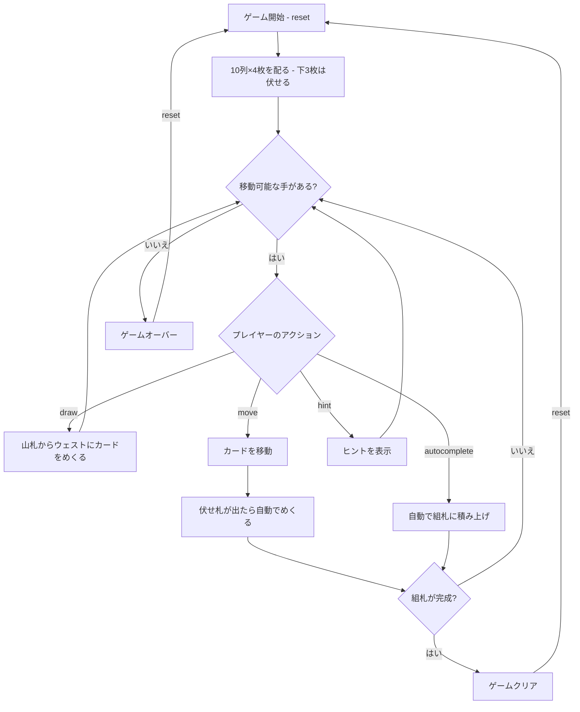

# ランク・アンド・ファイル（CUI版）遊び方

## ゲーム概要

1人用のソリティアカードゲームで、**フォーティシーブスの派生**です。2デッキ（104枚）を使い、10列のタブロー、山札、ウェスト、8つの組札で構成されます。組札にA→Kまでスート別に積み上げればクリアです。

フォーティシーブスとの違いは3点。**各列の下3枚は伏せて配る**（本家は40枚すべて表向き）、**タブローは異色降順**（本家は同スート降順）、そして**並びの一部でもまとめて動かせる**（本家は1枚ずつ）。

同系統に Deauville と Emperor があり、違いは「まとめて動かせる量」だけです（Deauville は上札のみ、Emperor は列まるごと、Rank and File は任意の並び）。

## 起動方法

```sh
go run ./cmd/trumpcards rankandfile
go run ./cmd/trumpcards --lang en rankandfile  # 英語モード
```

## ルール

### 基本ルール

- 2デッキ（104枚、ジョーカーなし）を使用
- 10列のタブローに各4枚ずつ配る（計40枚）。**下3枚は伏せ、最上段だけ表向き**
- 残りの64枚は山札（ストック）に裏向きで置く
- 8つの組札（ファンデーション）はスート別にA→Kの順に積み上げる
- タブローでは**異色で降順**に重ねる（例: ♠6の上に♥5または♦5。♠5は不可）
- **異色降順に並んでいる部分は、その一部でもまとめて動かせる**（並びが崩れていれば1枚も動かない）
- **空列にはどのカード（または並び）でも置ける**
- 札が動いて伏せ札が最上段になると、**自動的にめくれます**
- 伏せ札は積み先にならず、組札にも送れません

### ゲームクリア

- 8つの組札すべてにA→Kまで13枚ずつ積み上げるとゲームクリア

### ゲームオーバー

- これ以上移動可能な手がない場合はゲームオーバー（**山札の再循環が無い**ので、引き切ったら取り返しがつきません）

### 山札のルール

- 山札から1枚ずつウェストにめくる
- 山札の再循環はなし — 山札を使い切ったらそれ以上引けない

## ゲームの流れ



## コマンド一覧

| コマンド | 短縮形 | 説明 |
|----------|--------|------|
| `reset` | `r` | 新しいゲームを開始 |
| `draw` | `d` | 山札からウェストにカードをめくる |
| `move` | `m` | カードを移動する（サブ引数で移動元・移動先を指定） |
| `undo` | `u` | 直前の操作を元に戻す |
| `giveup` | `g` | ギブアップしてゲームを終了 |
| `hint` | `h` | 次の一手のヒントを表示 |
| `autocomplete` | `ac` | 自動的に組札へ積み上げ可能なカードを移動 |
| `log` | `l` | アクションログ（棋譜）を表示 |
| `quit` | `q` | ゲーム終了 |
| `help` | `?` | コマンド一覧を表示 |

### コマンド例

- `d` → 山札からカードをめくる
- `m` → 移動コマンド（移動元・移動先の入力を求められる）
- `u` → 直前の操作を元に戻す
- `h` → ヒントを表示
- `ac` → オートコンプリート

## 画面の見方

```
==========
Rank and File (ランク・アンド・ファイル)
==========
山札: 60枚  ウェスト: ♠5
----------
組札:
[♠1] --  [♠2] --  [♥1] --  [♥2] --
[♦1] --  [♦2] --  [♣1] --  [♣2] --
----------
タブロー:
[1] ?? ?? ?? ♦3
[2] ?? ?? ?? ♦6
[3] ?? ?? ?? ♠2
[4] ?? ?? ?? ♣3
[5] ?? ?? ?? ♥6
[6] ?? ?? ?? ♦2
[7] ?? ?? ?? ♥3
[8] ?? ?? ?? ♣6
[9] ?? ?? ?? ♠3
[10] ?? ?? ?? ♥6
----------
手数: 0
m・・・カードを移動  d・・・山札をめくる  h・・・ヒント
==========
```

- `山札: N枚`: 山札の残りカード数
- `ウェスト: ♠5`: ウェストの一番上のカード
- `組札`: 8つのスート別の組札の状態（`--`は空）
- `♠K`: 表向きのカード
- `??`: 伏せられたカード（**各列の下3枚**。上の札が動くと自動的にめくれます）
- `手数: N`: 現在の手数

## 遊び方のコツ

- **各列3枚が伏せられている**ので、まずは上の札を動かして中身を明かしましょう。何が出るかは分からないぶん、リスクを取る判断が要ります
- Aが出たらすぐに組札へ移動しましょう
- 空いた列を作ることが攻略の鍵です — **どのカードでも置ける枠**なので、深い列を崩す足がかりになります
- **異色降順**でしか重ねられません。同スート降順に見える形（♠6の上の♠5）は置けないので、フォーティシーブスの感覚のまま探すと手を見落とします
- **並びの一部でもまとめて動かせる**ので、上札が行き詰まっていても下から始まる並びが動けることがあります
- 山札は再循環しないため、引くタイミングを見極めましょう
- ヒントコマンドで詰まった時のアドバイスを得られます
