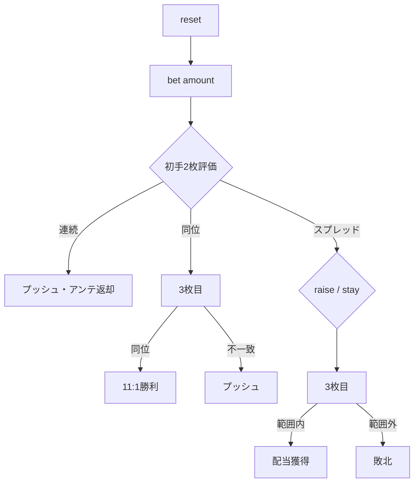

# レッドドッグ（CUI版）遊び方

## ゲーム概要

レッドドッグはディーラー対1人プレイヤーのカジノカードゲームです。最初に2枚配られ、3枚目のランクが2枚の間に入るかどうかを賭けます。

## 起動方法

```sh
go run ./cmd/trumpcards reddog
go run ./cmd/trumpcards --lang en reddog
```

## ルール

### 基本ルール

1. プレイヤーはアンテをベットします。
2. ディーラーがカードを2枚表向きに配ります。
3. 2枚のランクの差により以下に分岐します。
   - **連続（差=1）**: プッシュ。アンテ返却。
   - **同位（差=0）**: 3枚目を引き、同位ランクなら 11:1、それ以外はプッシュ。
   - **その他**: スプレッド = 差 - 1。プレイヤーはレイズ（最大アンテと同額）またはステイを選択。
4. 3枚目が2枚のランクの間に厳密に入れば配当を獲得、そうでなければ全ベットを失います。
5. ランク順序は A 高 (A=14, K=13, …, 2=2) です。

### 配当倍率

| スプレッド | 配当 |
|-----------|------|
| 1 | 5:1 |
| 2 | 4:1 |
| 3 | 2:1 |
| 4 以上 | 1:1 |
| 同位ペア＋3枚目同位 | 11:1 |

## ゲームの流れ



## コマンド一覧

| コマンド | 短縮形 | 説明 |
|----------|--------|------|
| `reset` | `r` | 新しいゲームを開始 |
| `bet <amount>` | `b <amount>` | アンテをベット |
| `raise <amount>` | — | スプレッド判断時にレイズ（最大アンテと同額） |
| `stay` | `s` | レイズせず3枚目を引く |
| `log` | — | 棋譜を表示 |
| `quit` | `q` | ゲーム終了 |
| `help` | `?` | コマンド一覧を表示 |

## 画面の見方

```
----------
chips: 1000
phase: SPREAD DECISION
ante: 100
spread: 4
--- INITIAL ---
S5,H10
----------
```

- `chips` — 手持ちチップ
- `phase` — 現在のフェーズ
- `ante` / `raise` — 現在のベット
- `spread` — 初手2枚のランク差から1引いた値
- `INITIAL` / `THIRD` — 配られたカード

## 遊び方のコツ

- スプレッドが7以上の場合のみレイズが有利です（数学的期待値）。
- スプレッドが小さい（1〜3）場合はステイのみが安全です。
- 同位ペアの3枚目はランダムなため、戦略の余地はありません。
