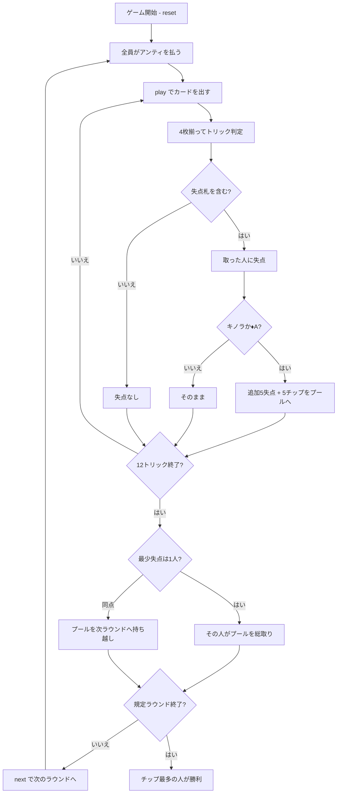

# レヴェルシ（CUI版）遊び方

## ゲーム概要

17〜18世紀のフランスで貴族に流行した**回避型**トリックテイキング。4人（あなた＋CPU3人）で、標準52枚から**10を4枚抜いた48枚**を使い、12トリックを戦う。トリックを取ると失点し、**キノラ（♥J）と♦A**は追加の失点に加えて**チップの支払い**まで発生する。毎ラウンド積まれるプールを、**失点の最も少なかった人が総取り**する。

## 起動方法

```sh
go run ./cmd/trumpcards reversis
go run ./cmd/trumpcards --lang en reversis  # 英語モード
```

## ルール

### 配り方

- **48枚**（標準52枚から10を4枚抜いたもの）を4人に**12枚ずつ**
- 1ラウンドは12トリック。既定は**4ラウンド**（1〜12で変更可）
- ラウンド開始時に全員が**5チップ**をプールに出す（プール20から始まる）

### トリックの取り方

- **切り札はありません。** リードのスートの最強札が取る（A > K > Q > J > 9 > … > 2）
- **リードのスートを持っていれば必ず出す**（フォロー義務）

### 失点

| 札 | 失点 |
|----|------|
| A | 4 |
| K | 3 |
| Q | 2 |
| J | 1 |
| その他 | 0 |

1スート10点、**4スートで40点**が毎ラウンド動きます。

### 印付きの2枚

| 札 | 追加失点 | プールへの支払い |
|----|---------|----------------|
| **キノラ（♥J）** | +5 | 5チップ |
| **♦A** | +5 | 5チップ |

**取った人が払います。** 出した人ではありません。1ラウンドで動く失点は 40＋5＋5＝**50点**。

手札の一覧は `[0]SPADE 1(4点)` のように**札ごとの失点付き**で出ます。0 点の平札も明示されます。

### 配当と勝敗

- ラウンド終了時、**失点が最も少なかったプレイヤーがプールを総取り**
- **同点ならプールは次のラウンドへ持ち越し**（分割しません）。次が重くなります
- 規定ラウンド終了時、**チップが最も多い**プレイヤーの勝ち

## ゲームの流れ



## コマンド一覧

| コマンド | 短縮形 | 説明 |
|----------|--------|------|
| `play <idx>` | `p` | 手札の `<idx>` 番目のカードを出す |
| `next` | `n` | 次のラウンドを開始する |
| `hint` | `h` | 打つべき札とその狙いを表示する |
| `giveup` | `g` | 投了する |
| `log` | `l` | 棋譜（アクションログ）を表示する |
| `reset` | `r` | 最初からやり直す |
| `quit` | `q` | 終了する |
| `help` | `?` | コマンド一覧を表示 |

## 画面の見方

```
==========
Reversis (レヴェルシ)
==========
ラウンド: 1/4  トリック: 3/12
プール: 25 チップ（最少失点のプレイヤーが総取り）
切り札なし。A=4 K=3 Q=2 J=1 が失点。♥J（キノラ）と♦A は追加で5失点＋5チップ。
あなた: 45チップ 失点7 [♥J] 手札10枚
  [0]♠2 [1]♠K [2]♣9 [3]♦A ...
CPU1: 45チップ 失点0 [無傷] 手札10枚
CPU2: 45チップ 失点4 [無傷] 手札10枚
CPU3: 45チップ 失点0 [無傷] 手札10枚
----------
手番: あなた
play <idx>・・・カードを出す
```

- **プール行**: 何を取り合っているのか。印付きの札が取られるたびに増えます
- **失点ルール行**: 盤面からは読み取れない配分の明示
- **`Nチップ 失点M [印]`**: 左が持ちチップ（**多いほど良い**）、中央がこのラウンドの失点（**少ないほど良い**）、右が取ってしまった印付きの札
- **`[n]`**: `play <n>` で指定する手札の番号

## 遊び方のコツ

- **キノラ（♥J）と♦Aが二重の地雷。** 失点5に加えてチップまで減ります。持っているなら早く手放す
- **ハートを迂闊にリードしない。** キノラを持っている人に押し付けられるどころか、自分が取らされます
- **Aを持っているスートは危険。** そのスートがリードされるとフォロー義務でAを出さされ、しかも取ってしまいます
- **絵札の無いトリックが処分どき。** 安全なうちにA・K・Qを捨てる
- **狙うのは「最少失点」であって0点ではない。** 40点は必ず誰かが取ります。他の3人より少なければプールは自分のものです
- **持ち越しラウンドは荒れる。** プールが2倍近くになるので、多少の失点を覚悟してでも取りにいく価値が出ます
