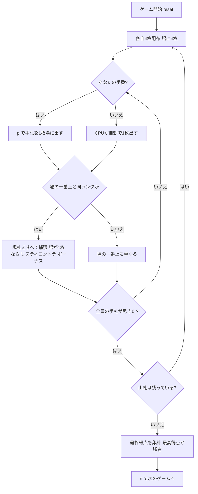

# リスティコントラ（CUI版）遊び方

## ゲーム概要

リスティコントラ（Ristikontra）はフィンランドの**捕獲（フィッシング）系カードゲーム**で、**常に2対2の固定チーム戦**です（席0・2 対 席1・3。あなたは席0）。52枚デッキを使い、各自4枚ずつ配って中央の場に1枚ずつカードを出していきます。**切り札はありません。**

場の一番上のカードと**同じランク**を出すと場札をすべて捕獲できます。捕獲の手段はこれだけです。

このゲームの名前になっているのが**打ち返し**（risti-kontra = 「十字の打ち返し」）で、**捕獲された直後にその捕獲を成立させたランクを被せると、束ごと奪い返せます**。奪い返しは、誰かが別のランクを出すまで何度でも続きます。

手札が尽きるたびに山札から4枚ずつ配り直し、山札がなくなるまで続けます。**チームごとに獲得枚数を合計し、多いチームの勝利**です。

## 起動方法

```sh
go run ./cmd/trumpcards ristikontra
go run ./cmd/trumpcards --lang en ristikontra  # 英語モード
```

## ルール

### デッキと配布

- **デッキ**: 52枚（標準デッキ）
- **プレイヤー**: **4人固定**（あなた + CPU3人）。席0・2 対 席1・3の2対2で、人数は変更できません
- **配布**: 各プレイヤーに4枚ずつ。さらに場の中央に4枚を置きます。
- 手札が全員尽きたら、山札から4枚ずつ配り直します。

### カードを出す・捕獲する

- 自分の手番では、手札を1枚選んで中央の場に出します（`p <手札番号>`）。
- 出したカードが**場の一番上のカードと同じランク**なら、場札をすべて捕獲します。
- **ジャックはワイルドではありません。** ただの札です。
- 捕獲できなかった場合、出したカードは場の一番上に重なります。

### 打ち返し（リスティコントラ）

- 誰かが捕獲した**直後**に、**その捕獲を成立させたランク**と同じ札を出すと、
  捕獲した束をそっくり奪えます。
- 奪い返しは連鎖します。同じランクが続く限り、束は席から席へ移り続けます。
- **別のランクが出た時点で打ち返しの機会は閉じます。** その後で同じランクを
  出しても、もう奪えません。

### 最終得点

ゲーム終了時、場に残った札は**最後に捕獲した人のチーム**が獲得します。

- **チームごとに獲得枚数を合計**します（席0＋席2 と 席1＋席3）。
- 枚数の多いチームの勝利です。札ごとの点数はありません。
- 同数なら引き分けで、勝者は出ません。

### CPU難易度

- **Easy（0）**: ランダムな合法手を選びます。
- **Normal（1）**: 捕獲できる手を優先します。
- **Hard（2）**: 捕獲と打ち返しを狙い、価値の低い札から捨てます。

## ゲームの流れ



## コマンド一覧

| コマンド | 短縮形 | 説明 |
|----------|--------|------|
| `play <h>` | `p` | 手札h番を場に出す（同ランクまたはJで場札を捕獲） |
| `next` | `n` | 次のゲームを開始する |
| `setdifficulty <0-2>` | `sd` | CPU難易度設定（0=Easy, 1=Normal, 2=Hard）。リセットされます |
| `log` | `l` | アクションログを表示 |
| `reset` | `r` | 新しいゲームを開始（設定保持） |
| `quit` | `q` | ゲーム終了 |
| `help` | `?` | コマンド一覧を表示 |

## 画面の見方

```
==========
リスティコントラ (リスティコントラ)
==========
山札: 残り36枚
場: 上=♣7 (1枚)
あなた: 手札4枚 / 捕獲0枚 / リスティコントラ0点
CPU 1: 手札4枚 / 捕獲0枚 / リスティコントラ0点
CPU 2: 手札4枚 / 捕獲0枚 / リスティコントラ0点
CPU 3: 手札4枚 / 捕獲0枚 / リスティコントラ0点
手番: あなた
p <hand> で手札を場に出す (同ランクまたはJで場札を捕獲)
```

- **山札行**: 山札の残り枚数。
- **場行**: 場の一番上のカードと場札の枚数。
- **プレイヤー行**: 各プレイヤーの手札枚数・捕獲枚数・リスティコントラ ボーナス点。
- **手番表示**: 現在の手番のプレイヤー。
- **`*` 印**: あなたの手番のとき、場を取れる手札に付きます（場のトップと同ランクなら総取り）。印の意味は手札の下の凡例行に出ます。

## 遊び方のコツ

- **打ち返しを読む**: 大きな束を取った直後は、そのランクを持っている相手に奪い返されます。取る価値と奪われる危険を天秤にかけましょう。
- **リスティコントラ を狙う**: 場が1枚のときに同ランクで捕獲すると+10点。相手が単独札を残したら積極的に狙いましょう。
- **枚数がすべて**: 札ごとの点数はありません。1枚でも多く取ったチームが勝ちます。
- **難易度調整**: Hard のCPUは リスティコントラ を狙ってきます。慣れないうちは Easy から始めましょう。
