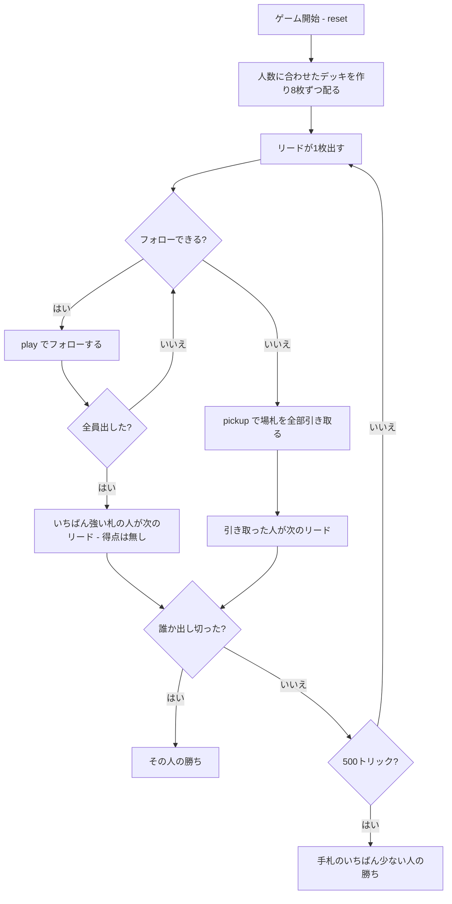

# ローリングストーン（CUI版）遊び方

## ゲーム概要

ドイツ・フランス圏の**逆転型トリックゲーム**（アンフレとも）。**トリックを取っても得点にはなりません。** 勝つのは**先に手札を出し切った人**です。フォローできないと、その場のトリックを**全部自分の手札に加えられます**——取るのではなく、増やされるのが罰。4〜6人で遊べます。

## 起動方法

```sh
go run ./cmd/trumpcards rollingstone
go run ./cmd/trumpcards --lang en rollingstone  # 英語モード
```

## ルール

### 配りとデッキ

**1人8枚固定**で、**デッキのほうを人数に合わせます**。

| 人数 | デッキ | 内訳 |
|------|--------|------|
| 4人 | 32枚 | 4スート × 8ランク（A と 7〜K） |
| 5人 | 40枚 | 4スート × 10ランク（A と 5〜K） |
| 6人 | 48枚 | 4スート × 12ランク（A と 3〜K） |

低いランクを抜いて作るので、**各スートの枚数は必ず同じ**です。A は最強として常に残します。

### プレイ

リードの人が1枚出し、以降は**フォロースート**で続けます。切り札はありません。全員が出したら、リードのスートでいちばん強い札を出した人が**次のリード権**を得ます——**得点は入りません**。

### フォローできないとき

**その場のトリックを全部、自分の手札に加えます。** そのうえで、引き取った人が次のリードを取ります。

これがこのゲームの罰則です。取ることに価値が無いので、**強い札はむしろ邪魔**になります。

### 勝敗

**先に手札を出し切った人の勝ち**です。

### 決着しない場合

このゲームは放っておくと終わりません。札が場から抜けるのは**全員フォローできたトリックだけ**で、誰かがフォローできなければ全部手札に戻るからです。実測では、4人戦の約半数が30万手でも決着しませんでした。

そのため **500トリック**で打ち切り、**手札のいちばん少ない人**の勝ちとします（同数なら席順）。決着した局の最長が303トリックだったので、本来決着する局を途中で止めることはまず起きません。

## ゲームの流れ



## コマンド一覧

| コマンド | 短縮形 | 説明 |
|----------|--------|------|
| `play <idx>` | `p` | 手札の `<idx>` 番目を出す（フォロー義務あり） |
| `pickup` | `u` | 場札を全部引き取る（**フォローできないときだけ**） |
| `hint` | `h` | 出すべき札、または引き取るしかないことを提示する |
| `giveup` | `g` | 投了する |
| `log` | `l` | 棋譜（アクションログ）を表示する |
| `reset` | `r` | 最初からやり直す |
| `quit` | `q` | 終了する |
| `help` | `?` | コマンド一覧を表示 |

**`pickup` は `play` の引数を省いたものではありません。** 「出せる札が無い」という別の行動なので、別のコマンドです。フォローできるのに `pickup` すると弾かれます。

## 画面の見方

```
==========
Rolling Stone (ローリングストーン)
==========
トリック: 3  デッキ: 32枚（場に残り 24枚）
トリックを取っても得点にはならず、勝つのは先に手札を出し切った人です。フォローできないと、その場のトリックを全部自分の手札に加えます——つまり取るのではなく、増やされるのが罰。1人8枚で始め、人数に応じてデッキの枚数が変わります（4人32枚・5人40枚・6人48枚）。
>あなた: 手札6枚 引き取り0回
  [0]♠9 [1]♠K [2]♥10 [3]♥3 [4]♣7 [5]♦Q
 CPU1[直前に引き取り]: 手札11枚 引き取り1回
 CPU2: 手札7枚 引き取り0回
 CPU3: 手札8枚 引き取り0回
----------
手番: あなた
play <idx>・・・カードを出す
```

- **デッキ行**: この卓の総枚数と、まだ場に残っている枚数。**抜けた枚数＝解決したトリック**です
- **手札の枚数**: これがそのまま順位。**少ないほど良い**ので、得点表示はありません
- **引き取り回数**: 何度トリックを背負わされたか。多いほど不利です
- **`[直前に引き取り]`**: 直前にトリックを引き取った席。盤面には痕跡が残らないので明示します
- **`[N位で上がり]`**: 出し切って抜けた席

## 遊び方のコツ

- **強い札は資産ではなく負債。** 取っても得が無いのに、取れば次のリードを押し付けられます
- **短いスートを先に減らす。** 手札に1枚しかないスートを残すと、そのスートがリードされたとき詰みます
- **長いスートからリードする。** 自分がフォローできる可能性が高く、相手が詰まりやすい
- **引き取りは倍返し。** 8枚配りで11枚まで増えると、そこから出し切るのは相当きつくなります
- **相手の引き取り回数を見る。** 多い席はスートが偏っているので、その席が持っていなさそうなスートをリードします
